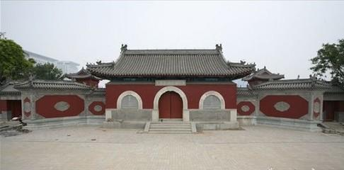
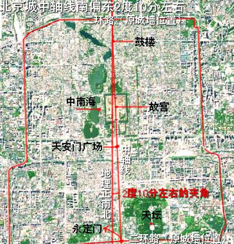
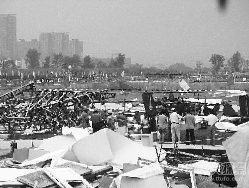
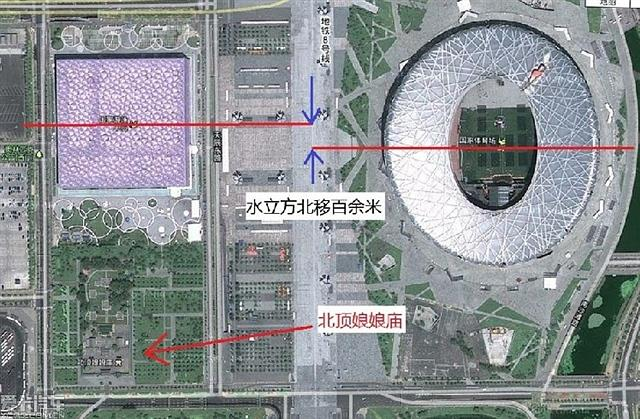

北京は非常に長い歴史のある都会です。風水の理論で定められた中軸線沿い、重要な建物が揃えます。今回、中軸線にある「北頂娘娘廟」の改築時に起こった超常現象を紹介します。

<figure>

<figcaption>

北頂娘娘廟の正面

</figcaption>

</figure>

「 廟 」とはお寺、神社の事、「娘娘」はお神様「[碧霞元君](https://ja.wikipedia.org/wiki/%E7%A2%A7%E9%9C%9E%E5%85%83%E5%90%9B)」です。「北頂」とは、北京の風水上、五つの方向に設置した五つの寺を「五頂」として、北側には「北頂娘娘廟」です。明の時代に建てられ、数百年の長い歴史を持ちます。  
北京の中軸線は南北方向ですが、地理的の南北と、約2度ぐらい斜めになっています。元朝に建てられた当初は、元のもとの首都と繋げているらしいです。

<figure>

<figcaption>

北京の中軸線

</figcaption>

</figure>

更に、太行山の観音の像の目線と繋げ、中国の龍脈にあり、帝都として最適な風水を維持するように長年で構築、改善されてきました。  
元、明、清、そして、今の中華人民共和国は、全て北京を首都にすることは、重視されている事を分かるでしょう。  
長い歴史の中、中心部であり、たくさんの戦争に経験したのにも関わらず、大きな乱が城の中にあまり入らない事も、風水の優れていることを証すると言えるでしょう。

ちょっと、脱線しますが、繫盛だが風水があまりよくない都市、揚州と南京を例にしましょう。  
揚州は明の末期に「[揚州十日](https://ja.wikipedia.org/wiki/%E6%8F%9A%E5%B7%9E%E5%A4%A7%E8%99%90%E6%AE%BA)」という、清の軍隊が城で皆殺しの大惨事がありました。南京では「[南京事件](https://ja.wikipedia.org/wiki/%E5%8D%97%E4%BA%AC%E4%BA%8B%E4%BB%B6)」、数字には色んな説がありますが、投降した軍人と民間人を含めて〇万人単位で虐殺された事は事実です。しかも、南京を首都とした政権は長く続かないようです。直近でいうと、永楽帝までの明の政権、中華民国政権はそうです。  
逆に風水は非常に良いと言われる都市は、北京以外、上海もあります。戦争など経験しても、大惨事まで至りません。特に北京は、世界第二次戦争も、内戦でも、奪われる中心的な地域にも関わらずです。

この帝都とした北京は、一番重要なのは中軸線です。中軸線には風水の理論をもとに国運を影響するほど重要な建物は建築され、勝手に移せない。仮に移そうとしたら、国の基を揺るがすかもしれません。「北頂娘娘廟」の超常現象は、北京オリンピック、鳥の巣とウォーターキューブ(水立方)を建設した時に発生した事です。

<figure>

<figcaption>

麻痺になったウォーターキューブの  
建設現場？

</figcaption>

</figure>

2004年8月27日15時、鳥の巣とウォーターキューブを立てるために、 「北頂娘娘廟」 を取り崩そうとして、色々準備を整えました。  
2人の作業者は正面を玄関の門を外した瞬間、鳥の巣の現場から、大きな風が吹き始めました。  
当時の報道によると、黒い柱のような強風は、高さ約7、８メートル、太さ約3，4メートルで、ウォーターキューブの建設現場を襲ったそうです。同強風は建材を十数メートルの高さに挙げ、風力階級7の強風を耐えられる臨時建築物などは全壊し、現場全体は麻痺の状態にりました。その時点では44人けが、2人死亡になりました。但し、当時、死亡したような2人は、理由を知らずに、事件後、間もなく復活しました。

専門家によると、確率が非常に低いが、この強風は陸上に発生する[塵旋風](https://ja.wikipedia.org/wiki/%E5%A1%B5%E6%97%8B%E9%A2%A8)と言い、約数百年の中、1回しか発生しないそうです。作業者の皆は違和感があっても、専門家からの説明があったので、作業は簡単にやめることはできません。取り崩す作業は継続した翌日、さらに怪奇な現象は発生しました。  
ウォーターキューブの建設現場で、一つの大きな穴を見つけて、中を望んでみたら、大量な蛇が潜んでいると確認し、作業は即時で停止しました。  
作業は停止していた日、ウォーターキューブと鳥の巣の建設現場では原因不明な停電が発生しました。停電していた最中、スタッフたちは、北頂娘娘廟は著しく明るく、沢山の電灯は同時に光っていたようだが、崩す予定の北頂娘娘廟には電灯がありません。  
TOPの責任者は緊急に会議を開き、北頂娘娘廟の取り崩す作業をやめ、ウォーターキューブを最初の決めた位置より、北側に移動するようにしました。  
手戻り作業により、コストは予定よりかかったが、それ以降の工事はスムーズに進め、この数百年の古跡も残せたことは何よりです。

<figure>

<figcaption>

左上、ウォーターキューブ、右側、鳥の巣、左下、 北頂娘娘廟  
ウォーターキューブは鳥の巣より、100メートル程、北側にずらしている

</figcaption>

</figure>

「北頂娘娘廟」 の件は本当かどうかについて、私は直接確認してないので、何とも言えませんが、都市伝説として捉えてもよいかと思います。  
但し、北京の歴史を知りたい人は、[中軸線沿いの建物](https://www.amazon.co.jp/%E5%8C%97%E4%BA%AC-%E4%B8%AD%E8%BB%B8%E7%B7%9A%E4%B8%8A%E3%81%AB%E3%81%A4%E3%81%8F%E3%82%89%E3%82%8C%E3%81%9F%E3%81%BE%E3%81%A1-%E5%8D%98%E8%A1%8C%E6%9C%AC-%E4%BA%8E%E5%A4%A7%E6%AD%A6/dp/4591130584/ref=sr_1_1?__mk_ja_JP=%E3%82%AB%E3%82%BF%E3%82%AB%E3%83%8A&keywords=%E5%8C%97%E4%BA%AC+%E4%B8%AD%E8%BB%B8&qid=1575810578&sr=8-1&_encoding=UTF8&tag=happinesea-22&linkCode=ur2&linkId=f7c133032c9d0c0dc7caa57c49e4daf0&camp=247&creative=1211)を一つ一つ確認していくことは、北京の事を詳しくなる近道だと思います。  
  
北京は日本の歴史より長く、繫盛し続けた都会ですので、伝説など沢山あります。  
読者の皆さん、ご興味がありましたら、この記事を共有して頂ければと思います。  
状況次第、別の内容も展開していきたいと思います。
