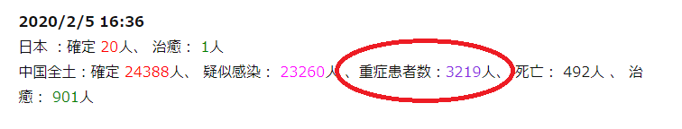

「[新型コロナウイルス(新型肺炎)の推移から状況を読み解く(2020/2/5)](https://blog.loveapple.cn/news/202002052790.html)」で、楽観的な見方を示し、免疫力の高い健康な人には、インフルエンザ以下だから、問題ないかとの観点を主張しました。  
但し、持病と高齢者を無視する事ではないところ、誤解して欲しくないです。

持病と高齢者は  
インフルエンザにかかっても、新型コロナウイルスにかかっても、命にかかわる所ですから、さほど変わらないのが現実です。  
治療薬ない事は、インフルエンザも、新型コロナウイルスも、同じで、患者自身の免疫力に頼る、抗生物質の最終手段でやる所が変わらない。  
そして、新型コロナウイルスがインフルエンザと同様、SARSや、MERSのような致死率の高いものではないことは明白だ。  
唯一の違いとして、インフルエンザの予防接種ができ、かかる**確率**を大分減らすことです。  
但し、あくまで、**確率**であり、予防接種すればかからない事ではありません。

勿論、インフルエンザの事例が多く、治療方法も練っているので、新型コロナウイルスの治療より効率的に対応できるところもあります。但し、持病や、高齢者の型には、**治療薬がない**主旨を認識して欲しくて、危険性はさほど変わらないでしょう。  
[インフルエンザによる死亡も高齢者が一番多い](https://influ-info.jp/basic/threat.html)です。

2月以降の集計数字の中、重症患者数が追加されているところをご注目してください。  
手元に詳細な統計情報がありませんが、持病や、高齢者は多数ではないかと思います。こちらについては、中国の新型コロナウイルス対応中の医療関係者の大きな課題でしょう。

10日間で建設された1000ベッド以上の規模、 新型コロナウイルス感染者専用病院の2か所は、これらの重症患者を中心に治療する所かと思います。重症患者の場合、状況はそれぞれで、我々普通の人は想像付かない複雑な対応になるので、何も言えませんが、救われる事を祈りたいと思います。  
因みに、現時点(2/5)まで、タイは9人の治癒者の中、持病のある高齢な重症患者も含んでいます。

中国の専門家[鐘南山](https://ja.wikipedia.org/wiki/%E9%8D%BE%E5%8D%97%E5%B1%B1)氏は2月23日前後は、新型コロナウイルスの転換点だと発表されました。  
2月23日ぐらいから、新しい感染が大幅に減り、持病や、高齢者も簡単に感染できないような環境になるかと思います。  
因みに、こちら分析の結果は、当局の発表した患者数で計算しているので、かなり保守的な内容です。  
今、中国全土、特に湖北、武漢では、全員、自宅で隔離している状況です。新型コロナウイルスを持っているが、症状が現れないなど、自覚しない患者が必ずいます。  
これらの人の数を含めて計算すると、季節性インフルエンザより、致死率が低い結果が出てもおかしくない。  
最終的に、新型コロナウイルス(新型肺炎)は、新しい風邪のようなもので、季節性インフルエンザと同等な扱いになるかと、こちらは推測します。

何回でも繰り返しますが、新型肺炎、新型コロナウイルスに対して、恐怖が不要です。季節性インフルエンザと同様に、清潔な生活習慣での予防は一番大事です。

特に日本の高齢者、持病のある方々、新型コロナウイルスより、季節性インフルエンザが身の回りにあるので、一番怖いです。新型コロナウイルスは入国の所で留められるもんで、怖がる必要がありません。  
どうしても心配するならば、インフルエンザの予防を徹底しましょう。
