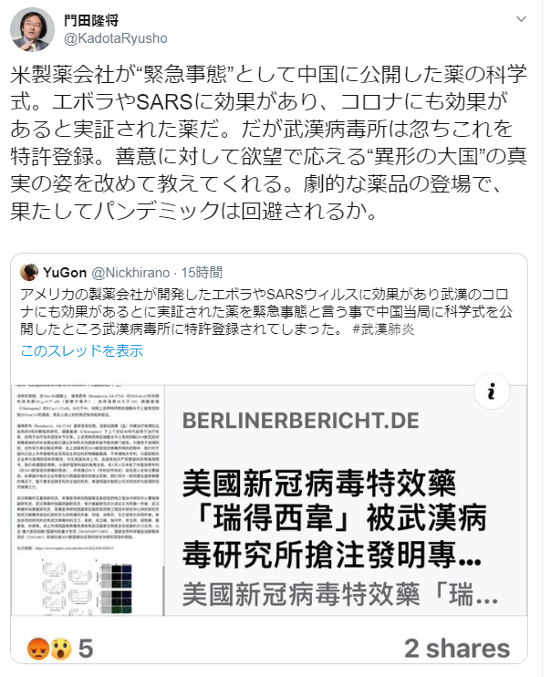

アメリカの製薬会社の薬、武漢病毒研究所に特許申請されてしまうって、タイトルが目立ちますが、また、門田隆将先生の印象操作のデマだそうです。

「[163.comの記事](https://tech.163.com/20/0205/12/F4KF888800097U81.html)(中国語)」によると、武漢病毒研究所の申請した特許は、臨床上で運用する特許権の申請で、薬そのものではありません。

勿論、緊急事態の中、急いでやる部分もあるようだが、同薬は中国では合法的に利用するために、**使用権**を確保しています。

仮に、武漢病毒研究所はその特許を申請しなくても、**同薬の開発会社のギリアド・サイエンシズ社は、使用する特許を申請できません。**臨床試験できないからです。同社も、積極的に中国側と協力しているようだ。

これを利用して、特許権について、あまり詳しくない普通の日本人に向けて、特許を盗むような言い方で、どんな目的か分かるでしょう。  
見た目反中だが、東亜の紛争を図っていることは、本質的には反日の者です。

https://twitter.com/KadotaRyusho/status/1225219463202533376
