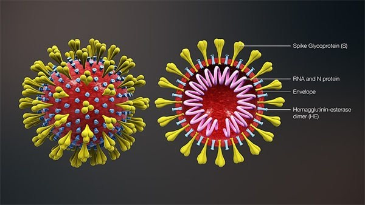
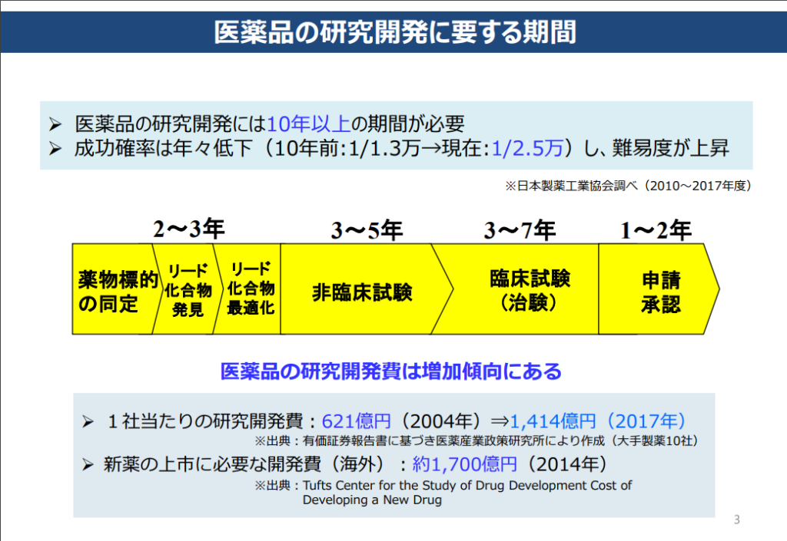

武漢に生物兵器で今の大混乱を興した新型肺炎という説が本当だったら、間違いなく、反人類のテロリストです。個人的に生物兵器と信じたくないが、今までの情報から、客観的に証明されているのではないかと、情報を整理しておきました。

**インド人研究者が武漢肺炎ウイルスの秘密を解明**

インドの学者は、新型コロナウイルス(2019-nCoV)の中には、 HIVのようなウイルスの挿入物（アミノ酸配列）を発見しました。そのような挿入物は、他のコロナウイルスの中から発見されていません。新型コロナウイルスが**人工的に設計され、『偶然ではない』**かもしれないと示唆した。  
英語で論文を発表されています。  
「[Uncanny similarity of unique inserts in the 2019-nCoV spike protein to HIV-1 gp120 and Gag](https://www.biorxiv.org/content/10.1101/2020.01.30.927871v1) 」

2019-nCoVウイルスの感染性はHIVと同じであり、その毒性は依然としてコロナウイルスによって決定される→風邪、インフル並みの毒性とのこと。  
このような巧妙な突然変異は、**自然に発生する可能性がなく、人工的に設計されたものでしかありえない。**また、中国科学院武漢ウイルス学研究所の周鵬氏の研究チームは、その数日前に発表された論文でも、近い事を発見したと述べた。  
**正式発表していないだけで、専門家の中では2019-nCoVウイルスが人造であることは既に知っているようだ。**

<figure>

<figcaption>

コロナウイルス

</figcaption>

</figure>

**抗エイズ（AIDS）薬は有効**

この構造から、抗エイズ薬は有効であると分かって、タイ国のお医者さんは、[インフル・エイズ治療薬で、高齢の患者でも、治癒](https://medical.jiji.com/news/27746)した実績ができています。

**マッチポンプをやるギリアド・サイエンシズ**

薬の開発期間は、[厚生労働省のデータによる](https://www.mhlw.go.jp/content/10801000/000398096.pdf)と、臨床試験の直前までも、5年以上かかるようだ。  
新型肺炎の爆発から、たった1ヶ月過ぎた所で、[ギリアド社は臨床試験向けの薬を出した](https://www.bloomberg.co.jp/news/articles/2020-02-03/Q54SVMDWX2PU01?srnd=cojp-v2)ことは、事前に準備してあることを示している。既存商品だと言っても、非臨床試験でも、通常3年以上かかるもので、緊急だからといって、早くしたとしても、１ヶ月ほどでできるとは想像付かない。

治療薬のRemdesivirを手に入れたら、直ぐ、使用権の特許申請を済んで、臨床試験を開始したことは、 中国もそのギリアド社の仕打ちを分かっている証拠かと思います。

武漢のウィルス研究所から流出した生物兵器の陰謀論が、[全く根拠のないデマであり、米紙ワシントン・タイムズ発](https://www.bbc.com/japanese/features-and-analysis-51290980)のものですが、もし、新型コロナウイルスが人造である仮説が成立したとして、ギリアド社の自作自演、米紙のデマ情報から、新型肺炎が、米国から、中国向けの生物兵器の攻撃だと推論できます。

**新型肺炎でアメリカの貿易戦の継続だ。**

中国経済の新型肺炎の影響について、いくら楽観的に見ても、経済などの悪影響が必ずでます。SARSの時は、GDP成長率はマイナス1%の影響があった、今はどうなるか、まだ分かりません。そして、中国周辺の日本、韓国、東南アジアの影響は更に大きいかと思います。

2年近く続いた貿易戦で、トランプ氏は製造業を本国に戻させようとしても難航だったが、新型肺炎で、武漢という工業の中心地から、アメリカの人材を連れ帰ることは実現できたわけだ。

貿易戦で中国を孤立しようとして中々アホのように見られたが、新型肺炎で実現できた。各国は、何かしらの形で中国と距離を置かざるを得ない状況になっている。

習近平の4月訪日には直接影響することは、日中韓の自由貿易圏に大きく悪影響することだ。  
この混乱な状態は、海洋文明のアメリカの望ましいアジアの状態で、**日本を弱体化しやすい(経済復活し難い)、中国の発展を牽制しやすい**環境であることだ。

**疑う異様はまだある。**

今後、もう一点を注目して欲しいことは、新型肺炎が、基本、中国の漢民族の人しか重症しないことです。  
新型コロナウイルスは、ゲノム操作で、中国人しか重症しいように設計された可能性も高いです。  
重症と死亡の人は、中国人がメインであることと、中国以外、重症がすくない、又は、重症になっても、基本、治癒することです。因みに、今の集計結果では、この傾向に進んでいるようです。

新型コロナウイルスはアメリカの生物兵器だと信じたくないが、今の情報はその結果に導いています。  
反論になるようなものがありましたら、是非、教えていただければと思います。

**補足：**

https://twitter.com/info\_nbd/status/1233325026633379841?s=20
