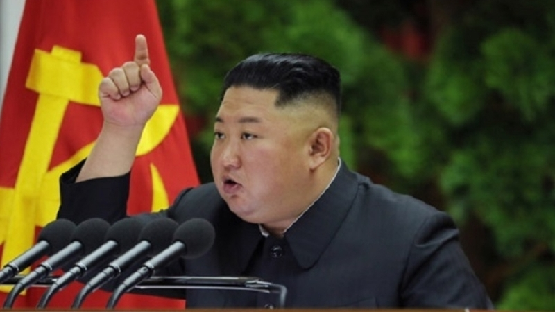
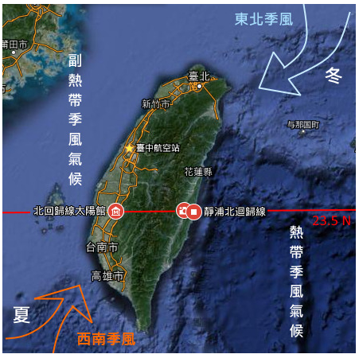

新型コロナ流行の前後、朝鮮の異動は非常に多く、台湾海峡戦争に近くなってると疑っています。以下は、疑いの根拠を紹介します。

朝鮮の異動：  
1．[1/23：観光客受け入れ停止](https://www.nikkei.com/article/DGXMZO54688220S0A120C2MM0000/)  
2．[1/28：中国との鉄道、飛行機など(貿易)の全面停止](https://news.livedoor.com/article/detail/17741378/)  
3．[2/8：軍事パレードがないのに軍を大規模集結](https://news.yahoo.co.jp/byline/kohyoungki/20200210-00162327/)  
朝鮮は中国東北と隣接して、新型コロナの重い地区ではない。且つ、朝鮮へ観光に行く人は、殆ど中国東北のひとで、停止と宣言したタイミングがちょっと早いというか、必要ないでは？ぐらいです。  
過去事例があったとしても、貿易全面中止ことは、中国からの支援がなくなること？  
更に、軍を大規模集結する事は、何かしらのことを備えているように見えます。新型コロナでしょうと推測する人がいるが、私は別の観点を持っています。

- 朝鮮は経済の発展するには、中国と同じように、改革開放が必要だが、その前に、平和な環境を保つために、武力の強さを何かしらの方法で示す必要がある。  
    (中国はベトナムとの戦争だった)
- 観光客受け入れ停止→鉄道、飛行機など全面停止ことは、通常の人員だけではなく、朝鮮で情報を収集するスパイも足止めになる。
- 「[中朝友好協力相互援助条約](https://ja.wikipedia.org/wiki/%E4%B8%AD%E6%9C%9D%E5%8F%8B%E5%A5%BD%E5%8D%94%E5%8A%9B%E7%9B%B8%E4%BA%92%E6%8F%B4%E5%8A%A9%E6%9D%A1%E7%B4%84)」があるので、独立と宣言蔡英文政権と戦争が起こった場合、朝鮮も自動参戦になる。
- 台湾海峡で戦争をやることは、朝鮮半島に戦火が届かなずに、武力を示せる。

朝鮮軍を台湾海峡の統一戦争に投入する事は、中国にもメリットがある。

- 接近戦を避けることで、
    - 本土へ戦火のリスクをある程度抑える？
    - 奪還後の世論の回復に有利？
- 戦争の泥沼に陥るリスクを抑える。
- 中国軍の損傷を抑え、アメリカの参戦、ロシアの参入リスクを抑える。

あり得る？その考えが飛びすぎるか？と思われる方もいると思いますが、朝鮮志願軍にすればよいです。  
朝鮮戦争の時、中国志願軍と同じように、朝鮮志願軍を派遣すれば、台湾政権と宣戦する必要もない。  
ウクライナ紛争等では、ロシアの志願軍はよく活躍しています。中国と朝鮮はロシアから現代の志願軍のやり方を学べばよいです。

勿論、本当に戦争になる場合、どうやるかわかりませんが、一つの選択肢としてあり得るかと思います。

**新型コロナ後の世界は戦争が必要？**

中国の経済活動が冷え込むことで、原油価格は下落させざるを得なく、世界の消費活動一気に冷え込むことでしょう。  
台湾海峡の戦争があれば、中国軍備により、GDP成長、原油価格の上昇につなげるでしょう。  
更に、台湾の軍備増強は米の製造業の注文が増えるでしょう。日本の観光業は必ず影響受けるが、米国の製造業を本国へ取り戻すこと、日本の製造業の注文も増えるでしょう。

勿論、金正恩は戦争で軍事力を育てられる、中国共産党と台湾政権、両方から多大な利益を吸い上げるチャンスでもある。

戦争の投入は膨大になるので、台湾海峡の統一戦争で、世界経済を一気に復活できるかと思います。しかも、島なので、泥沼化になっても、その島に限る範囲で、事態の拡大を抑えやすい。やる最中でも米中間の新たな利益交換などの遣り取りは可能でしょう。

**中国に何故台湾海峡の統一戦争が必要？**

- 絶力反中政権の台湾が、中国にとって、リスクが大きい
- 国の統一、民族の繁栄をスローガンとする中共政権は、台湾の独立を許せない
- 現状維持するには、膨大なコストが更に高まっている
- 中国は世界一になる時、今のアメリカと同様、色んな反対勢力の矛先になるので、台湾問題を解決しようとしたら、更にリスクが高くなる
- 中東で利益を争っているアメリカは、アジアに分身する力が限られる
- 軍備の需要で新型コロナの経済への影響を無くす？更に高成長をはかるか？
- アメリカとの関係は既に最悪の所まで悪化した。核保有国は直接戦争しないので、これ以上の悪化を心配不要
- 新型コロナで既にアメリカ主導の各国に孤立されている。戦争で孤立される心配不要

**もし、やるとしたら時期的には？**

4月の可能性が高ではないかと思います。5月頃まで、北側からのモンスーンがあるので、上陸にしやすい。  
5/20の総選挙もあるので、その前に現政権を倒すのも良いタイミングではないかと思います。

<figure>

<figcaption>

台湾の気候、**5月頃まで、北側からのモンスーンがある**

</figcaption>

</figure>

4月、習近平の訪日もなくなったので、国内の事に専念しても良いかと思います。台湾の統一は、今のところ、歴史上、内外環境のどちらも、非常によいタイミングであるので、見逃し日欲しくないです。

**まとめ**

武力で得られない利権は、平和な手段で得られると望む事自体は勘違いであり、今まで平和な手段で台湾と統一ための努力は全て失敗した事正式に認めなくてはならない。  
中国の崛起はいくら牽制しても、止められない。 中国は一歩踏み出すべきの時は来たでしょう。

新型コロナは中国での爆発以降、アメリカ、台湾は敢えてこの時期で挑発行為は多い。今だからこそ、強硬な姿を見せるべきでしょう。
