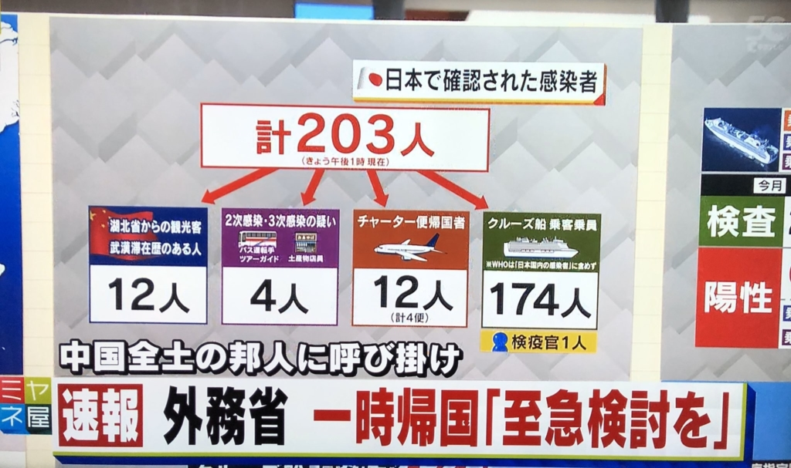

新型コロナウイルス(新型肺炎)を、大規模で制するために、有効な方法は人の動きを止める事で、今の中国全土ではやっていることです。今の所、滞在邦人は大規模で帰国したら、日本でも新型コロナウイルスは拡散する最悪なシナリオになるのか？  
ウイルスは国籍を知らないので、日本人だから中国で感染しない事がまず有り得ない。賢明な対策としては、よほどな理由ない限り、中国滞在中の日本人は、現地の政府に従って、自主隔離すべきでしょう。

[外務省の一時帰国と至急検討ください](https://www.anzen.mofa.go.jp/info/pcspotinfo_2020C027.html)の周知で、中国滞在中の日本人は一気に帰国したら、間違いなく、新型コロナウイルスは、日本でも拡散するのではないかと懸念します。

<figure>

<figcaption>

観光客よりの感染人数16に対して、チャーター便、クルーズ船の感染者数186人

</figcaption>

</figure>

現時点、日本の感染者数が計203人、観光客などで本当に中国人からの感染が、十数人しかいません。それ以外、武漢から直接帰国した邦人と、検疫(防備)の甘いクルーズ船です。今の所、日本患者数がカウントアップしても、実質的に、新型コロナウイルスが日本外に遮断されているが、邦人は大規模で帰国したら、話は別になります。

中国滞在邦人は10万以上います。仮に十分の一でも、大規模で帰国になり、**日本の医療機関はそこまで対応しきれない訳だ。**[一般病床でも対応可能するように、厚労省は周知](https://www.nikkei.com/article/DGXMZO55499000R10C20A2CZ8000/)していますが、個人的には不安を招くだけに見えます。[チャーター機で帰国した埼玉の男性は、自宅待機で新型コロナウイルスの感染を発見した](https://www.fukuishimbun.co.jp/articles/-/1027648)件から、医療機関の無力さを見えるのではないかと思います。  
今は、やっと、[中国で収束に向かえるように希望を見えているところ](https://blog.loveapple.cn/news/202001221766.html)、滞在邦人は一斉に帰国しようとして、間違いなく、日本でも本気で拡散するでしょう。

国として国民を守る気持ち、日本としての誇りを分かるが、  
感染病を拡散して、中国との明暗を分けることは本当にやめて欲しいです。  
今時、邦人の一時帰国は、日本でも新型肺炎を拡散させる決定になるのではないかと思います。

4、5月で日本で新型肺炎が流行ったら、オリンピックは本当に大丈夫？

**補足：**

日本国内各勢力の闘争の結果だとしたら、制御範疇内の感染は求めるかもしれません。  
親中派閥を攻撃するための準備かもしれません。

https://twitter.com/pandypandy0513/status/1227392651189571585?s=20
