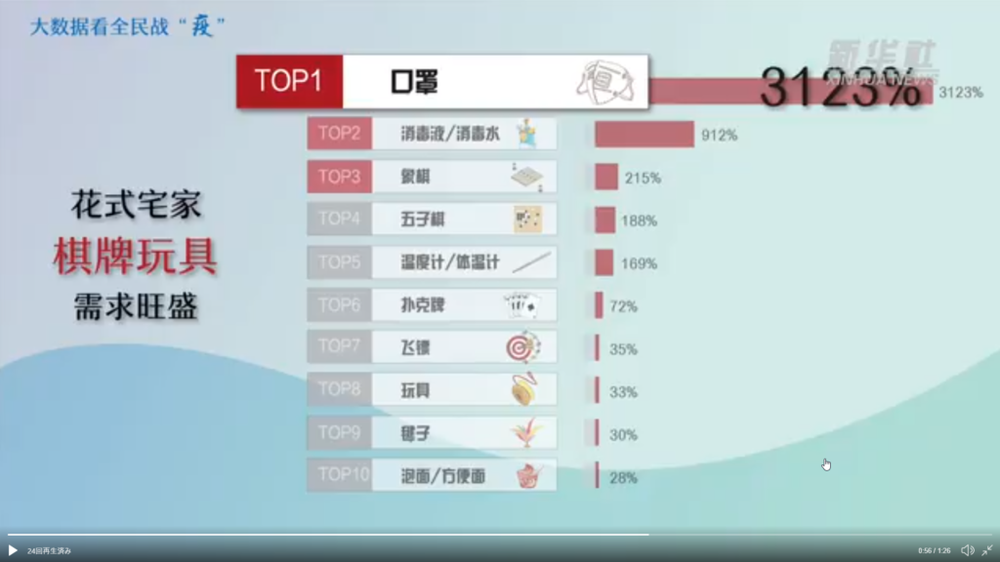

当たり前の結果でもあるが、こちらの想定通り、中国マーケットの需要は好調です。  
関連記事：[新型コロナウィルス(新型肺炎)、中国経済の影響は楽観的だが、隣国は致命的かも](https://blog.loveapple.cn/news/202001282091.html)

以下は、新華社通信より、新型肺炎、流行期間中の統計結果となります。

**飲食関連、宅配成長TOP10**

**冷凍食品成長：614%**

**ペット用食品成長：499%**

**医薬品関連の成長：286%**

**その他飲食関連の売上も急成長**

**小売りの売上TOP10**

**マスクの売上成長：3123%**

**消毒液関連の売上成長：912%**

**それ以外はシャンチーなど娯楽用品の売上も高成長**

**外食の宅配の割合は、新型肺炎の流行前、住宅街の割合は50%⇒84%成長、病院向けは3%⇒7.1%成長**

