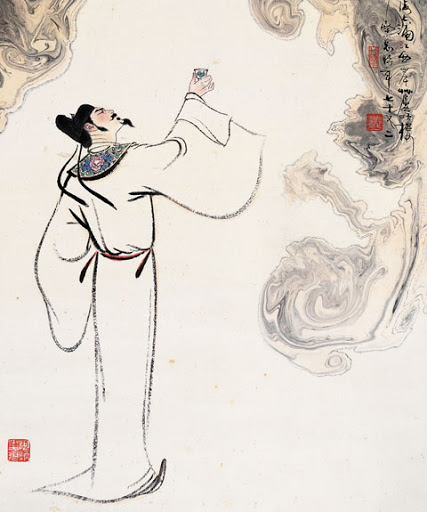

子夜吴歌·秋歌  
长安一片月，万户捣衣声。  
秋风吹不尽，总是玉关情。  
何日平胡虏，良人罢远征。

**「子夜吴歌·秋歌」**  
東晋の世、今の浙江地方当たり、「子夜」という女性が作った歌は、「子夜歌」と言います。呉の地域なので、「子夜吴歌」とも言われています。一年の四季を歌う歌と構成されるので、「子夜四時歌」とも言われています。「子夜吴歌·秋歌」が四季の歌の中の秋歌と表します。

**「长安一片月，万户捣衣声。」**  
月が昇って、夜になり、静かな町では、砧(きぬた)で布をたたく声が聞こえるよう。  
今はアイロン、昔、砧で布を叩いて、衣類を整える。  
月のある、きれいな夜では、他の家では夫のために衣類を整える声を聞こえるようにして、自分だけに一人ぼっちという風景だ。

**「秋风吹不尽，总是玉关情。」**  
秋の風が吹いて尽きず、玉門関にいる夫を思う、寂しい妻の心が尽くさない。

**「何日平胡虏，良人罢远征。」**  
いつか胡慮の乱が収束するだろう、貴方は遠征をやめて傍にいてくれるだろう。

日本語も同じだと思いますが、中国は詩歌で感情を表すことは良くあると思います。昨日、親戚の若い弟(薬剤師)が新型肺炎疑似感染者の隔離施設の中で、消毒薬散布後の写真を見せてくれた。  
いつもデータやニュースを見て、悲しく感じても、知っている人は現場で戦っている姿を見ると、やはり、心の中は複雑です。

今日は唐詩を検索したら、何故かこの「子夜呉歌」が一番上にヒットしたので、こちらなりの解釈で、訳しました。  
戦場に向かって、危険と直面する人は沢山いるこそ、我々は平和な環境で暮らせるのです。今は、中国だけではなく、日本の医療従事者も、日本に生活している人々を守るために、感染病と戦っています。

最後の**「何日平胡虏，良人罢远征。」**を感染病と戦っている皆さんと家族へ！  
一日も早く収束して正常に戻すよう、祈ります。

参考： [https://kanbun.info/syubu/toushisen004.html](https://kanbun.info/syubu/toushisen004.html)
