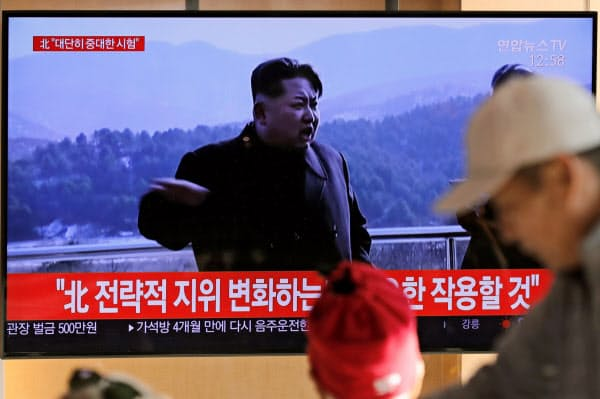

北朝鮮は８日、東倉里の西海衛星発射場で「非常に重要な」実験に成功したと発表した。北朝鮮国営の朝鮮中央通信（ＫＣＮＡ）は、「大きな意義のある実験の成功」を報じました。その本当の意味と、近い見えそうな未来を勝手に予測してみます。

西海衛星発射場はロケットや、ミサイルを発射する所で、核も既に持っているし、半島は勿論、中露日も攻撃の範囲内にあるし、今更 「大きな意義のある実験の成功」 と強調する事は、それ以外、アメリカにも脅威を与える事かと思います。  
然も、核を長距離ミサイルに積んで、アメリカ本土への攻撃は実現できる事を指してるかと思います。  
最近、トランプより、駐日、駐韓の米軍費用の向上の要求にあわせて、この情報は、アメリカのスパイ機関は、大分前から握ったかと思います。 駐日、駐韓 の米軍の費用について、トランプは勝手に決められるものではなく、プロの作業員達は色々リスクを予測した結果を、大統領の身分で発表しただけです。今まで、北朝鮮は有事になったとしても、戦争は韓国、せめて日本の一部まで留めるが、これから、有事になった場合、アメリカまで、核攻撃も予想できるでしょう。

ここまでみた多くの日本人の観点では、戦争に近づいたやばい状況だと見受けるかもしれませんが、私の観点は、これから、東アジアの本当の平和の時代を迎えると見受けしております。  
核を持つ国家間は大規模な戦争をしないからです。且つ、侵略されません。勿論、アメリカは北朝鮮を全滅すれば別だが、バックに中露が立てるから、無理でしょう。

日本マスコミ漬け込まれた方々は、金正恩のことを邪悪しか見えないかもしれませんが、政権の維持＝社会安定の維持ですから、北朝鮮の国民の安定な生活のために、色々せざるを得ないでしょう。  
イラク、リビア等を見えれば分かると思いますが、北朝鮮は民主になったら、国民は今より悲惨になるわけです。戦力となる核を持って真の平和を得るこそ、飛躍な未来があります。

こちらは2020年以降、確率高い順で予想してみます。  
①アメリカの対北朝鮮政策は強硬→協力。武力対立主軸→貿易  
②米軍は韓国から撤退  
③中国の台湾統一  
④米軍は沖縄から撤退  
日韓は高くなった米軍の費用を認める可能性もあるが、アメリカを自国から追い出し、平和主軸で東亜諸国との関係を維持するのが、有利だと思います。  
安倍政権の改憲の最終目的の一つも、駐日米軍を追い出す事かと思います。アメリカの国益を守る米軍に高額な費用を払い続けるより、健全な軍需産業を発展すべきでしょう。

最後に安倍内閣支持率についてです。  
日中友好、改憲で真の独立を目指す、これら安倍政権の推進していることは、アメリカにとって非常に都合が悪いでしょう。日本の反社会的勢力の団体は、政界と同じく、元々財閥と密に関係するというか、操られるものです。今更、プールの写真など公開されることは、通常の記者はできるのでしょうか？安倍を反するアメリカ勢力しかないかと思います。
