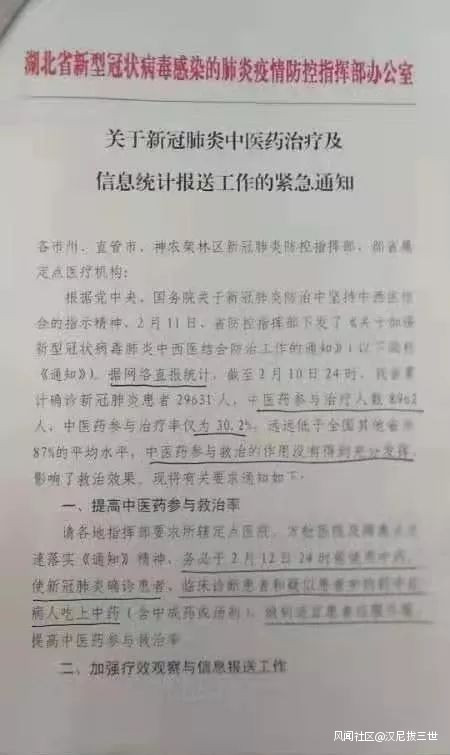
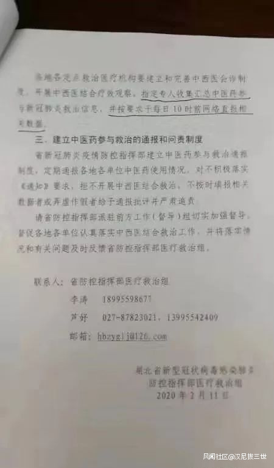

新型コロナウイルス(新型肺炎)の状況を見る方は分かると思いますが、湖北の致死率が他の地方より遥かに高いです。  
初期の情報隠蔽などもあるが、 内部の文書によると、 今の段階、要因の一つは中医(漢方医)を軽視してたらしいです。

湖北以外、中医のやり方で治療することは当たり前だそうで、湖北は中医の使用率は30.2%だけで、2月10日から、改善すると命じられたようです。  
中医を使う事は、SARSの時代からの経験であり、中医で治療したSARS患者の全員治癒した実績があったようだ。

- 
    
- 
