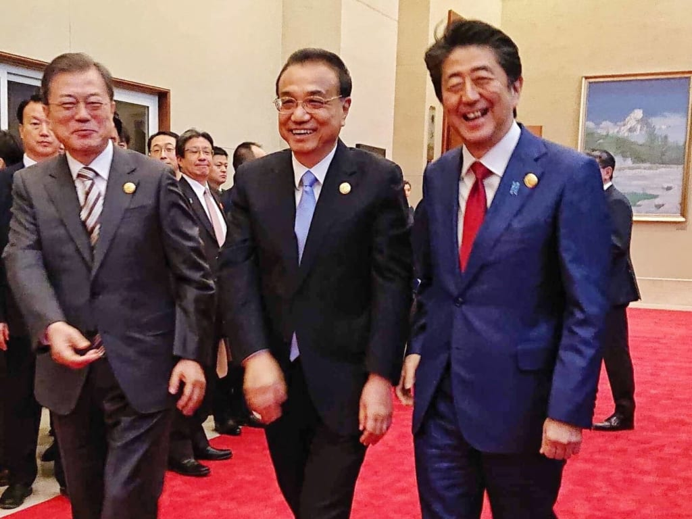

安倍総理は極右の政治人物として、中国では知られています。旧暦新年のあいさつから、今の新型肺炎の対応まで、七、八年前、日中関係の氷河期と比べて、全く想像できない状況でしょう。  
安倍政権は、何故、こんなに親中になったか？

根本原因は一つだけ、RCEPです。  
(Regional Comprehensive Economic Partnership/東アジア地域包括的経済連携)

<figure>

<figcaption>

RCEP(Regional Comprehensive Economic Partnership/東アジア地域包括的経済連携)

</figcaption>

</figure>

新型肺炎のため、中国の工場が生産に追いつかず、日本で、週に1億枚生産するって、ワイワイする奴も多いようだが、残念だけど、日本は付加価値の低いマスクの生産地になったら、日本製は本当にバカになるだけだ。  
今は特別な時期だから、一時的に日本生産だけで、本来、日本製造業のあるべき姿は、付加価値の高い、ハイテックのものです。

上の図、RCEPのメンバーを見てください。ハイテック製品の生産地は日本だけです。  
RCEPが成立すれば、ほぼ関税なしで、日本製のハイテック商品は、中国の市場を制覇することは間違いない。  
関税なしだから、欧米の製品より、同レベルでも価格安く提供できることで、膨大な利益を齎せるのだ。

勿論、東南アジアも発展して、新たな成長を期待できるから、中国、東南アジアまで、日本製の新たな活躍は期待できるでしょう。これは日本の長期不況から脱出の道であると分かったら、何故、今の安倍政権は親中するのか、理解できるでしょう。

習近平の国賓来日、武漢、各地方の支援、全て、長期不況から脱出ための下準備と分かったら、まだ、反対できますか？

新型コロナの乱は必ず鎮静する。中国の新興マーケットの存在は消えない。  
日本も中国も、必ず新たな未来に向かえる。勿論、RCEPは成立できれば、日本の製造業だけではなく、貿易拠点としても、非常に重要な位置になります。  
製造業のみならず、貿易、観光、小売り等々、あらゆる産業は高成長は見込めるでしょう。

長期不況を継続させるか、脱出させるか、全ての日本人に関わる未来である。  
イギリスはブレグジットでGDP成長0を実現したことをみて、日本も長期不況を継続させる可能性はゼロではないと、警鐘を鳴らしたいと思います。
