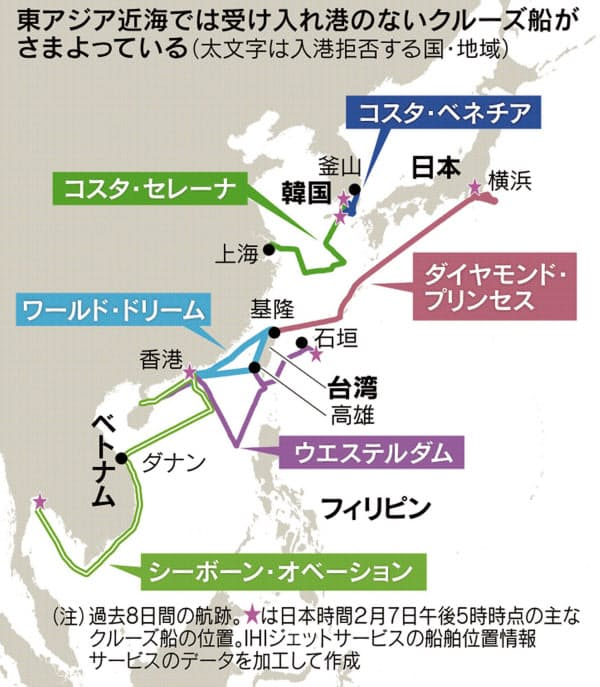

台湾のクルーズ船から降りた人の検疫対応から、「[中国本土より、台湾も危険？！](https://blog.loveapple.cn/news/202002173608.html)」と記事を作成しました。もうちょっと、調べたら、台湾全島、日本以上、武漢以下(？)ではないかと思います。

前回は、スーパースター・アクエリアス号で取り上げたが、ダイヤモンド・プリンセス号のルートを確認しましょう。

<figure>

<figcaption>

日本で大騒ぎしたダイヤモンド・プリンセス号が台湾からだ(日本経済新聞)

</figcaption>

</figure>

あわせて、日経新聞の記事をご覧になっていただければと思います。観点が異なるが、ダイヤモンド・プリンセス号のルートを確認しましょう。現時点(2/18 10:40)、 既に日本に入国した人を除いても、ダイヤモンド・プリンセス号の新型肺炎感染者数が454人となっています。これは全て台湾から?(経由？)の感染です。

今まで、台湾のクルーズ船から降りた人に対して、検疫だけで、感染者ないと示して、検査がしないようで、実質的に情報隠蔽していることは確実です。

2月16日、台湾保健局は、2月15日、[新型肺炎のため、60代の男性が死亡した](https://www3.nhk.or.jp/news/html/20200216/k10012288271000.html)と発表しました。  
同男性は、台湾中部の運転手で、1月27日に入院して、治療を受けて、15日で死亡した。  
　・海外の渡航履歴なし  
　・感染者との接触がなし  
　・クルーズ船の止まる港キールン港、台北と離れている中部  
　・同居の50代家族感染確認  
新型コロナウイルスの潜伏期間最大14日で計算すると、1月13日～1月27日の間でも、市中感染が進んでいたと言えるでしょう。

日本でも市中感染が広がり始めているが、政府側から情報共有、対策は素早く手を打て初めているので、あまり酷くなることはないと見ても良いかと思います。更に中国と密に連携することで、課題が多いとはいえ、楽観的に見ても良いのではないかと見受けています。

かわりに、台湾を見ると、何も明らかになっていない様から、更にマスクなど物資不足、中国側との協力拒否から、かなり酷く進んでいるとしか見えません。台湾と武漢の違いとしては、即で倒れた映像がネットに流されていないだけです。

一つの説は、新型コロナウイルスで、台湾政権を麻痺させ、中国共産党政権は、そのまま台湾を受け取ると言っています。１ヶ月前から、この説について、冗談だとしか見えないが、最近、アメリカ、台湾政権の強硬な対応と、今の状況の発展からみると、ありではないかとしか思えない。

いつの時代でも、大きな変動があるとき、かわいそうなのは、庶民だけです。この先の１、２ヶ月先の台湾島はどうなるのか、正直、想像しなくない。反中であろうじゃなかろう関係なく、皆さんのご健康を祈ります。

**補足：**

https://twitter.com/EARL\_Med\_Tw/status/1229717945791631362?s=20

**航路についての追記：**

こちらの記事「[【コロナウイルス】ダイヤモンドプリンセスの航路や寄港地は？鹿児島バスツアーのルートも](https://amate-ssno.fun/cruise-kouro/)」詳しく記載されています。  
寄港地は**横浜／鹿児島／香港／ベトナム・チャンメイ／ベトナム・カイラン／台湾基隆／那覇**、全て予定通りだそうです。  
香港の男性の発症から、確認されたようです。  
こちらの想定、香港(政府がほぼ麻痺され)、台湾(情報隠蔽)、一番危ない所です。

**追記：**  
こちらの想定通り、台湾が既に市中感染とアメリカCDCも正式発表  
「[米CDC、台湾を「明らかな市中感染発生渡航先」に指定 蔡総統が反論](http://japan.cna.com.tw/news/apol/202002200010.aspx)」  
蔡英文政府の情報隠蔽により、武漢よりひどい状況に悪化すると見込みます。
