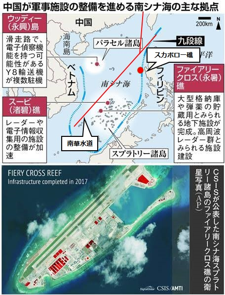

日本では一帯一路の戦略の根本的な所を触る記事が少ない。 一帯一路の本質を知りたい方は、是非、こちらの記事をご覧になり、ご意見をいただければと思います。

上海協力機構の時代から、一帯一路まで、貧しい国々の集まりとして日本マスコミは基本、否定的な論述が主流でした。マスコミは戦略的な視点から説明できないので、当サイトはその不足な所を埋めようとして、一帯一路の戦略を理解するーー海上編を作成しました。  
まだ見られていない方は、是非、[その一](https://blog.loveapple.cn/politics/national-strategy/2019120379.html)、[その二](https://blog.loveapple.cn/politics/national-strategy/20191204109.html)、[その三](https://blog.loveapple.cn/politics/national-strategy/20191205200.html)、一通り目を通して頂ければと思います。

海上編の一帯一路は南シナ海中心である前提を、三回で分けて、その重要性を説明しました。ヒラリー曰く、中国は磁器の皿などで主権を主張するが、我々アメリカは南シナ海で軍を配備して、支配するから、中国は無力だ。アメリカは空母を派遣し、シンガポール、ベトナム等の港を利用して、南シナ海での軍事力を配備してるが、中国は南シナ海で基準高い大型空港の建設、そして、海南で潜水艦、空母の港を建築することで対抗路線にして、アメリカ以上の軍事力を南シナ海に配備しています。

<figure>

<figcaption>

中国は南華水道中心に  
軍事基地を展開

</figcaption>

</figure>

南華水道を中心に軍事基地を展開して、中国は南シナ海を実に制する事を実現し、特に日本の殆どの石油、貿易の通路は中国に制されます。

中国は曽てのアメリカと同様、実力で南シナ海を制するが、東南アジア諸国に協力してもらう姿勢で対応して、実質的なwinwin関係を求める事がアメリカと根本的な違いでしょう。例えば、マレーシアの反中政権は当選したにも関わらず、中国と協力する方向で高速鉄道の建設等を進んでいます。2022年、フィリピンの選挙で、仮に親米系の政権が当選したとしても、中国と協力的な姿勢が主軸ではないかと思います。

今まで、日本は台湾の独立を支持してきた理由はシンプルです。日本の生存に関わる南シナ海を中国共産党政権からの影響を薄めたいからです。仮に、台湾政権が日本に支持されたきっかけで独立したとしても、南華水道がなければ、今の日本には意味がありません。  
親中路線は別の意味でいうと、欧亜大陸の世界一のマーケットを手にするでしょう。中国と対立する事は、欧亜大陸のマーケットを捨てる事で、アメリカ大陸はそのギャップを代替できません。インドもあるかと疑問される方はいると思いますが、結論から言うと、南シナ海を制する中国に通路が握られているもので、変わりません。 詳しいについて、別途、インド太平洋戦略について議論したいと思います。

南シナ海を制しようとして、最終的に中国勢力が強くなり、アメリカの勢力は圧縮され、日本、グアムあたりに縮めることになります。中米勢力の中間地代の台湾、2020年はどうなるか要注意でしょう。  
但し、 スカボロー礁がまだ未完成では？  
このスカボロー礁が最終的なポイントです。スカボロー礁に空港が立てられた時点から、アメリカの勢力は南シナ海から、ほぼ排除される状態になるでしょう。  
中国は敢えてスカボロー礁の建設を遅らせて、アメリカと利益の競争や、交換などを行っている最中で、勿論、台湾の独立、香港の騒動、新疆問題、全て関わるでしょう。(正確に言うと、アメリカにとって、スカボロー礁はの空港が完成できれば、太平洋とインド洋の繋がりが切断されることになり、アメリカのコア利益に関わる所です。ここが米中の決戦になる所といってもよいかと思います。まだ、そこまで対立する必要もない、実力も足りない。)

これらについて安倍政権は全て看破し、親中政策、改憲を進めようとしているかと思います。今、日本中の反安倍政権の声がなんと一致しすぎて、その原因は反戦、自由や民主等、シンプルではないと思います。アメリカは日本の勢力を確保として安倍政権を倒そうという風に見受けています。(因みに、反戦の論調が特に怪しいでは？)

突然ですが、日欧米に関連する世界の情勢を分析する時、この世界は有数な膨大な財閥に操られることを意識してください。私は、「産業財閥」と「金融財閥」として、乱暴、且つ、勝手にまとめます。  
両財閥は利益の最大化を求めるために、世界の政界、マスコミを操る所が同じだが、グローバル化を反対と賛成するのが、大きな差です。今のトランプ政権はグローバル化を反対する産業財閥に主導されていると思われます。  
「 アメリカは日本の勢力を確保として安倍政権を倒そう 」等、今までの論述は、財閥の事を読み替えていただいても良いかと思います。

一帯一路の海上編は、日本の大東亜共栄圏と近い事をやろうとしているのではないかと思います。  
但し、中国は「 戦わずして敵を屈服させる 」で、戦争、侵略、植民地、民族同化は基本なしで、アジアの諸国とwinwin関係を築き、共に発展していく道を探っています。どの時代でも世界のTOPに立つ日本はこの歴史的な機会を見逃すべきではありません。

一帯一路の戦略を理解するーー海上編はこれをもって一旦終了させていただきます。  
次回から、陸上編の展開をさせていただきます。[twitter](https://twitter.com/loveapple)などでの議論は歓迎です。
