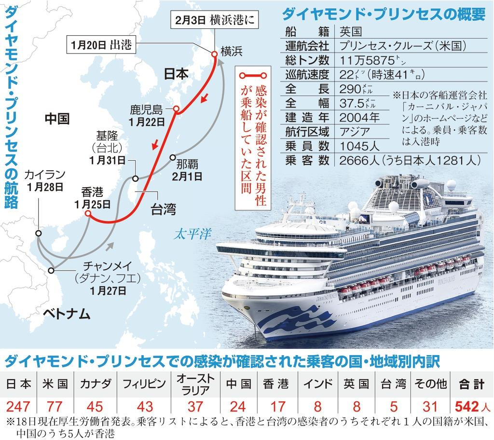
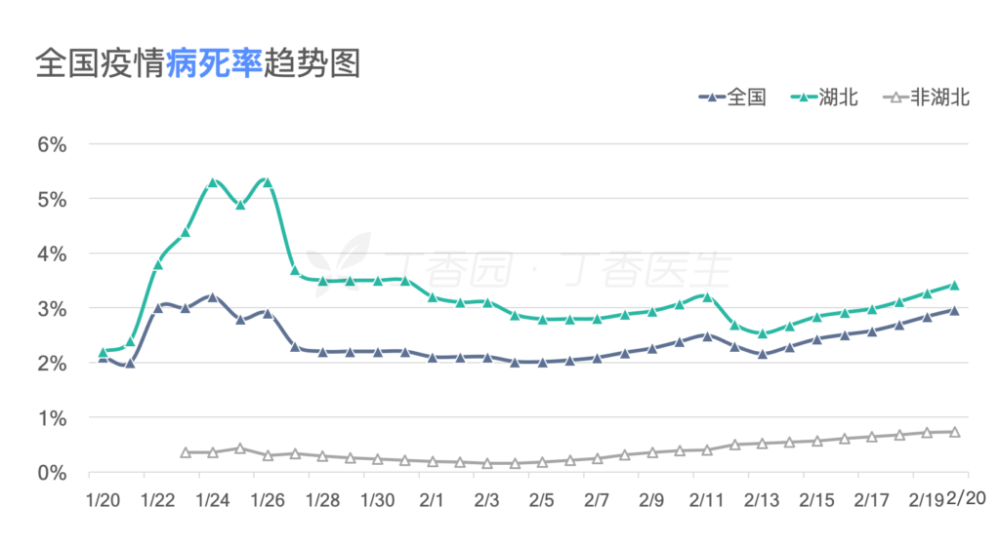
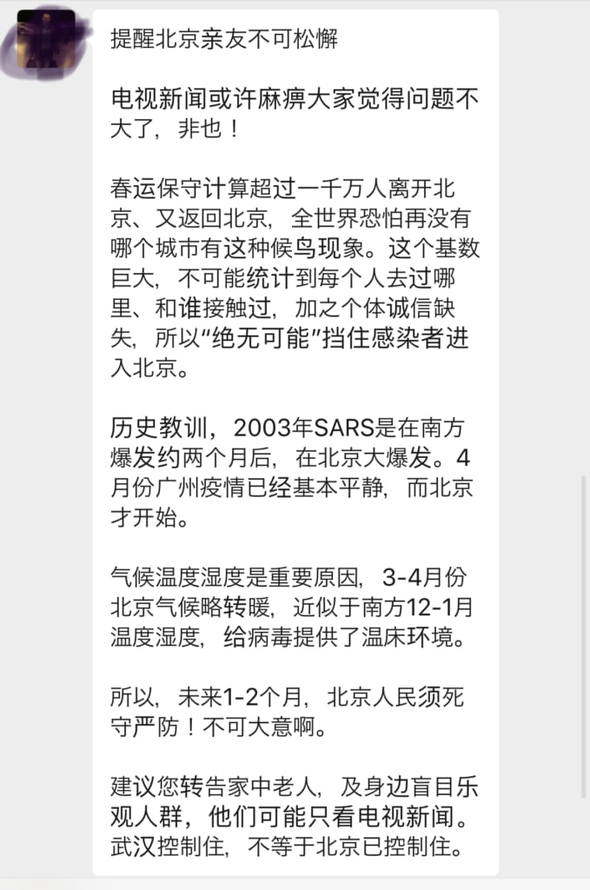

この記事を書いているところで、[北海道では、小学生の感染者がいたと報じられています](https://news.yahoo.co.jp/pickup/6351834)。間違いなく、市中感染は進んでいるでしょう。左右、与野党関係なく、厳重さを再認識する自覚がなく、根本的な所から、問題点を掴まず、政治利益で揉め続けると、もう、中国人の入国禁止ところか、日本人出国制限を検討した方が良いかもしれません。

**新型コロナの主な輸入元はチャーター機とクルーズ船だ**

厚労省の2月20日12:00までの情報(※)だと、国内の累計患者数の84人の内、72人はチャーター便で入国した人です。クルーズ船のダイヤモンド・プリンセス号では、621名の感染者を確認しています。これらの感染者は全て日本の感染者として集計しないかもしれないが、全て日本で治療を受けます。

中国人の入国禁止を謳う人は厚労省の情報を見てるかどうか分からないが、その人達主張する事は、まさに1x%の入り口を封じて、80%以上の所を自由に拡散しろうと言ってる事です。しかも、市中感染が広がっている今現在、全く関係ない所で揉めて、限られた政府のリソースを無駄に消耗するだけで、国民に無益なわけです。

※[新型コロナウイルス感染症の現在の状況と厚生労働省の対応について（令和２年２月20日版）](https://www.mhlw.go.jp/stf/newpage_09670.html)

<figure>

<figcaption>

[【新型肺炎】クルーズ船対応にルールなし　船籍国・英政府の動き見えず](https://www.sankei.com/images/news/200218/lif2002180034-p1.jpg)

</figcaption>

</figure>

国内の主流専門家の判断で、クルーズ船から降りた人達、検査結果で陰性であれば問題ないだろうが、実に、この帰宅した人達は、また、陽性になり、日本中で感染を拡大するでしょう。  
中国からの公開情報もあるし、クルーズ船の[オーストラリア人、帰国後陽性に転じる](https://www.fnn.jp/posts/00432569CX/202002211212_CX_CX)ケースが既にあるからです。

市中感染し始めている日本、これから、クルーズ船から降りた人は日本各地へ行くことで、更に、感染を悪化させる可能性が非常に高いではないかと思います。北京のサーズの経験から、3、４月の暖かくなる時期は、ウイルスの猛威が発揮する所を見ると、これからの3ケ月間、沖縄、鹿子島など熱い所を除き、日本の状況はかなり厳しくなると見込みます。

但し、政府を非難しても意味がない。日本政府はダメではなく、法的にクルーズ船から降りた人達は解散せざるを得ないだそうです。(※)

※関連記事：[ダイヤモンド・プリンセス号からの下船は日本の心が大きいからではなくやむを得ずの対応―中国メディア](https://www.recordchina.co.jp/b780027-s0-c30-d0062.html?utm_source=google)

**とにかく外出の自制を！**

今時こそ、我々庶民の無力さを感じます。新型コロナは誰も見たことないもので、政府も専門家たちのアドバイスに従って動くしかありません。日本は日本の法律があるので、政府は責任の重い側で、〇国は△をやったから日本もやることは、まずありえないでしょう。

政府を非難するより、自ら、外出の自制をできる限り尽くしましょう。できる限り、人の集まるところにいかないこと。こちらは、中国の過去2ヶ月と、サーズの時の経験です。  
日本政府は中国のように強制することが難しいこそ、厚労省、首相官邸の情報を随時チェックして、協力するべきです。  
ウイルスはイデオロギーがないので、民主国家だからパンデミックしない事がありえない。 2009年、アメリカはH1N1インフルエンザを世界に広げたアンチパターンがあります。

今の中国が日本や、欧米より情報は開示しているはずです。新型肺炎対策、先取りしたければ、中国からの情報も確認して無難でしょう。

**インフルよりちょっと重いだが、インフル自体が危険な訳**

新型肺炎がちょっと重いインフルの見解は間違いないと思います。  
但し、1000万人口の武漢の医療機関がパンクしたら、全国からの支援が受けられます。病棟が足りなければ、十数日間で、あっちこっちで大型専門病院が整えます。日本は？

<figure>

<figcaption>

中国全土、湖北、湖北以外の新型肺炎の致死率推移

</figcaption>

</figure>

医療のリソースが十分であれば、新型肺炎の致死率は最初からも1%以下を維持して、H1N1等、季節性インフルエンザより低い水準だそうです。但し、医療リソースの限界をを越えた湖北では、5%を越えた所です。日本だったらどうなるか？分かりません。既に3人の死者が出ています。

インフルよりちょっと重い病気とは、ちゃんと治療を受けられる環境ならば、基本、かかっても心配しなくてもよいですが、日本の医療リソースが圧迫され、全ての人をちゃんと治療できない状況になったら、インフル並みでも、沢山の死者ができます。

2019年末から、アメリカで流行っているインフルを見れば分かります。ワクチン、特効薬はある上、数千万人は感染、1万人以上死亡になり、この数が、まだ、増加中です。ちゃんと治療できなければ、どうなるか、想像しなくても、悲惨な状況になると分かるかと思います。

**まとめ**

中国人、外国人のヘイトを煽る人達、安倍政権を非難する人達、岩田先生の動画を広げる有名なマスコミ、全て政治利益で動いているものです。  
こちらでいい加減にしろうと呼んでも、意味がありません。

私の読者の皆さんだけに、注意を促したい。

<figure>

<figcaption>

北京市民の中、SNSが流している情報

</figcaption>

</figure>

北京の友人からもらったSNS内流している情報ですが、この先の2ヶ月ぐらいは、非常に危険です。

引き続き、不要不急の出掛はやめましょう。  
手洗い、エチケット、うがいなどを尽くしましょう。

北京の同じ緯度の東京も、これから、新型肺炎の流行りやすい時期かもしれません。  
もう、冗談ではなく、真面目な話です。この先の日本は、もう笑えません。
