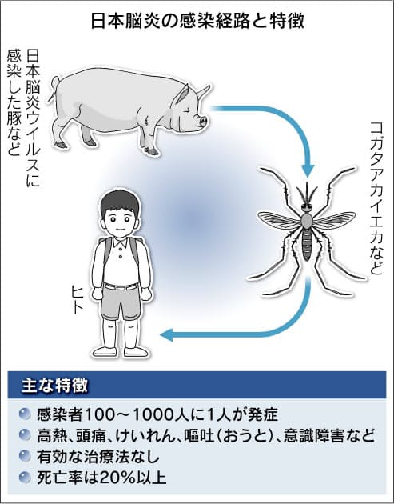
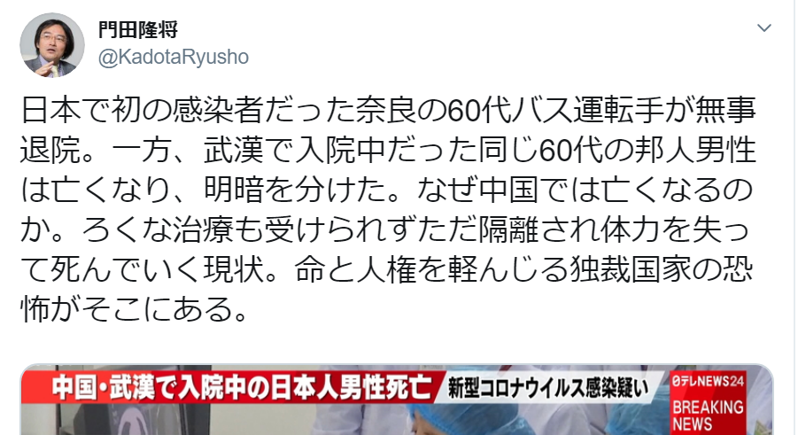
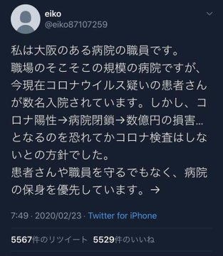
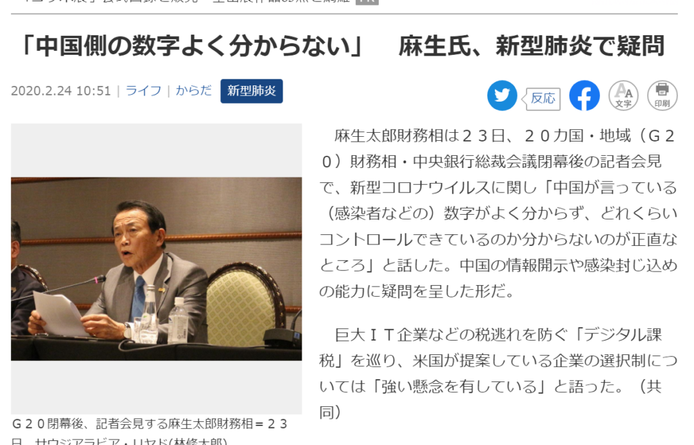

悪意のある人は武漢肺炎など、中国を侮辱的な名前で新型肺炎を称して、WHOに不満を表している。勿論、WHOは新型コロナをCOVID-19など、病名を地名しないことは、中国の忖度ではなく、過去の教訓からです。

ノロウイルス、日本脳炎、スペインかぜは人名と国の名前を使っています。  
但し、[スペインかぜ](https://ja.wikipedia.org/wiki/%E3%82%B9%E3%83%9A%E3%82%A4%E3%83%B3%E3%81%8B%E3%81%9C)はスペインからの病気ではなく、アメリカからのものです。当時のヨーロッパは第一次世界大戦で、スペイン以外のヨーロッパの各国は、戦争優先で、風邪の報道に関心なく、アメリカは情報を隠蔽していたから、情報を開示していたスペインだけ、風邪で大騒ぎしていたようです。  
スペインかぜ、この世界で5千万～1億人の死者を出した感染病は、数年後、アメリカ発であることを解明しました。

病気の名前を人名や、地名で冠名することは誤解を招きやすいので、野呂さんが「ノロウイルス」の名称変更を訴える件もあったらしくて、 [WHOは病名に地名や人名、動物名を使うことを避けるよう指針を公表](https://www.excite.co.jp/news/article/Slashdot_15_05_13_0343229/)したようだ。

西側のマスコミは新型肺炎を、あえて武漢肺炎で表現するようだが、これは習慣ではなく、悪意な侮辱です。例えば、2009年、世界中に流行っていたH1N1は、アメリカ発なのに、アメリカかぜなどではなく、豚インフルエンザを使っています。習慣の説は矛盾です。

今は、新型コロナについて、まだ、解明していないことは多く、本当に中国の武漢からなのか、疑うだけで、明確になっていません。今シーズンのアメリカのインフルの死者が例年より遥かに多いことから、新型コロナはアメリカからでは？と疑う説もあります。地名で病名を冠名することは適切ではない。  
※関連記事：[インフルと思いきや新型コロナ？米の医療事情ネック](https://news.tv-asahi.co.jp/news_international/articles/000176900.html)

政客や政治で利益を図る人たちは元々心の汚い群れですから、人間性を期待しませんが、感染病での政治操作は程よいでお願いしたいです。

人を襲う感染病ですから、特に有名人は人を笑うより、人類としての人間性を優先にすべきだ。この人のように、中国を非難した後の数日、日本でも死者がでた。今は、既に市中感染中、下手にしたら、日本医療はパンクになるではないかの緊急状態に陥てしまう可能性高い状況です。僕ならこんな発言は絶対恥ずかしく思うが、この人ならば無感のようです。

<figure>

<figcaption>

大阪の病院職員がツイッターでの内部告発らしいキャプチャ

</figcaption>

</figure>

中国政府は情報隠蔽と訳わからない理由であえて「武漢肺炎」と称するが、情弱というか、その情報隠蔽は民主国家で誇るアメリカも日本もあるわけです。  
むしろ、新型コロナについて、中国は日米より、情報を開示しているともいえるでしょう。やはり、地名で冠名することと関係ない言訳です。

あえて中国の地名で新型肺炎を称するメインマスコミ、有名人はあくまで反中のために、ヘイトを煽っているでしょう。感染病対策の根本的なところに施策しようとせずに、ヘイトと恐怖を煽る方も煽られる方も、無益です。韓国は、数日で、感染者が数十人から、千人近くしたのも、その余計なことをやり過ぎたからではないかと思います。

WHOは中国を忖度する必要がない。新型コロナウイルスの退治では、中国以上優れている国は、今のところはありません。あえて褒めなくても、事実を世界に伝えるだけでも、褒めるように聞こえるかもしれません。  
病名の命名など、今までWHOの動きは国際組織として、非常に相応しい動きかと思います。

侮辱など、存在感を表すような愚かな行為より、手を組んで、中国の経験を日本で活かせるようにするのは賢明でしょう。武漢肺炎などはあくまで病名で中国を侮辱する手段の一つですが、協力を拒むような動きは、日本を滅びる近道です。

