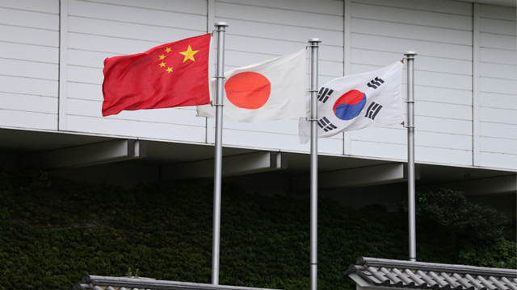

日中韓の自由貿易協定について、 中国紙、「第一財経」の記事より、新型コロナ対応のおかけで、加速するかとの見方を示している。  
関連記事：[中日韩相互驰援，专家：抗“疫”或加快三方经贸协作](https://www.yicai.com/news/100519628.html)

上海財経大学日本研究センター主任、季衛東氏は同紙の取材を受けた際、以下の内容を言いました。  
・日韓の経済は中国への依存性が極めて高いため、新型肺炎で、必ず深刻な影響を受けるでしょう。  
・中国の産業チェーンを復帰するために、日韓との協調も重要である。  
・元々、東亜の経済の協力を強化していく方針ですので、このきっかけで、商務、医療関係を優先させるべきかとの見解  
・新型肺炎の鎮静後、日韓を感謝する一方、今の協調体制は今後の基盤になるでしょう。

**日本はダメになったら中国へ逃げよう**

現在、韓国は新型肺炎が爆発している中、中国へ避難に行く韓国人は急増しています。

日本では、爆発ではありませんが、既に市中感染で広がっているため、日本と韓国の**渡航履歴**ある人は、中国へ入国する際に、隔離せざるを得なくなっています。

但し、安心して欲しいのが、隔離の費用、及び、新型肺炎と確定した場合の治療費用は、**日本人も、韓国人も無料**で対応します。具体的なやり方は地方によって異なりますが、韓国人の多い青島、威海など、山東省各地は既に内容を発表済みです。  
関連記事：[威海：从日韩等国入境人员统一免费集中居住14天](https://www.guancha.cn/politics/2020_02_25_538299.shtml)

日本の状況は更に悪化しないよう祈りますが、医療リソースが限られているので、万が一、最悪な状況になる場合、なるべく中国へ逃げましょう。今時こそ、東亜は一丸になって、疫病と戦いましょう。  
新型コロナウイルスで、アジアは沈みません。

**追記：**

緊急であるこそ、中国人は在中外国人を助けようとします。中国へいって、差別などの心配不要です。  
関連記事：[「私たちは元気」　中国を応援する留学生たち　河南省](https://this.kiji.is/605601900971983969)
