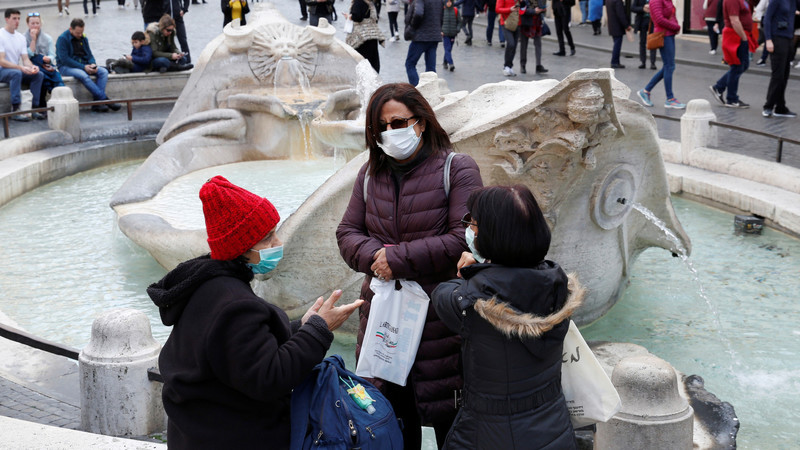

<figure>

<figcaption>

サンフランシスコ

</figcaption>

</figure>

[サンフランシスコは非常事態宣言](https://www3.nhk.or.jp/news/html/20200227/k10012303941000.html)、[カリフォニアで新型コロナ患者３３人確定(監査中8400人)](https://www.tokyo-np.co.jp/s/article/2020022801000829.html)、という事は新型コロナはアメリカ全土に広がる日は近いと見受けています。  
抑々、今回のインフルシーズンは、２千万人以上の感染者数、２万近く死者が出ているところから、新型コロナがアメリカ発ではないかと疑い声もあり、否定できません。

インフルなどを含めて、パンデミック状態であることは確実です。アメリカに滞在中の方は、直で見えるので、私より詳しいですが、特に庶民向けの公立の医療機関はかなり混んでいるのではないかと思います。更に、新型コロナが確実に流行っていると確認できたら、社会的な混乱が必至と想定して、備えた方がよいでしょう。

新型コロナと言えば、マスコミのお陰で、アジア発の印象が非常に強くて、アメリカ本土は緊急事態の宣言をしたら、暴力的に、アジア系の差別は避けられない。日本でも市中感染の中、武漢とか、東京とか、白人、黒人にとっては、全て同じ顔に見えるので、区別しないのが普通です。

アメリカ滞在の人は、更に悪化する混乱な状況を備え、生活用品の備蓄だけではなく、ショットガンなどの武器も、できる限り、準備したほうがよいです。普通の拳銃や、マシンガンは当たらないか、殺傷力が高すぎるかで、普通の人に向かないので、ショットガンの方が一番使いやすいでしょう。

特に地方の小さいまちなど、１人の出掛は、避けるべきかと思いますが、避けられない場合、普段より注意を払うべきでしょう。
