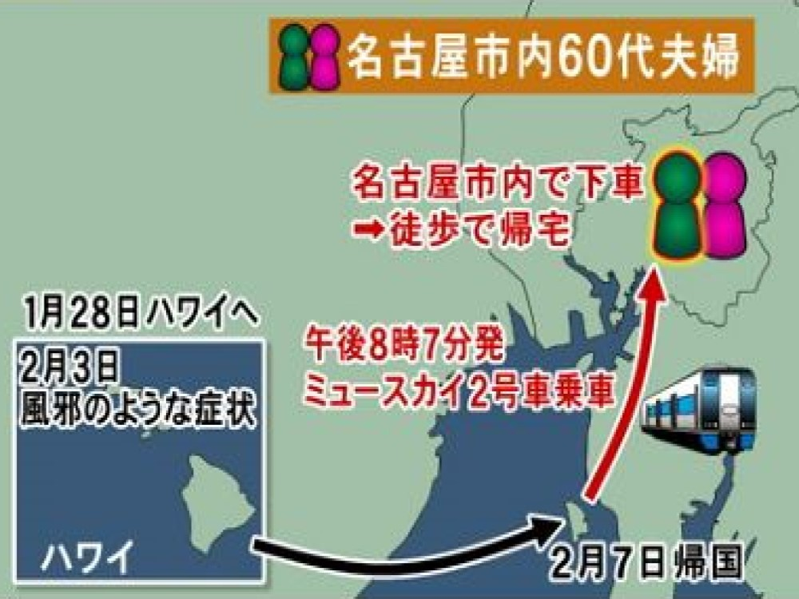

本日の午前中、「[アメリカ滞在中の人は、日用品だけではなく、ショットガンなどもソロソロ調達すべき](https://blog.loveapple.cn/news/202002284252.html)」と、懸念を示したが、状況の変化が早すぎて、もう、アメリカ全土は既に市中感染と考えてほうが良いかもしれない。

ハワイから愛知県に帰国した人は新型コロナの感染を検知したと言う事は、ハワイでは、新型コロナが既に広がっている事です。寧ろ、新型コロナと検査しようとしないから、アメリカ全土では、新型コロナもインフルエンザと勘違いして、治療してるのではないかと、考えてもよいではないかと思います。  
関連記事：  
　[【アメリカ】すでに新型肺炎コロナウイルスが蔓延か？](https://www.bookservice.jp/2020/02/16/post-41286/)  
　[死者1万人超｢米国インフル猛威｣は新型コロナかもしれない](https://president.jp/articles/-/33051?page=3)  
　[さらに７０代の男女２人感染　ハワイ帰国後に感染確認の女性関連　名古屋](https://hicbc.com/news/article/?id=0004D0E7)

**新型コロナ、何故、武漢で異様を気付き、アメリカでは気づきにくいのか？**

アメリカの季節性インフルエンザと言ったら、経験の少ないアジアの人はあまりイメージしないでしょう。風邪的なもの？体がだるい、熱、咳など、言葉的な表現では同じく見えるかもしれないが、実は、レベル違うほど、死にかけているようなものです。  
普通の風邪だったら、体を動かすなどして、汗をいっぱいかければ普通に治るひとは多いです。アメリカの季節性インフルエンザにかかったら、持病など、体の弱い人というところか、健康な人でも、治療を受けないと、死んでもおかしくない危険な病気です。

アメリカでは「普通」の季節性インフルエンザ的なものは中国では普通ではない。  
武漢の医師たちは、最初新型コロナに遭遇した時、中国ではあまり見慣れてない風邪(?)からちゃんと検査すると新種のウイルスを発見したかと思います。勿論、SARSっぽいの所もあって、特に注意を払ったわけです。

勿論、こちらはあくまで素人の推測です。アメリカではあえて新型コロナの情報を隠蔽したかもしれません。

武漢はアメリカとの連携が密にしている中国の工業の中心地です。今の所、断言できませんが、新型コロナがアメリカから移った可能性としては、ないとは言いきれません。  
ハワイから名古屋へ移ったことは、[暖かくなっても新型コロナが収束しない可能性ある](https://natgeo.nikkeibp.co.jp/atcl/news/20/022700130/)と考えた方がよいでしょう。

**アメリカの在住の人は要注意**

アメリカは現在、流行っているインフルの中、新型コロナが既に混ざり込んでいる可能性が非常に高いです。どこでも、サンフランシスコのように緊急事態だと宣言されてもおかしくない。

普通の人は行き成り安全な所へ行こうと言われても、仕事や生活はあるから、中々難しい。  
いざという時、弱そうなアジア系は被害になりやすいので、前文にはショットガンを準備しようといってたが、やはり、逃走ルートまで考えた方がよいかと思います。

行き成り日本や、中国へ行かなくても、安全なまちへの逃走ルートを準備した方がよいかと思います。路線、乗り物、など、代替案もできる所まで、準備しておいた方が、家族の命を救えるかもしれません。
