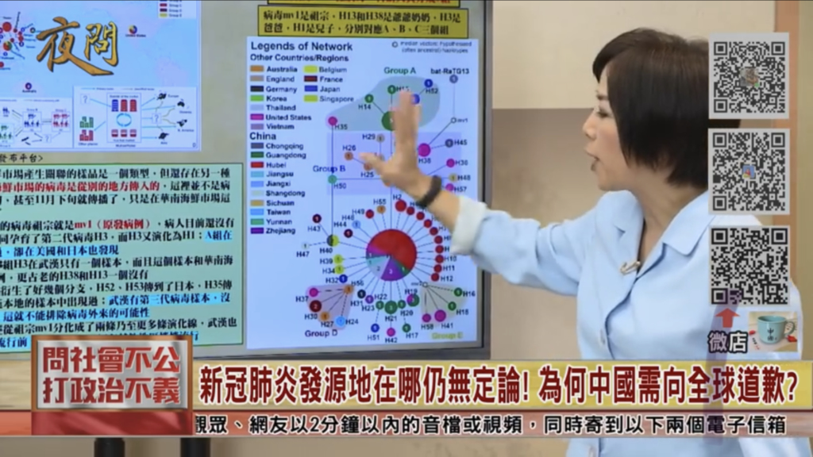

新型コロナは武漢から爆発的にパンデミックになりました。感染病の対策するのに発生源を特定するには非常に重要な一環であり、武漢の海鮮市場に目線を集めた。研究は重なることで、発生源の究明に明らかにならず、未知のものは更に増えています。  
新型コロナの発生源が当初の想定と外れて、いまだに疑問点が多く、不明です。

台湾のジャーナリストは色々情報を集めた結果で、武漢でパンデミックしたウイルスは、新型コロナの第三世帯で、**古い世帯のウイルスが武漢では見当たらない**という結果を示した。要すると、武漢の海鮮市場が、感染を広げるのに重要な一環であるが、その前に、新型コロナが別な所では、既に、密かに流行っていたかと表しています。

<figure>

<figcaption>

番組のリンク：[https://youtu.be/FhBT2kQZyfA](https://youtu.be/FhBT2kQZyfA)

</figcaption>

</figure>

新型コロナの古い世帯はアメリカ、広東、日本、台湾では見つかったようで、特に、アメリカは全ての新型コロナの種類は揃えています。

新型コロナの対応について、アメリカは実質上、情報の隠蔽に必死にしているため、明らかにならないことは沢山ありますが、今年のインフルシーズンは例年以上に死者が多いことが疑われているようです。既に死んだ人は新型コロナかどうかの調査は不可能で、毎週、インフルで約１千人の死者の中、新型コロナがないか、検査しない事で、実際の新型コロナの感染状況は隠されています。

やはり情報を隠そうとする政権はあるため、事実の究明までには時間がかかるでしょうが、 世界中の科学者のお陰で、新型コロナの発生源の究明に近づいています。

以下は上記番組以外、参考となる情報です。

https://twitter.com/info\_nbd/status/1233325026633379841?s=20

https://twitter.com/loveapple/status/1233551986374651915?s=20
