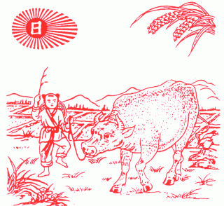
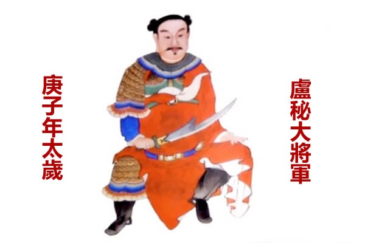

2020年は干支では、庚子の年です。「地母経」に庚子の年を予測する内容、春牛图の地母经に記載した内容を紹介します。  
農業社会の中国では、収穫に影響する災害などは一定規律があると主張して、干支で一年を予測するための本、「黄歴通書」があります。 この書の中に、毎年を総括する春牛图と地母経があります。

<figure>

<figcaption>

春牛图

</figcaption>

</figure>

庚子の年、地母経の内容：

詩曰︰  
太岁庚子年，人民多暴卒。  
春夏水淹流，秋冬頻饥渇。  
高田犹及半，晩稲无可割。  
秦淮足流蕩，吴楚多劫夺。  
桑叶须后贱，蚕娘情不悦。  
見蚕不见丝，徒劳用心切。

地母経の超意訳です。  
不吉な庚子の年では、沢山の庶民は突然な事件で死ぬでしょう。  
夏には洪水、農作物の不作で、冬になると飢餓で辛抱するでしょう。  
産量高い畑の収穫はいつもの半分以下、晩稲の収穫がほぼなくなるでしょう。  
元々豊かな所は貧しくなり、強盗などの犯罪は増えるでしょう。  
副業などをやっても、コストをかけるだけで、利益が見えにくいでしょう。

この「黄歴通書」の「地母経」が古くからできたもので、2020年特化したものではありません。ようすると、庚子の年は何かしらの災害が多いという規律があるようです。直近の庚子の年の大きな災害などを見てみよう。  
・1840年  
　　[アヘン戦争](https://ja.wikipedia.org/wiki/%E3%82%A2%E3%83%98%E3%83%B3%E6%88%A6%E4%BA%89)(中国現代史の転換点)  
・1900年  
　　[義和団の乱](https://ja.wikipedia.org/wiki/%E7%BE%A9%E5%92%8C%E5%9B%A3%E3%81%AE%E4%B9%B1)(大勢な人が犠牲した)  
　　ペストが日本での流行 (1899年開始)  
　　米比戦争(1899年開始)  
・1960年  
　　中国での大規模な飢饉、  
・2020年  
　　新型コロナの世界規模のパンデミック
