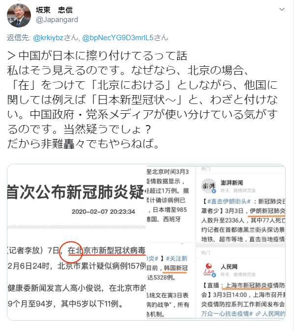

中国語のテーマでデマ潰しのネタを持ってきたこと、お詫び申し上げます。  
文法が私の得意分野ではないが、「日本新冠肺炎疫情」の例が日本語の習慣から、勘違いしやすい所かと思うので、取り上げてみようと思います。

誤認識になった中国語：  
　目前，日本新型冠状病毒肺炎疫情不断变化，我在日同胞对此高度关注。

直訳した日本語の意味：  
　現在、日本における新型肺炎の流行状況は悪化しているため、我々在日中国人は高く関心している。

「日本新型冠状病毒肺炎疫情不断变化 」の主語が「疫情」で、「日本」と「新型冠状病毒 」は代詞、名詞の性質を持つ定語です。  
「日本における新型肺炎の流行状況」を「日本新型肺炎の流行状況」にして、元の文言はこう修正する必要がある「日本新型冠状病毒肺炎**的**疫情不断变化」、少なくとも接続的なものが必須になります。  
「日本肺炎」にしたければ、更に、「日本新型冠状病毒肺炎」⇒「日本肺炎」にしないと、単なる繋げるのが意味がなくなり、あまり文書をかけない小学一年生っぽく見えるかと思います。

誤っていると分かったら、謝らなくても、それで終わればよいかと思うが、何故か引き続き、そのデマの正当性を説明しようとしているようです。  
「**在**北京市新型冠状病毒肺炎的**肺炎疫情防控工作新闻发布会**上」  
特定な場所で何かしらの行動を行ったと表す時、「在」を使う時が多いです。  
上の句は日本語に直訳すると以下となります。  
「北京市、新型コロナウイルス肺炎の肺炎感染対策記者会見において」  
「新型冠状病毒肺炎的肺炎疫情防控工作新闻发布会」が一つの名詞として「新型コロナウイルス肺炎の肺炎感染対策記者会見」に訳します。主語の意味がありません、場所を表す言葉です。  
日本語で「おいて、おける」は、中国語の固定な言葉がなく、同じ「在」の字でも、別の意味を表すことは多いです。

今回はデマだと既に分かっているので、これ以上説明するつもりがありませんが、言葉というものは、文化背景が異なると、考え方は全く異なるので、色々誤解しやすい所は多いです。  
当ブログの易経文化の下に、今日の中国語のカテゴリの意図は、日本の考え方ではあまりおなじみの薄い表現の紹介、及び、言葉を通じて、独特な考え方を紹介したいと思います。

新型コロナウイルスの情報について、是非、首相官邸と厚生労働省からの発信を基準にしましょう。

関連記事：  
[中国語：句子成分](https://baike.baidu.com/item/%E5%8F%A5%E5%AD%90%E6%88%90%E5%88%86)  
[新型コロナ、中国が「日本肺炎」と広めようとしている→誤り。ネット番組で誤訳が拡散か](https://www.buzzfeed.com/jp/kotahatachi/unknown-cause-china-19)
