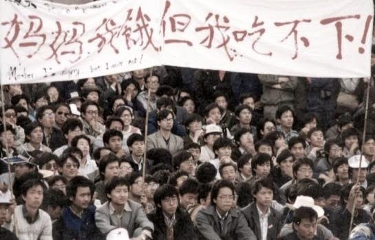
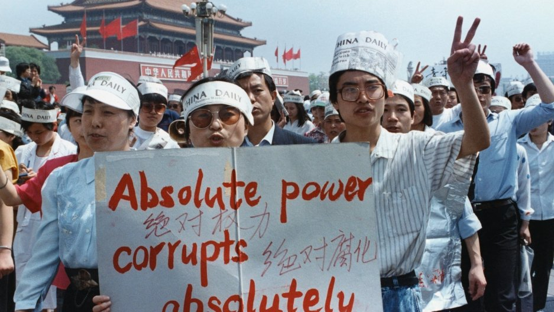

天安門事件をご存じる方多いでしょうが、「学生デモ→虐殺→戦車を留め」単純なシナリオではない。 日本でよく知られてる「虐殺」は本当一部しかすぎず、[@SBjuexing](https://twitter.com/SBjuexing) 氏は整理した内容を日本語で意訳していきたいと思います。  
こちらの記事は[twitter](https://twitter.com/loveapple)にて[翻訳した内容](https://twitter.com/loveapple/status/1189067431550959616?s=20)を見やすくまとめます。

天安門事件は偶然ではない。  
SNSない時代では、大勢な人を簡単に集める事ができない、伏線を張ったのが1978年改革開放だ。  
計画経済→市場経済転換期、政府、幹部など特権を持つ不公平な現象や、インフレ(1987-1988北京物価30%UP)、終身雇用廃止などで、腐敗特権へ不満日々増加しました。

当時の首席胡耀邦は改革派であり、中央規律検査委員会の陳雲は改革の反対派と対立中、どちらも鄧小平の支持を求めていた。 鄧小平はTOPだと間違う人が多いでしょうが、実に違います。ただ、中国政治を左右する大きな勢力であるので、彼の支持がどの派にとっても重要だった。

1978年、魏京生氏主導した民主の壁を興し、反個人崇拝、政治民主を求む記事を貼付、1979年に民主の壁が崩され、魏氏も逮捕された。  
1986年学生の大規模デモが全国で興し、中共の民主選挙干渉を反対しました。  
同済大学の陈破空達は胡耀邦に「上書」し政治改革を呼掛け、直ぐ鎮静化されました。

- 
    
- 
    

4月15日、胡耀邦の死去が天安門事件の始まりと見られる。  
改革派の同氏は、国民、特に学生に支持され、17日、数百名の中国政法大学の学生が天安門広場で集結し、記念活動を興し、学生以外の参加者もいた。  
演説の人がいて、政府の批判も行い、夜、北大清华も数千人加わりデモは始まるようになりました。

4月18日、学生達は中南海の入り口新華門に集め、政府のTOPと会うと要請したが、警察に断れ、衝突まで発生した。  
学生は虐待された噂があり、更に多くの人が抗議に参加しました。  
4月22日、胡耀邦葬式を挙げた時点、数万人が天安門広場に集め。三人の学生が跪く李鵬首相に会いたく請願書を出したが、政府側の返答がありません。

4月22日、西安や長沙など一部の都市で、暴力事件発生し、店荒し、強盗など、数百人を逮捕しました。  
4月25日、李鵬と主席楊尚昆は、鄧小平に会見し、強硬に対処と合意  
4月26日、人民日報社説、「[旗幟鮮明に動乱に反対せよ](https://ja.wikipedia.org/wiki/%E6%97%97%E5%B9%9F%E9%AE%AE%E6%98%8E%E3%81%AB%E5%8B%95%E4%B9%B1%E3%81%AB%E5%8F%8D%E5%AF%BE%E3%81%9B%E3%82%88)」を発表し、「公然と憲法に違反し、共産党の指導と社会主義制度に反対する」と指摘しました。

人民日報社説は更に多くの学生を激怒し、北京大学の劉鋼氏は北京高校(大学)学生自治聯合会(以降、高自聯)を立上げました。  
4月27日、北京の抗議する学生は十万に近くなりました。  
4月30日、趙紫陽が訪朝帰国しました。同氏は学生と対話を主張する派を代表する人で、対立として、李鵬 は学生に強硬策を主張しました。

**五四演説と学生の分岐**  
5月3日、4日は、趙紫陽が演説を発表し、学生は愛国運動だと肯定的な態度を示しした。  
5月4日、約十万人の学生が五四運動記念デモし、改めて訴求を挙げた。 学生内部で分岐が発生し、趙紫陽を支持した清華北大以外、授業再開と発表しました。  
但し、リーダの王丹とウーアルカイ達がもっと激しい抗議を主張しました。  
趙紫陽の演説について、多くの学生は認めるが政府が訴求に対して正式な協議がありませんでした。  
5月13日、王丹、ウーアルカイ、柴玲等、一部の学生をリードして、絶食で個人名義の抗議を興した。政府が正式な協議しなければ物を食べないと宣言した。多くの学生が絶食支持しないが抗議に戻り、午後、30万人ほど集まりました。

5月15日、ゴルバチョフ訪中、59年以来、初のソ連最高指導者訪中でした。  
天安門広場が学生に占領のため、歓迎式が空港でやらざるを得なく、国際のイメージに影響した事、当局は激怒しました。  
5月16日、趙紫陽が ゴルバチョフ氏に、鄧小平は決定権があると言い、鄧は趙の発言に責任を逃げると見受け、両氏緊張関係になりました。

**李鵬が学生代表を会見**  
5月18日、李鵬は人民大会堂で初めて学生代表の王丹、ウーアルカイ、卲江、熊焱等を会見し、ライブ放送した。 双方は一触即発な雰囲の中で弁論しながら、意見を交換して、何方も譲る事なく、結論ないままで終わり、学生は絶食を継続して反抗します。以下は映像の抜粋です。

https://www.youtube.com/watch?v=qPjwDXohuys

**事態拡大**  
学生の絶食は全国の支持を得て、ソ連訪中を報道する西側の記者達は残って、学生運動を報道し続けた。 各地の学生は北京へ運動を参加、学生以外、北京の各業界、公務員を含めて、デモを興しました。  
地方都市も抗議デモ多発し、香港、台湾から、学生への物質を支援、応援しました。

- 
    
- 
    
- 
    
- 
    

https://www.youtube.com/watch?v=3ZxjV0s2CrA

**趙紫陽最後の講演**  
事態拡大により、中共TOPのプレッシャーが増大した。  
趙紫陽の妥協な対応で事態の拡大になり、党内の反感を招き、孤立された。  
5月19日の夜明け、温家宝は随行し、趙紫陽は天安門広場で抗議中の学生に会い、最後の講演を行いました。

5月19日、鄧小平は会議を主催し、戒厳が問題解決の唯一の選択と言い、李鵬は20日から北京市の戒厳と発表して、5大軍区の30師団の25万兵士は北京へ進入するようにしました。  
但し、軍は北京へ進む途中、多くの民衆に止められ、動かず、衝突なく兵士達に水や食べ物を与えた。  
5月20日、学生側がデモで李鵬を追い落とすと主張 しました。

- 
    
- 
    
- 
    
- 
    
- 
    
- 
    
- 
    

**毛沢東の像は汚された**  
5月23日、魯徳成、喩東岳と余志堅は湖南から北京へ行き、中共政権の転覆を主張したが、学生の支持を得られませんでした。  
天安門にある毛沢東の像をペンキなどで汚し、高自聯(学生)はこの3人を警察署へ送った。同時に学生内部で、王丹は武力鎮圧を懸念し、撤退を主張、強硬派の学生に反対され、学生内部の対立が激しくなりました。

- 
    
- 
    
- 
    

5月29日、中央美術学院等、6大学の学生達は、高さ10mの民主女神の像を完成し、天安門広場、毛沢東の像の対面に立上げた。  
6月2日、学者劉暁波、高新、周舵と台湾芸人侯徳健は広場へ行き、2回目の絶食を興し、内部紛争を止めようと図った。この4人は4君子と呼ばれた。前回の絶食した学生らは休養のために運ばれました。

**最後通牒**  
6月2日夜、一台の軍用車が事故を発生し、3人の死亡になりました。意外な事件だが、学生らは軍の侵入を懸念し、各入り口に障害物を設けた。  
6月3日、学生と市民は武器持ちの私服軍人を捕まり、北京警察へ送還した。  
同日夜、中央テレビニュースは緊急通告：戒厳部隊は全ての手段を採用すると発表した。  
静粛担当の解放軍部隊は各方向から北京へ進入したが、市民に止められた。  

**軍の進入**  
6月4日、 市民に止められ進行できず、一旦撤退した軍隊は、武装して再び北京市へ進行しました。市民側は、前回の止めた経験があり、厳戒を無視して再度軍を止めようとした。西側から侵入した38軍は実弾で市民に向けて発砲した。

**木樨地事件**  
38軍は市民に発砲後、市民は軍に対して石、レンガや燃焼物を投げ、道路を妨げるようとして、車両を燃やした。軍は天安門広場の5km離れた木樨地に止められた。軍人は市民と付近のアパートに発砲しました。  
「天安門母親運動」の調査結果より36名の死者がでました。軍も犠牲者を発表しました。

**北京包囲**  
多くの人は天安門広場は衝突の一番激しい所と思ったが、広場までの途中では多くの暴力な衝突、死傷があった。多くの病院は負傷者で満員になり、治療の遅延により犠牲した負傷者もいた。復興医院の霊安室が満室のため、屋根付き駐輪場に一時搬送した所もあった。  
北京自営業者中心で、市民は自発的に「飛虎隊」を立上げ、まちの中で走り回って、軍の動向などの最新情報の拡散や、負傷者の搬送、救助の手伝いなどを行った。

- 
    
- 
    

6月4日朝、静粛部隊は天安門広場を包囲した。この時点では多数のデモ者は撤退し、数千人の学生と市民は残って抗争し、一時的に大火があった。 軍の侵攻が一時止めれたが間もなく制され、約三千人の学生が軍に人民英雄記念碑に包囲された。youtube上正反認識は交じてる  
下記の写真は、天安門広場で、大規模虐殺の証拠としてあらゆる所で広がってるが、実は83年頃、行われた パフォーマンスアート、2匹の犬の屍体の写真だったそうで、人間ではありません。

- 
    
- 
    

<figure>

https://youtu.be/GwKx02ClIA8

<figcaption>

ウィキリークスからの動画：米は最初から天安門の虐殺がないと分かった

</figcaption>

</figure>

**四君子の交渉と撤退**  
6月4日朝3時、侯徳健、劉暁波、周舵、高新は残った学生の撤退を説得しようとし、軍から奪ったガンを壊し、手を頭上にあげ、軍隊方向へ撤退するために交渉を求めに行き、軍に認められた。  
4時、天安門広場消灯、軍から静粛し始め学生撤退するようスピーカでアナウンスした。  
学生は撤退と継続の声で投票し、撤退を決めようと、投票の提案者は撤退の声が大きいと判断し、撤退を決定した。  
4時45分、学生は東南口から、速やかに退場し始めた。  
5時40分、学生の退場ほぼ完了した。

**タンクマン**  
6月4日昼、軍は天安門広場を制したが、戒厳は継続し、軍のパトロールは行っていた。  
6月5日、一列の戦車は天安門前の長安通りで行進した時、1人のシャツ着る男子は自ら戦車の前に立ち、戦車の行進を止めた。回って越えようと試みたが、ダメだった。外国記者は映像を撮影した

- 
    
- 
    

https://www.youtube.com/watch?v=GRb4VY2dU4c

タンクマンは天安門事件の象徴となり、一つの側面から、軍人は自制的だと証明できる。間もなく、数人の身分不明な人に現場から離され、戦車は進めた。 タンクマンは誰か今でも謎、噂によると(王維林)と言い、地方から学生を応援に来たが、証拠がありません。

6月6日、中共の発表により、軍隊、暴徒、学生、市民は合計300人死亡、軍人5000以上、市民2000以上負傷。 具体的な数字に争議があり、14年米の機密文書より、死者1万、負傷者4万。17年英の機密文書によると、約1万死者と国務院の関係筋に教わり。近年、前者の中共の結果が支持されてる。

- 
    
- 
    
- 
    
- 
    

**国内の影響**  
6月9日、鄧小平は事件後初の公開講演：天安門事件中に犠牲した軍人は烈士であり、抗議活動は共産党を倒し、西側の共和国を立ち上げるものだ。  
趙紫陽は全職務を解除、2005年死亡まで軟禁 鄧小平は軍委主席辞任、陳雲、習仲勳等同時代の人も辞任、江沢民、李鵬等に譲った。

**国際的な影響**  
中国政府のイメージがダウン、非難だけでなく、経済、貿易の制裁も受けた。ソ連は非常に残念を表した。 朝鮮、東ドイツ、パキスタン極少数の国は鎮圧を支持した。 米は中国学生保護法案を通し、欧米の武器禁輸は今まで継続し、多くの武器は中国が購入できない。

参考文献：  
[Tiananmen Square, 1989: The Declassified History](https://nsarchive2.gwu.edu/NSAEBB/NSAEBB16/)  
[Jeff Widener](https://nsarchive2.gwu.edu/NSAEBB/NSAEBB16/)  
[吴仁华六四文集](https://blog.boxun.com/my-cgi/post/display_all.cgi?cat=wurenhua)  
[《李鹏六四日记》](https://www.bannedbook.org/resources/file/3684)  
[《平息反革命暴乱纪事》](https://t.co/SKsnfN8o7a?amp=1)  
wikipedia
