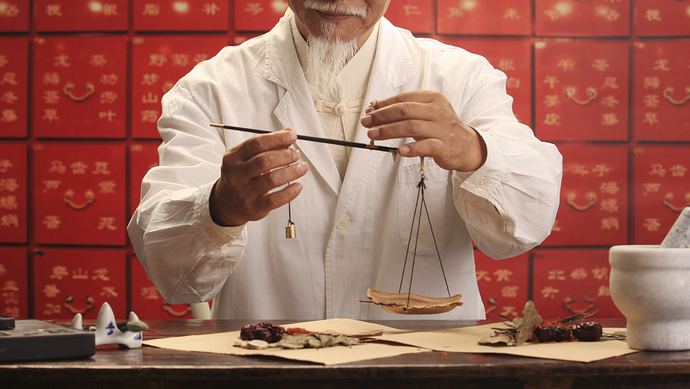

台湾の有名な作家、テレビコメンテーターの黃智賢氏は、今まで各国の公開情報をもと、中国の漢方医は新型コロナに一番有効であり、実績も示していると報道しました。

<figure>

<figcaption>

黃智賢氏

</figcaption>

</figure>

同氏は湖南中医薬大学の中医博士出身であり、お父さんから、家族は長年で病院を経営して、特に台湾の医療業界の裏情報にも詳しいと言われています。　

3月7日の番組で、新型肺炎の治療について、以下の内容を紹介しました。

中国は既に５万人以上治癒した実績から、中医(漢方)を中心に治療した方が明らかに効果があることを証明しています。こちらについて、今回の新型コロナだけではなく、SARSの時も、中医で全員治癒の実績があったようだ。

米ギリアド・サイエンシズ社の特効薬について、WHOも言及するが、中国では効果が薄い実績を示しており、正式に発表してある。[武漢は初期頃、中医を軽視することで致死率が他地域より高いのが、要因の一つと批判された](https://blog.loveapple.cn/news/202002143469.html)。  
中国本土も、台湾も中医(漢方)は普及しているのに、世界向けにあまり言わない理由は経済利益だ。  
中医は患者の状況に合わせて投薬するから、単一の薬で推奨する事が難しらしく、企業の利益につながりにくい。お医者さんは薬を推奨する場合、基本、製薬企業との利益がつながる。この点について、中国本土も台湾も、他の国もどこでも共通なルールであり、WHOを含めて、あまり効果の得られない米製薬企業の商品を推奨する理由も、企業から出資を受けているかと思われます。

**併せて同氏は中医治療の特徴について、同番組で以下の内容で紹介しました。**

通常の西洋医学、カゼや、肺炎などを治療する方法は、基本、咳、くしゃみ、痛みなどの症状を抑えるのと、抗生物質で菌を駆除することです。  
特徴として、直ぐ効果を得られるが、体へのダメージ(リスク)が大きいです。  
抗生物質は基本、細菌に効果があるが、ウイルスに効果が薄い。酷いケースだと、病気が治ったが、人も死んだ事例が少なくないようだ。

中医の考え方が西洋医学と異なって、直接抗生物質でウイルスを殺すのではなく、人の免疫力を引出すようにして、免疫力で細菌や、ウイルスと戦ってもらうのです。  
中医で治療する場合、良くあるパターンとして、同じ先生、同じ症状をもつような人を診察する時も、人によって、異なる薬を処方する場合が多いらしい。こちらは、完全に人の体質に合わせて、調整するのです。  
そして、漢方薬は長年で使われているものが多いので、副作用などのリスクも少なく、抗生物質より安全なわけです。

鐘南山チームの発表資料により、中医の介入がなく、通常な治療だけだと、新型肺炎の死者は、肺臓に痰が溜まって、抗生物質や、呼吸補助の設備などを使っても、人の体が回復できないため、死亡したケースが多いようだ。  
抗生物質の使用を控えめな中医の治療と合わせて治療する方が、患者は著しく回復するケースは殆どだと発表されています。

因みに、李文亮医師も、中医の介入のなかった初期段階からの治療であり、お亡くなました。李医師の同僚、新型コロナに感染した４人は、重症の人を含めて、中医の手法中心に治療したので、３人は治癒して、１人は観測中だったが、回復に向かっていたという。

**中医の専門家は「新型コロナ」？を予測した！**

勿論、新型コロナウイルスについて、まだ未知だったが、2019年の夏ごろ、中医専門家の王永炎氏は、秋から大変な疫病が流行ると予測して、事前準備をするよう促した。未然でもあるので、政府はその警鐘を重視しなかったが、当時の会議の映像は公開された。

この記事の元の内容について、中国になりますが、下記、Youtubeのリンクへどうぞ

関連記事(中国語)： [https://www.youtube.com/embed/6V7O5jrE\_7E?feature=oembed](https://www.youtube.com/embed/6V7O5jrE_7E?feature=oembed)
