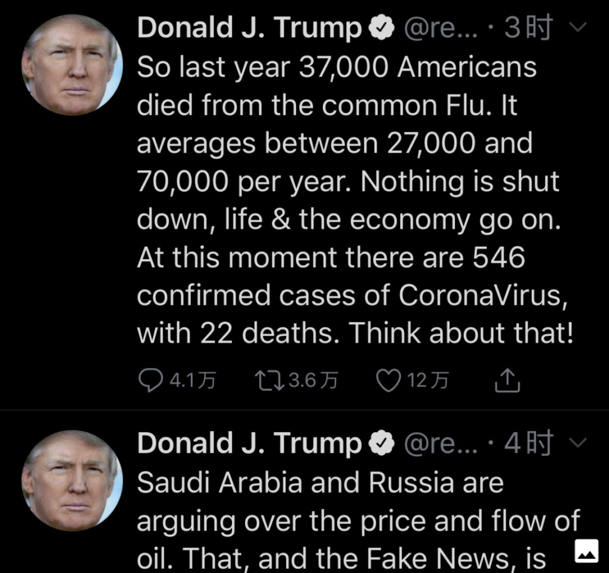
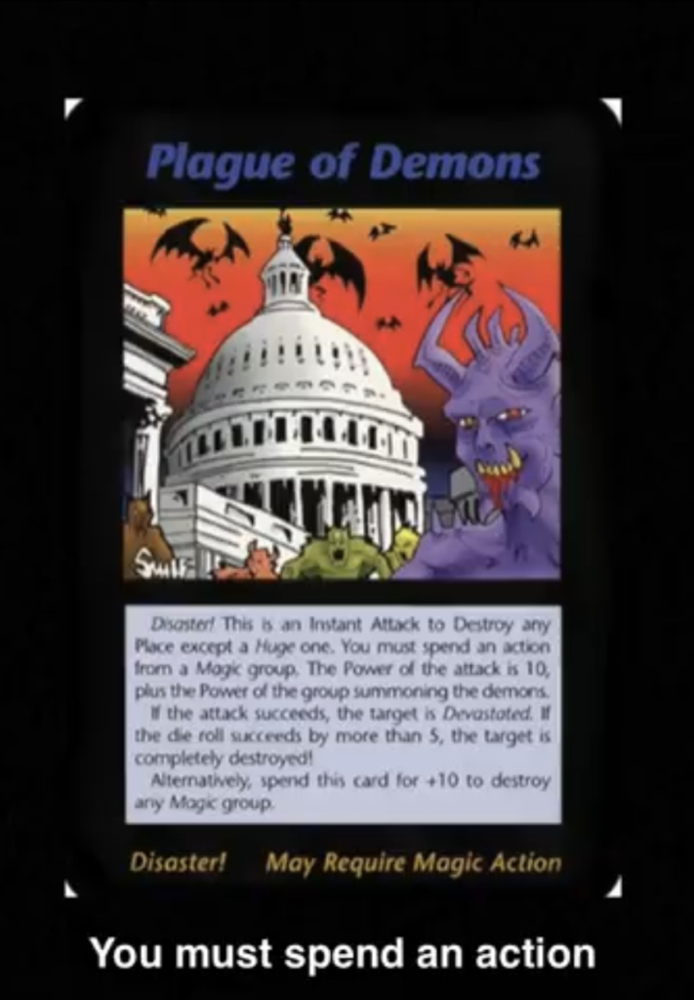

新型コロナのニュースばっかりで、ちょっと抜けて世界を鳥瞰してみようとして、最近の世界情勢をざっくりとまとめてみたいと思います。

**東アジア経済圏崩壊？世界経済急減速**  
１．中国は新型コロナが落ち着いてる様子を示している。一時停止にした製造業はこれから回復するでしょう。今年の経済はV字成長になると普通の見方だそうだ。  
２．新型コロナで日中韓の自由貿易圏の構想は崩壊？昨年の前向きに見た東アジア経済圏が暗雲が立ち込める影響で、世界の経済成長は急減速。

**アメリカとEUの悪夢がこれからだ**

<figure>

<figcaption>

トランプ氏の発言

</figcaption>

</figure>

1．アメリカはこれからパンデミックになるでしょう。FRBの大幅利下げ直後、株価の急落から投資者たちの懸念を見えるでしょう。  
２．アメリカ国債１０年の金利が史上最低、世界大戦以下になっていることは、危機の寸前？を示すでしょう。  
3．ミラノ封鎖の直前、大勢の人は逃亡したことにより、新型コロナがヨーロッパ全土に広げるには間違いない。  
4．本来、毎年数万人の死者がだすインフルより、新型コロナが大分弱いはずなので、上手く情報隠蔽すれば恐怖が興すほどでもないが、中国流行っていた時期、ヘイトや恐怖を煽った成果が返ってくるでしょうから、少なくとも、4，5月まで、影響が続くのでは？

**原油価格が30ドル以下？**  
1．ロシアがジョージア侵攻で各勢力のエリアがすこしずつずらすようで、中東の紛争が長く続くようになるでしょう。東アジアまで影響がくるのでしょうか？台湾海峡の戦争リスクが依然として高い。  
2．東亜とヨーロッパの経済不振で、原油の供給が需要より上回るでしょう。原油の出産国、ロシア、サウジアラビア、アメリカは、市場のシェアを奪うために戦うでしょう。  
　・サウジアラビアとイランの戦争リスクが高――中東の産量が減らせば、ロシア中心で需要のギャップを埋める。  
　　 関連記事：[ロシアの原油減産拒否の標的は米シェール業界](https://www.newsweekjapan.jp/stories/world/2020/03/post-92668.php)  
　・シェールオイル関連企業は赤字拡大で、投資家の意欲が低くなれば、大量な倒産が必至では？  
　原油のバレル単価が30ドルとは、サウジアラビアの原価と近い価格だ。仮に20ドルに下がったら、1バレルを輸出する事で、10ドルほどの赤字がでる。元々コストの高いシェールオイルはもっと赤字を出すわけだ。  
3．サウジアラビアが収入が減ると国内の動乱が起こりやすいので、原油価格下落を先取りして、政権を安定させるために、皇族内部の権力闘争があったわけだ。  
　関連記事：[サウジ、前皇太子ら有力王族拘束　反逆罪の疑い＝関係筋](https://headlines.yahoo.co.jp/hl?a=20200309-00000010-reut-asia)

4．サウジアラビアとロシアは原油の価格競争を演出してるが、本当の狙いはアメリカである。シェールオイル系の企業だけではなく、テスラなどの新エネルギー関係のハイテック企業を含めて、全ては打撃の対象でしょう。これらの企業は破綻し始めると、連鎖的に経済危機まで至る可能性が高いです。

**アメリカの衰退は現実的であり、次回の経済危機は？**

<figure>

<figcaption>

アメリカ 疫病についての予言

</figcaption>

</figure>

資本主義は経済危機が必ず伴うおものだ。金融覇権のうち、製造業をと取り戻し、石油の消費国→輸出国の転身など、全て衰退の証だ。アメリカの衰退、アジアへの影響としは、日本の改憲、在韓米軍の縮小、台湾の独立への偏りなどです。

今のアメリカは非常に危ないと、投資家たちの意見です。その意見は円→ドルの高値で表しています。  
世界情勢をまとめる文書では都市伝説のような予言が登場すべきではないが、悪魔がコウモリの疫病でホワイトハウスを囲んで、退治するには魔法が必要だと、予言されたそうです。その「魔法」とは何でしょう？米製薬企業の商品ではないだろう。  
れいの特効薬のウソ？は何時か、欧米でもバレるでしょう。

**新型コロナ流行最中で、中国は筋肉を示した。**

緊急な時期こそ、安定を求めるので、尖閣諸島、ハワイでは、海軍の実力を示した。  
台湾に影響あるか、まだ、言い切れないが、原油価格の下落、中東の紛争など、中国にとって、台湾統一するための外部条件は色々揃えていると間違いありません。但し、一つのトリガーが必要だ。

勿論、世界の経済を復帰させるために、中国というマシンをパワー全開させなくてはならないので、世界経済不振であるこそ、台湾海峡での戦争は欧米中露、世界中殆どの国は望んでいるでしょう。

去年の言った通り、2020は世界情勢が大きく変化する一年です。
