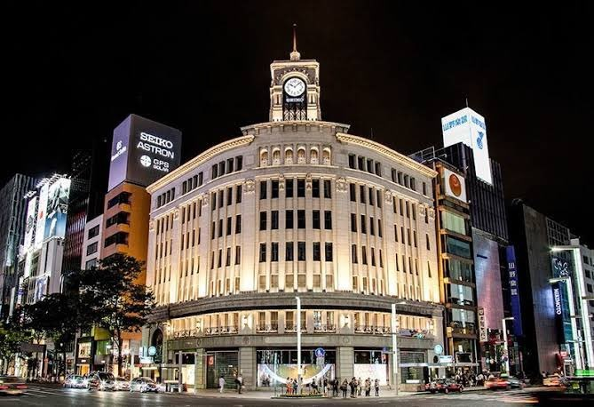
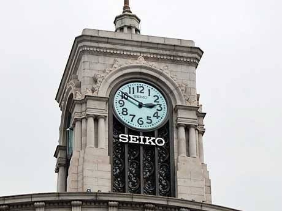
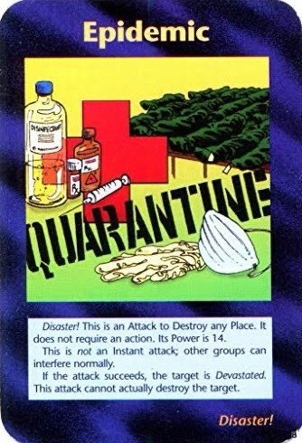
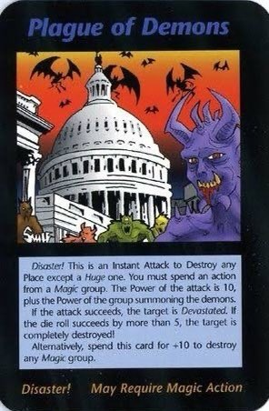
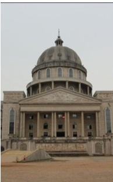

2020年は災難の多い年です。予言に有名なイルミナティカードから、東京オリンピックについての予言は最近、話題になっているようです。まず、予言の内容から見ましょう。

説明の原文：  
You may combine tow Disasters on the same Place, as long as both are eligible to be userd on it.Play both of the Disaster cards, as well. Pick one Disater to be the "main" one, and follow all the instructions on its card. Add the Power (but none of the other effects) of the other Disaster.

五輪のマークと同じ色の服を着る男たちが並ぶ後ろに倒れたのが東洋銀座の和光の時計台であることを注目して欲しい。時間が11時10分、又は、14時55分にさしている。  
カードゲームの説明文になるので全ての翻訳を割愛しますが、概ね、一つの場所にある2重災害と記載しています。  

<figure>

- 
    
- 
    

<figcaption>

和光の時計台

</figcaption>

</figure>

続いて、二つの災害を表すカードを使うといって、 悪魔の疫病と感染病のカードはありますが、そのカードに別の予言もあり、左側が伝染病、右側が悪魔の疫病を表している。

<figure>

- 
    
- 
    

<figcaption>

この右側の建物はホワイトハウス、武漢と関係ないようだ

</figcaption>

</figure>

右側の疫病のカードは武漢の建物という人は多いようだが、武漢の何の建物か誰も説明できない。武漢の建物ではないからです。  
この建物はどこかわかりませんが、ロシアの「[聖イサアク大聖堂](https://ja.wikipedia.org/wiki/%E8%81%96%E3%82%A4%E3%82%B5%E3%82%A2%E3%82%AF%E5%A4%A7%E8%81%96%E5%A0%82)」と似ており、白くないです。やはり、武漢と関係なさそうです。

カードに映ってる建物はアメリカ合衆国議会議事堂です。  
そうだね、新型コロナ、この悪魔の疫病はアメリカからのもんだといってます。最近の時事に関心を持つならば、新型コロナを利用した政治操作が多いこともわかるでしょう、悪魔が政治家等の悪者を表しているかと思います。

<figure>

<figcaption>

アメリカ合衆国議会議事堂

</figcaption>

</figure>

**あり得る災害は？**

上の左側の写真、伝染病について何を表すか理解できていませんが、おこりうる災害を想像してみたいです。

1．新型コロナの再来？  
　夏は流行りにくいと思うが、スペインかぜも、一段階目ある程度納めた後、再度流行ったとき、大勢の人は亡くなったようだ。  
　特に今のアメリカの情報隠蔽体制では、夏にどうなるか、 アジアは一旦鎮静したとしても、アメリカ人は大量に入ってきたら、非常に怪しい。  
2．戦争？  
　尖閣諸島、竹島、北方四島に領土の問題があるが、簡単に戦争するはずがない。  
　ただ、中国は台湾海峡で統一戦争をやるとき、日本が巻き込まれるリスクが高いです。  
　勿論、中国は日本と戦争をやりたいはずがないが、アメリカとアメリカの番犬の右翼勢力ならば、全力で日本を巻き込むでしょう。  
３．地震  
　首都圏直下の地震のリスクがありでしょう。  
4．中止の可能性がなくはない  
　アメリカの新型コロナ防疫対策が非常にあまいもんだから、危機転嫁するリスクが高いでしょう。具体的何をどうするかわかっていませんが、何かしらの理由で東京オリンピック中止にしてしまうリスクがあるかと思います。

東京オリンピックは無事で開催できるよう祈りますが、2020年が庚子年ですから、最悪な状況にも備えたほうがよいかと思います。

関連記事：[今日の中国語：庚子年地母经春牛图の抜粋――2020年がこう予言された](https://blog.loveapple.cn/yijing-culture/today_chinese/202003044457.html)
