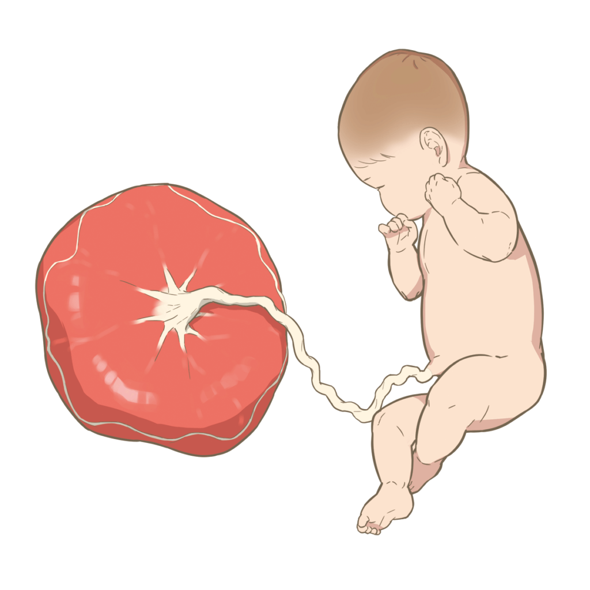

生物の進化には、進化論があるが説明できない現象は沢山あります。それを補足する理論として、ウイルスの感染より、ゲノム変化が起こる理論があります。簡単にいうと、ウイルスのRNAが、寄生の主の染色体と結合して、変異を起こすことです。

例えば、妊娠中の妊婦と胎児が、異なる血液型をもつことは普通ですね。血液型が異なると、人の体の中では異物として、排除するのが普通ですが、何故、妊婦の体に、異なる血液型の退治を排除しないか？って考えたことがありますか。

<figure>

<figcaption>

胎盤と胎児のイラスト

</figcaption>

</figure>

異なる血液型が人の体に入ると、命に係わる危険なことです。妊婦の体内に、胎児と共存するための器官が胎盤です。胎盤は血液を乗り越えて、養分と廃棄物を、渡橋のような役割で、上手く胎児を育てる。この胎盤のゲノムがウイルスから進化したものだそうです。

要すると、ある爬虫類の群が、ウイルスに感染して胎盤が生まれるように、変異が起こったそうです。

最近、新型コロナなど、マイナスな情報があふれていますが、ウイルスがすべて悪ではない事、伝わればと思います。
