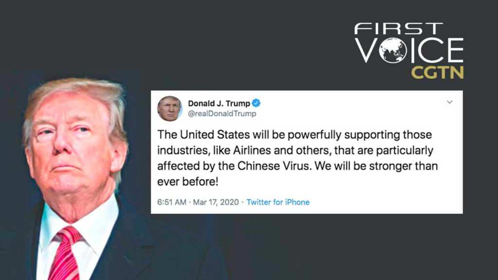

アメリカの衰退が事実であり、連続したサーキットブレーカー、FRBの金利下げ等、トランプ政権は経済に対して打つ手が殆どなくなっている。この一週間ぐらいで、アメリカ市場は日本の年間GDPに匹敵する数万憶ドルの資金が蒸発し、更に、原油価格の爆落で、経済の面では、トランプ政権はほぼ手上げでしょう。  
１１月の大統領選挙に向けて、何かしらのことをやらなくてはならないので、以下の２通りと想定しております。

**１．経済から注目を離れるようにして、代わりに、アジア系の種族差別を煽る。  
**　民主国家だから信じられないと単純な人はいるかもしれないが、アメリカは宣伝されたような天国ではないことを早いうち、頭に入れておいた方がよい。  
　普通の米国民は中国人も、日本人も同じく見えるので、集団リンチなどの差別を受けたら、偉い事になるので、[取り敢えず武器を準備するって、２週間前以上、警鐘を鳴らした](https://blog.loveapple.cn/news/202002284270.html)。  
　トランプ氏の「Chinese Virus」発言が、その前奏であり、クー・クラックス・クランなどの極右組織、ナチズム組織はこれから行動に移すでしょう。  
　行き成りアメリカから逃げる事は現実的ではないと思うので、トランプの支持者、共和党の勢力が強い州は保守的であり、成るべく、ニューヨークなど、民主党勢力の強いオープンな 州へ行く方が無難でしょう。

**２．軍備で消費を牽引**  
　他の記事でも何回か繰り返したと思います。今年、台湾の統一戦争の可能性が高い。  
　・現状の原油価格の爆落でも、産量がアップ  
　・台湾の事実上鎖国  
　・アメリカの経済不況等、  
　色々、戦争の起こり得る条件が揃えているように見えます。台湾での戦争で、世界中の産油国も、軍備の輸出国も、皆は大喜びになります。特に経済不況の2020の各国にとっては、雪中送炭ではないかと思います。  
　因みに、２、３月、解放軍の戦闘機など、連続で台湾の防空を試みていたことから、統一戦争はオンスケではないかと見受けています。

COVID-19で、アメリカは混乱に堕ちいます。医療インフラの不足、防疫の物質不足など、人種差別がなくても、これからの１，２ヶ月は、かなり大変な時期になると見込んでおります。  
お身の安全は何よりです。

**3/19追記：**

米経済の衰退というところか、崩壊のリスクもあります。  
成るべく現金を手元(家)に多めに用意しておこう。例えば、半年間、クラスに必要なお金とか、準備しておいた方が無難でしょう。  
勿論、口座から全部の引出すと振込に必要な場合、困るので、ご自分の状況にあわせて判断してください。

株、金、ビットコインなど、あらゆる投資の物は下がっていることは、現金が欲しがっているのが米の実情です。今の状況が悪化すると、銀行も倒産になるリスクが高くなるでしょう。いざとなる時、口座からお金が下せなくなり、生活に困る可能性あります。この事例が曽てもあります。
