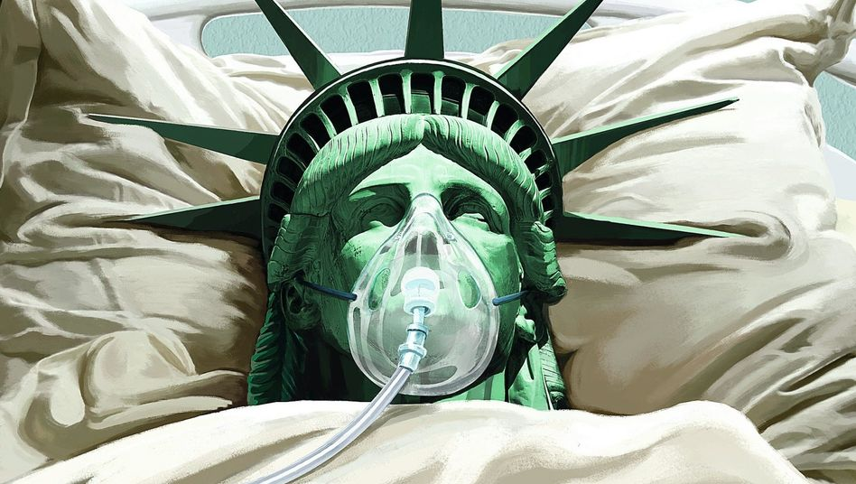

トランプは中国やWHOに責任転嫁せざるを得なくなっている状況に陥ったのです。  
COVID-19(新型コロナ)は12月末から武漢からパンデミックが爆発し始めて、4ヶ月以上経ってます。アメリカの感染者数、4/20 15:00の時点まで、患者数が70万、死亡4.1万人を超えたと公表されています。

COVID-19がどこからか、別として、1月、武漢封鎖から、3月頃？、アメリカ本土の感染者がでるまで、2ヶ月程経っていました。感染者数は今後100万を超えるでしょうから、では、トランプ政府はちゃんと、防疫できてるかどうかについて、大きな矛盾があります。

1．防疫ができていると言ったら？  
　政府としてやるべきことを尽くしたと言ったら、何故、100万(？見込み)ほどの感染者になるのかと言えば、最初からこのCOVID-19がアメリカにあるものとしか言えない。数千万のインフル感染者と比べたら、確かによくできたと言えるでしょう。  
　これが成立したら、では、中国がアメリカよりCOVID-19を見つけたと、世界に公表後の12月以降、トランプ政府は何をやってた？

2．防疫できてないと言ったら？  
　実もそうでしょうけど、責任はあまりデカすぎるから、そのままでは事実を言えません。

2020年11月の選挙に向けて、トランプは準備しなくてはならない。韓国のようにちゃんと対応して収束できれば、与党に大きなプラスになるわけだが、中国から防災物資の輸入など、防疫にやるべきことはアメリカの大手企業の利益に相応しくないらしくて、情報の封鎖、世界各地から物資の強盗等、色々やってきたのです。

責任を負うことができなければ、逃げるしかありません。これはトランプ政権に特化したものではなく、民主政権はよくやっていることです。  
転嫁しやすい相手は、長年で邪悪化した共産党政権の中国、もう一つは、元々気に入らない国際組織のWHOです。

中国向けはあくまで貿易戦の継続でしょう。あまり正当な理由がないが、中国ウイルスとか、情報隠蔽とか、本当は論理の通じない言訳で中国に責任を転嫁しようとしている訳だ。  
トランプは最初から色んな国際組織から脱出しようとしたところもあり、新型コロナで、米の製薬企業の生産などは本土に戻ってほしいらしくて、WHOにプレッシャーをかけたようです。

テドロス氏はあくまで雇われた人で、できることは定まられているので、トランプの言ったような中国よりが基本無理です。テドロス氏のボースは190ヶ国と国連です。そして、WHOがあくまで、顧問的な役割で、アメリカはどう防疫するか、実際には何もできない。最初はやばかったけど、自国の状況にあわせて、WHOの推薦を忠実に実行し、収束に収めた韓国もあるわけです。トランプの非難は全く成り立たない。

トランプ政権や、アメリカの議員たちは、責任転嫁すべきだと、1ヶ月前から、わかってきて、中国やWHOを非難し始めた、トランプの言訳が事実と全く関係ない事は分って頂ければ、気づいてほしいのが、何故、日本はトランプのでたらめな話を大幅に取上げてるのかと、安倍政権も責任転嫁したがると注意を払うべきかと思います。

2月から、正式に中国から入国禁止と言わなくても、事実的に中国から入国した人はかなり限られたが、欧米からの入国はしばらく通常通りでした。イランや、ロシアと同様、COVID-19が大量に欧米から入ります。ハワイへ旅行してきたら、感染した事例もあるから。特に、最近の首都圏の感染者の増え方もかなり異常です。  
日本は、まだ、武漢や、韓国のような大規模検査は実施していると言えない？かな、でも、**東京の[罹患率は38.7%](https://www.mhlw.go.jp/content/10906000/000622837.pdf)に**達している。NYと同等かどうかは私が判断できないが、かなりやばい状況であることは間違いありません。これから、沢山の死者がでても、おかしくありません。

皆さん、自粛期間中、成るべく外出しないでください。  
**生活必需品を買い溜めて、成るべく外出の回数を減らしてください。**  
医療関係者、スーパーや、物流の関係者、皆さんの生活を支える方々に敬意を表したいと思います。
