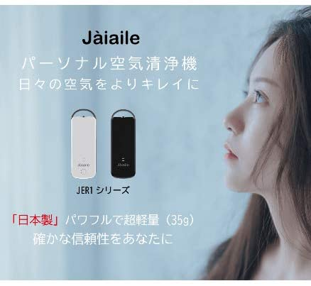

いくら外出自粛、完全封鎖といっても、医療関係者、生活必需品の小売り業、物流業の関係者の皆さんはこの社会の回転を支えるために、常に危険な所にいるでしょう。普通の人でも、生活必需品を購入するために、外出しなくてはならないかもしれません。

手洗い、消毒、マスクをつけるなど、常識ですが、パーソナル空気清浄機を使って、周りの空気をきれいにして、飛沫、ほこりなど、ウイルスの感染する媒介をなくすことで、感染の確率を軽減すると期待できます。

やはり、日本製は得意、不得意な分野があり、単純な布マスクより、日本製のパーソナル空気清浄機はPM2.5まで対応してくれるので、花粉は勿論、今の季節では、まだ、お役に立てそうです。  
中国新型コロナウイルス状況応急研究研究チームリーダー、鍾南山氏は、空気清浄機等を活用して、身の回りの常に良い環境を保つ事も大事であるとアドバイスしております。中国の新型コロナの治療現場でも、空気清浄機を活用しているようです。

特に、東京の感染状況はかなり大変になっているので、外出時に、パーソナル空気清浄機をぜひ使ってみてください。自らの周りのコロナ感染ルートを遮断しましょう。

商品ページ：[https://store.shopping.yahoo.co.jp/acherrytree/search.html?p=Jaiaile#CentSrchFilter1](https://store.shopping.yahoo.co.jp/acherrytree/search.html?p=Jaiaile#CentSrchFilter1)

https://youtu.be/Z6aMM\_rKoew
