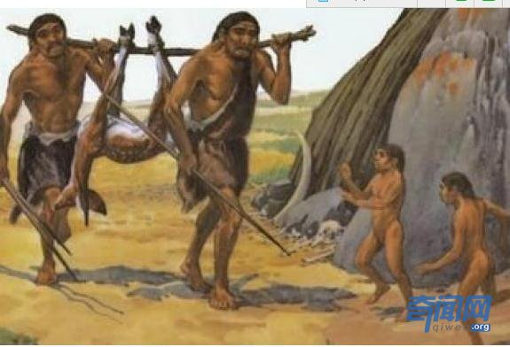
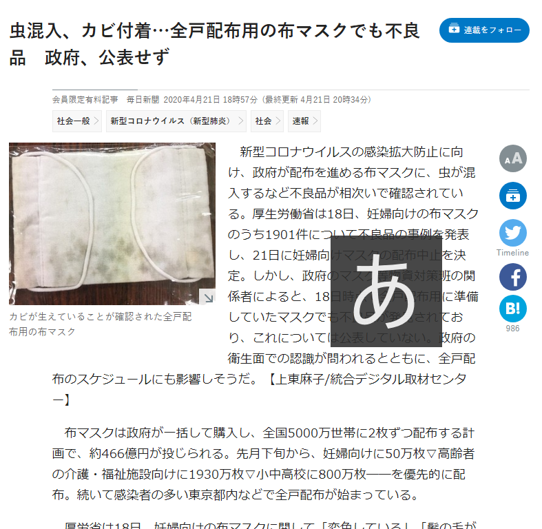

人類は数万年の進化してきてる中、常にウイルスと戦ってきたものです。COVID―19の完全退治もその一つの過程であり、以下の2ルートを選べます。

・ルート1：未来人らしく生きる事  
・ルート2：原始人らしく生きる事

- 
    
- 
    

ルート１は中国の選んだ道です。防疫の中で、最先端技術を生かして、情報開示で見える化を実現し、ほぼ全員を一丸にして、対応していることです。  
こちらについて、ウイルスが人類の敵だと共通認識して、人間の命を一番大事にして、皆で一緒に戦っていくことは非常に重要であることです。

ルート2はアメリカ代表したいくつか民主国家のやり方です。  
グローバル化を反して、救助物資の流入も色々壁を設ける。世界工場の中国は一番安価、品質良く物資の提供はできるが、国内の財閥の利益に相応しくないから、とにかく反する。  
庶民の反発を防ぐために、反中を煽る。だから、５Gもあらゆる中国製もコロナだとレッテルを貼って、裁判で提訴する茶番まで演出している。  
反グローバル化の極端な所までに進むと、原始人のように、村間の移動は1日程になれば、どんなウイルスも、感染病も、完全退治できる。

日本も麻生大臣の主導する脱中国製で、メンマから、カビ入りの布マスクを全戸配布に至ってます。これから、日本はどのような茶番を演出するかわかりませんが、このまま続くと、本当に損するのは、日本のお金持ちも、中国人もなく、日本の右翼信者だけです。

私は何かしらの事を呼びかけようとするつもりがなく、いつも私をフォローして頂く方々に、煽られないように、客観的な判断ができれば、コロナ禍から生き抜くことはできると伝わればと思います。
