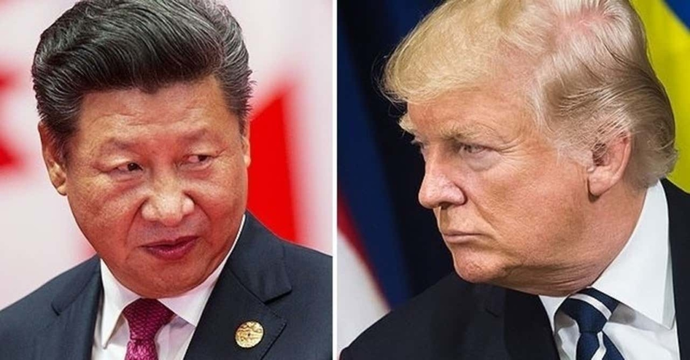

私のいつもの論点ですが、米中は紛争を演じて、共に弱い他国から利益を吸い上げています。トランプ氏の中国が持つ米国債の無効化と謳うことも同じく、相手は中国のようだが、本当にターゲットになるのは中国ではありません。

今年の2、3月から、[FRBが兆単位の大量なドル](https://www.nikkei.com/article/DGXMZO56743500T10C20A3000000/)を新たに発行し始めた。1兆ドルって、どうい事かと、大韓民国2018年のGDPが1.6兆ドルで、日本は4.91、2020年は、大韓民国年間GDP並みのドルを印刷するでしょう。  
ちょっと、話が脱線しますが、富は通貨の印刷で生まれないので、米国は通常より、世界からこれほどの財産をこれらのドルで交換する意味で読み替えたほうがよいでしょう。

但し、FRBは政府ではないので、そのまま印刷したドルを政府は使えないらしい。これら、新たに印刷したドルを補助金、政府主導の投資などに回したいときは、国債を発行して買ってもらうのは普通です。

こちらで一つの問題があります。大手の国債の持ち主は既に沢山もっているので、新たに大量な購入が難しく、手元に持っている国債を売ってもらう必要がある。しかも、安売りしないとだめです。  
何これ？あほらしいことを言ってるかもしれないが、こちらはウォール街のエリートたちの素晴らしいところです。2月以降、トランプの発言を含めて、原油価格の爆落、国債の爆落などを思いだしてみましょう。  
米国債について、1．成るべく安くする、2．金利高い時期になる前、売ってもらうように、不安を煽るなどをする。

注目してほしいのは、いくら米国債の無効化と謳っても、中国の保有量はさほど変わらないようです。去年から、中国の保有量が計画的に減ったのですが、トランプの煽りは中国に効きません。  
集計データが手元にないので、具体的な数字を出せませんが、流れを見る限りでは、日中などの大手以外、本質を読めない持ち主が、米国債は大量に売って、現金化にしています。  
世界全体の経済が減速して、安定性を求める現金は、また、新たに発行される米国債に流れるでしょう。

こちらは、大量な現金を政府に回して儲かることが、中国の米国債を無効化と謳ってきた本当の目的です。  
金融のクレジットは米の立国の原点です。誰がの持つ国債を無効化する事は、まず、あり得ません。
