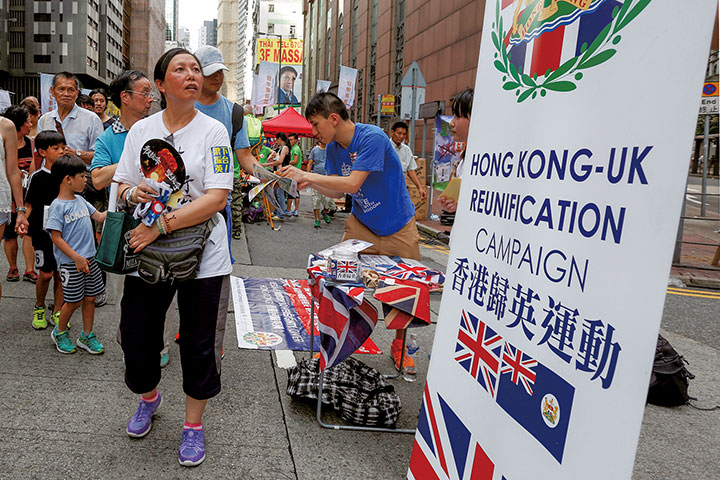
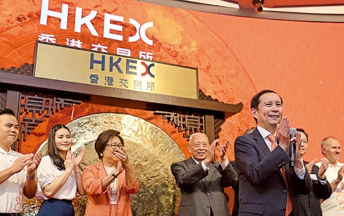
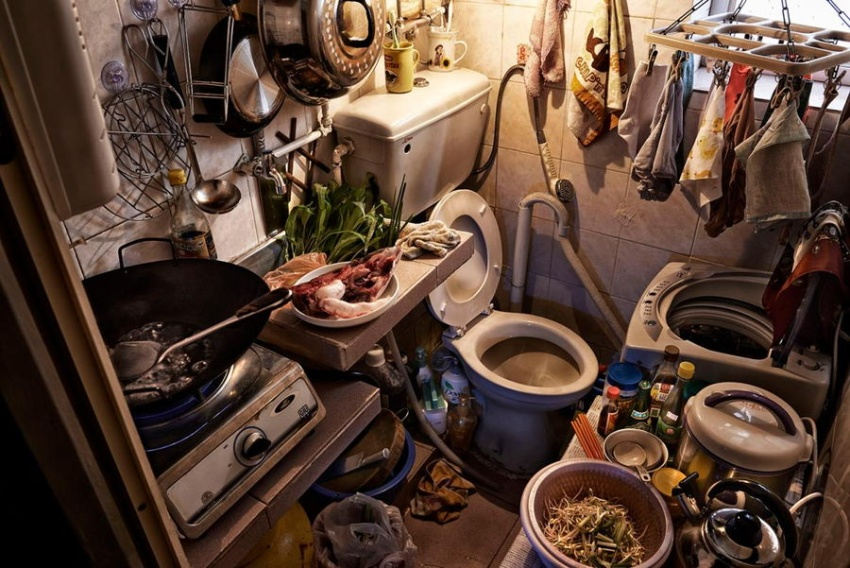
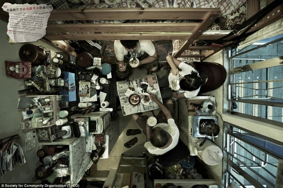
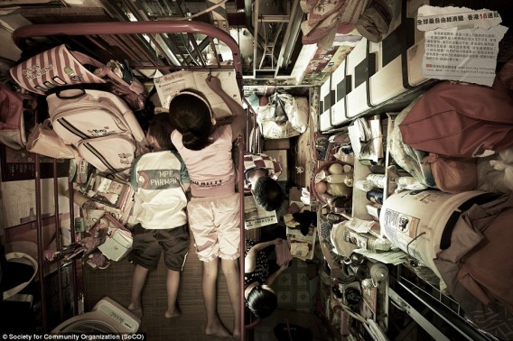

香港の反送中運動で、どこでもあるような刑事犯引渡条例を反対するところから、今の香港国家安全法案まで、香港の所謂自由派は捨てられるまで、ざっくりと紹介したいと思います。  
私のいつもの観点ですが、政治について、我々庶民は見るのはよいが、成るべく関わらないようにしよう。

1997年、香港は中国に返還したと皆さんはご存知ですが、本当は、返したのが主権だけです。香港にあるお金、資産は基本、イギリスのもので、既得利益です。中国のコントロールできない状況は、今まで続いています。「自治」と間違う人はいるでしょうが、本当は「外国治」で、主権があっても、非常に弱い立場であることが現実です。でないと、**20年間の反中教育**でもあり得ないし、こんなに所謂自由派が育ちません。

ここまで話したら、香港は「自由」だった？と勘違いだらけの疑問がでてくるかもしれませんが、1997年以降、「**20年間の反中教育**」に注目してください。中国に返還する前に、香港では、中共政権をバカにする事以外、政治を議論する自由がありません。特に英皇室について文句したら逮捕します。基本、選挙もありません。(なお、中国返還のために、不安定の種を埋めるために直前数年に設けたが、当時は飾り物です。)  
自由になったのが、中国に返還以降、選挙、政治関連の言論自由はできるようになりました。  
但し、自由というものは色々意味があるので、イギリス資本管理下の香港は、小学生から、「国民」という意識をなくして、反中教育を強化してきました。  
ここでは、本当の中国を知るようになるのではなく、中国に対して恨ませるような教育です。勿論、自由と関係ありません。地域、人種の差別など、香港の若者をテロ化にしてきました。

しかも、この人たちは反中だけではなく、故郷の香港にも愛情がなさそうです。香港を愛する人なら、まちを壊して回っていくはずがない。米大統領は香港に特化した関税制度を廃止するような発言をしたとき、何を表すのか考えるはずです。イギリス人になりたがるようだが、何故イギリスが簡単に受け入れないか、考えるはずです。けして、数人のリーダーを除いて、この人たちは、どこの国もいらないものになるでしょう。

中国にとって、この香港の状況は望ましくなく、管理を強めなくてはならない。但し、いきなり〇〇法案をだそうとすると、現状を変えることによって、英米だけではなく、世界のあらゆる国の反発が必至です。

反送中運動で、中国は望ましくないでしょうが、イギリスの財産を壊してきたので、中国政府にとって、反対だけど、他人の財産を守る義務がなく、放っておきました。  
本当かと思うかもしれませんが、所謂自由派の奴らはいくら崩壊して回っても、中国の勢力にさわりません。香港駐在解放軍が、街で掃除した時、あの自由派たちは遠く離れて、別の所で騒動していたことから、わかるかと思います。いくら反中と称えても、中国利益のレッドラインに触りません。  
騒動中の奴らのボースたちは何をやってはいかんか、はっきりしている。所謂自由派も、自らの意識ではなく、雇われている、一斑は見えるでしょう。

https://twitter.com/rthk\_enews/status/1195623625371422722?s=20

香港のインフラ、不動産、企業など、大多数はイギリス系資本です。米CIA主導の騒動と、中国の放っておく対応は、必ず何かしらの理由があるわけです。それは、イギリス系資本の排除かと思います。  
イギリス資本排除することに当たって、米中の資本は入ってくる必要があります。  
トランプ氏の中国企業をアメリカから追い出そうといってるが、アリババ社をはじめ、単に中国マネーではなく、アメリカで上場する事は、アメリカのマネーも含んでいるわけです。  
これらの優良企業のお金を捨てるって、トランプらしくないでしょう。香港へ移るだけかと思います。

<figure>

<figcaption>

**香港証券取引所でアリババ社の上場を祝うダニエル・チャン氏（右から3人目）**（写真=ロイター/アフロ）

</figcaption>

</figure>

何故、香港ですか？中国は米ドル体系にある限り、孤立されることがまずありえないし、世界一規模の中国市場は捨てられない。香港は重要な拠点であること、将来もさほど変わらないかと思います。但し、香港を動かす本当のボースが英⇒中米に切り替わるかと私の見えたところです。

いきなり、国家安全法案、イギリス資本を排除しようとしたら、関連国からの反発が必至ですが、「反送中デモ⇒騒動」、貿易戦の色々があることで、唐突しないでしょう。勿論、所謂自由派は必ず国家安全法案を反対するが、具体的な説明ができなく、声を出すだけで、終わってしまうでしょう。

話は戻って、本文の主役の香港の所謂自由派を見てみよう。少数の有名になったリーダーを除いて、この人たちは何を得たのでしょうか。失業？ボロボロにされたまち？  
香港は人平均GDPが非常に高いが、収入格差が激しい、日本人の想像できないほど本当の資本主義の社会です。長く続いた騒動は、社会への不満も多いでしょう。但し、やり方が間違っている。

<figure>

- 
    
- 
    
- 
    

<figcaption>

香港の一般市民の住宅事情を表すイメージ、空間に集めたトイレ、キッチン、寝室

</figcaption>

</figure>

上のギャラリーは一般市民の住宅事情を表す一斑です。これらの全て、イギリスは香港に残した問題について、イギリス資本配下の〇〇運動では何も改善できません。改善しようにもしない。  
普通の香港市民の福祉などを求める要望は理解できますが、共産党の力で一般市民向けの投資が必要であると、反中教育で漬け込んできた若者たち、誰も理解できないようです。  
福祉改善要望⇔改善しようとする政府、本来はニーズがマッチしやすいはずだが、福祉改善=資本主義の社会に共産主義の要素(※)を導入することになるので、反発されるの繰返しでした。  
(※日本も同様、資本主義の社会では市民の福祉を高めるには共有制の要素が必要です。話が長くなるので詳しく説明しませんが、日本が中国より共産主義らしいと言われるのはこちらが要因でしょう。

中米はイギリス資本を香港から排除、管理の強化させるために、所謂自由派を利用(?)して、スムーズに進んできたでしょう。利用し終わって捨て駒になるだけです。国家安全法案が成立後、また変にやると、捕まえて、虚構された民主と自由のために、人生を捨てる事になるでしょう。

政治は我々の生活に関わるものですが、重要ではありません。関わるには、少なくとも、それなりの知識の備蓄が必要な訳です。我々一般の人には、煽られないよう、常に冷静で対応できるよう、政治と距離を置くべきだと、私のいつもの主張することです。

この香港の件について、言及できないのは、中米は裏側にどのような利益交換したかです。流れを見る限り、台湾のスパイが、香港へ避難することが難しくなるだろう。中国は、強権に戻る道に辿っていく中、領土の問題を一つ一つ納めて解決していく。次は台湾で、香港の所謂自由派も、台湾へ上陸し始めているようだ。

https://twitter.com/loveapple/status/1264178423523508224?s=20
