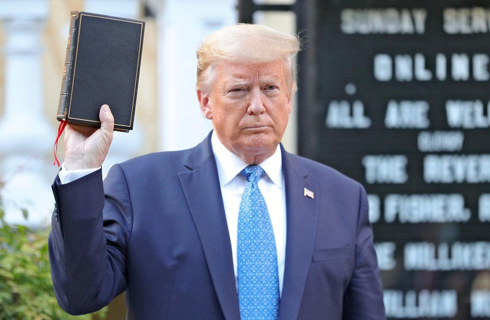

[トランプ氏「ワシントンに軍派遣」緊急演説](https://www.google.com/url?sa=i&url=https%3A%2F%2Fwww.news24.jp%2Fsp%2Farticles%2F2020%2F06%2F02%2F10654424.html&psig=AOvVaw0Cn8NJQg-1E1b-IJgdfxm5&ust=1591406279429000&source=images&cd=vfe&ved=0CA4QjhxqFwoTCIDR-8LA6ekCFQAAAAAdAAAAABAI)で表明しました。  
一言まとめると、軍隊を派遣してデモを鎮圧する事は、USAという国を分断して、トランプ政権の利益の最大化を図ることを表します。勿論、内戦状態に導く可能性も高いです。以下、その理由を説明します。

**世界一の反人種差別デモ**

今のアメリカの抗議デモは反人種差別運動です。ジョージ・フロイド氏の警察官よる殺害がトリガーですが、黒人などの人種差別が、奴隷時代から、アメリカ大陸で、長い歴史を持つ考え方ですので、簡単に無くすことはできません。白人以外の黒人、ヒスパニック、アジア系は全て差別される対象です。  
世界一の反人種差別デモに至るには、仕事のない暇な人を大量に作る史上最悪の失業率も要因の一つです。  
更に、新型コロナ対策、黒人の高い罹患率と死亡率は、遥かに白人を超えている所、政府への不満は高まっているでしょう。

**トランプの当選は分断させることからだ**

アメリカの一番大きいな政党、共和党と民主党ですが、保守勢力と民主勢力を代表していると言えるでしょう。  
トランプは保守の共和党です。同氏の「アメリカを再び偉大に」のスローガンは印象に残ろ方は多いと思います。彼の主張する事は、イメージ的に、白人のお父さんは規律的に工場で働き、お母さんは専業主婦で家事や育児に集中するような、昔のアメリカでの生活スタイルのようです。こちらも、アメリカの福音派の主張する理想な家族だそうです。

トランプ氏は優秀は経営者ですが、政治にあまり経験がないので、選挙では選民にどう国を制するのより、人種差別を煽って、保守派の白人を絶対な支持を得るために、力を尽くしてきたでしょう。

「アメリカを再び偉大に」をスローガンにして、移民の排除、製造業を米に取り戻すために、反中、そして貿易戦まで、経済の分かる人には不可解な事ばっかりに見えるかもしれないが、保守の白人の絶対な支持を得てきました。

**新型コロナ、抗議デモがあっても再選するには？**

候補者を選ぶ選民は、政治や、経済に詳しくない、知らない人は大多数ですので、民主制度では、必ず有能な人が選ばれると限りません。トランプ氏は、経済、政治にあまり目立つ実績が見えなく、新型コロナ防疫に大失敗している、大失敗に見えるかもしれないが、トランプ氏ならば、上手くやれば、再選の可能性は高いです。

再選するために、基本的な考え方は、当選した時と大筋が変わらなく、同氏の実績から注目を離すように、国民の対立を煽り、多数の白人の支持を得ていくことです。軍派遣は以下、二つの意図があります。

1．米軍の人種の構成として、白人以外の黒人、ヒスパニック、アジア系は、約40%を占める。米軍を反人種差別デモの鎮圧に派遣する事は、必ず反発があり、最悪、軍の反乱があっても想定内でしょう。  
2．今のデモは、基本反トランプとなります。軍を盾にして、反米軍、そして、反政府になるでしょう。政府や軍を支持する人は沢山いるので、政府や軍を支持することを、トランプ支持に変える事は可能でしょう。

アメリカの反人種差別デモが発生して以降、トランプの行動は、基本、内乱を煽っています。軍派遣して、デモを鎮圧する事も、更に、状況を悪化させて、支持を固める一環となります。勿論、米軍を巻込んで、デモの鎮圧をやらせると、アメリカは内戦に陥るリスクが高まるわけです。混乱するほど、責任転嫁しやすいし、更に福音派の宗教の要素を加えると、不安を満ちている庶民は煽りやすくなるでしょう。

トランプの意図は、国防総省は看破しています。前任、現職の国防長官は、皆、反発しています。  
現職のマーク国防長官はあまり反対しすぎるとクビされるでしょうが、今後の動きを見てみましょう。  
トランプは、アメリカをどこまで分断できるのでしょうか。

**補足：**

各勢力を分断させ、自らを含めて、孤立させることは、トランプ氏の国外、内に一環とした戦術です。  
国内の選挙では、行き成り50%以上の支持率を得られなくても、絶対支持層に忠実していることで、約13%をずっと、確保しています。  
人種差別、紛争を煽って、各勢力を分断する事を実現することで、13%の支持でも、勝ち抜けるために、十分に大きな勢力である。当初、当選した時から、ずっと変わっていません。  
今、民主党のバイデンは、民意調査で55%の支持を得ても、選挙で勝てるか、言い難いです。民主党内部でも、盤石ではなく、分断される可能性が高いからです。

2020年の米大統領選挙でも、トランプ氏再選の可能性が依然として、高いと見ております。
