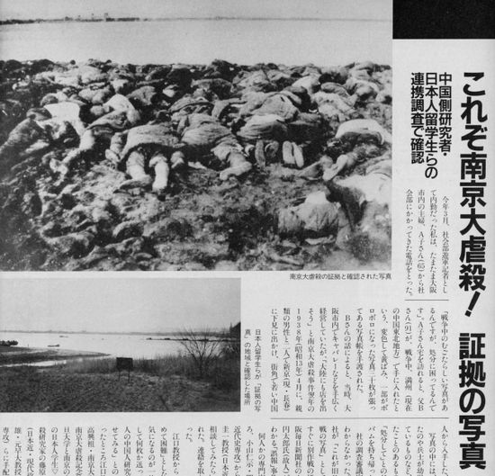

南京大虐殺について、江沢民派の偽造学者のおかげで、数字の論争は色々あります。  
但し、日本軍は当時の中国の首都を落として、降伏した軍人や、民間人の虐殺、レイプ等、反人類の罪を犯したことは間違いない。

当時の中国人は、勿論多くの軍人も含めて、日本に統制されることが特に違和感なく、反感もなかったようだ。  
南京大虐殺のお陰で、中国人は反抗しないと虐殺されることを分かって、中華民国政府は多数の庶民の支持を得て、抗日戦争は新たな転換点になりました。  
今、振り返ってみても、侵略戦争を興す理由は分かって理解できるが、意味のない虐殺について、正直、理解できません。  
単なる上目線で解釈できるのでしょうか？だから、原爆について、いくら日本は被害者立場と主張しようとしても、中国では全く通じません。

  
もし、日本は強くなった中国と再び戦争が起こったら、日本はどのような目に遭われるか想像付きません。  
これは、私いつも日中友好を唱える原因の一つです。
