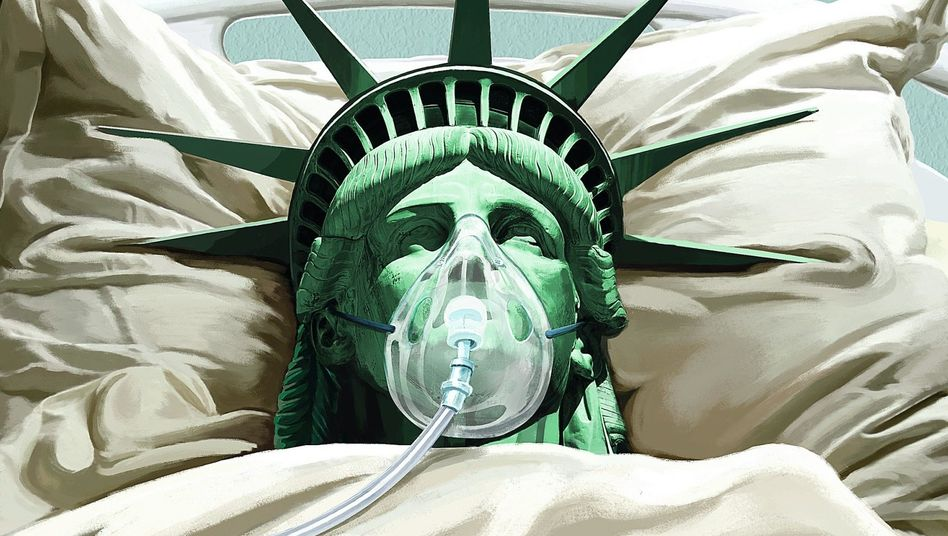

新型コロナのパンデミックで、この世界一の大国のアメリカでは大惨事が起こっています。  
イデオロギー指向で防疫の良いタイミングを失い一方、政府の行政力無能さ、全て暴かれています。約半年で、帳面上の死者だけでも、12万を超えました。  
ワクチンが早く出て、このコロナ禍の大惨事が終わりに迎えるかと願いしたいが、仮に理想なワクチンが開発できたとしたら、別の紛争になり、特にアメリカは、新たな危機に迎えるかと思います。

仮に新型コロナのワクチンが、インフルエンザのワクチンと同様な工程で製造するとします。  
原材料に鶏の卵が必要です。これが、スーパーの並んでる鶏卵ではなく、無菌化された独特な卵です。  
大体、１ワクチンを製造するのに、２、３個の卵が必要とするらしい。主要国ほぼ全員予防接種の場合、３０億個以上必要らしいです。

インフルエンザワクチンが、２、３種類のウイルスに効くので、新型コロナ向けのもの場合、仮に一種だけでも、少なくとも、３０憶の卵が必要になるでしょう。通常の卵なら何とか行けそうですが、無菌化する卵でしたら、難しいでしょう。

アメリカのような、防疫に怠る場合、予防接種の途中で、新たな変異でパンデミックになり、最初に接種した成果は全て水の泡になるじゃないか？

仮に、ワクチン開発も、大量生産の原料も何とかできたとして、では、どう輸送しますか？  
ワクチンを輸送する容器はホウケイ酸ガラスで作られています。通常のガラスでは、基本、使えません。  
EUの医療用ホウケイ酸ガラスの生産メーカに、既に、十億以上の注文が殺到したようです。「十億」の意味とは、約２年ほどの生産力に当たるらしい。  
ようは、世界規模のワクチン輸送の容器を生産するだけでも、１、２年以上かかるらしいこと。  
中国メーカーの生産量が上がれば、それほどかからないかもしれないけど、単にこれらの数字でみると、全て順調に進んでも、新型コロナの鎮静までは、2021年以降、2022年頃のことになるか推測します。

こちらは製薬の専門家ではなく、素人でも分かるような情報でまとめてみたので、実施の所、ワクチンの生産フローが一般人の想像もつかない複雑になるでしょう。  
初期頃、連邦政府と各州との呼吸器、マスクの強奪バトルから、ワクチンの時も状況が改善できると望めないでしょう。

東アジア諸国を見ると、ワクチンがあれば、希望が見えているかと思いますが、  
アメリカは、ワクチンがあっても、中々鎮静になる考え難く、逆に、新たな危機が現れるでしょう。
