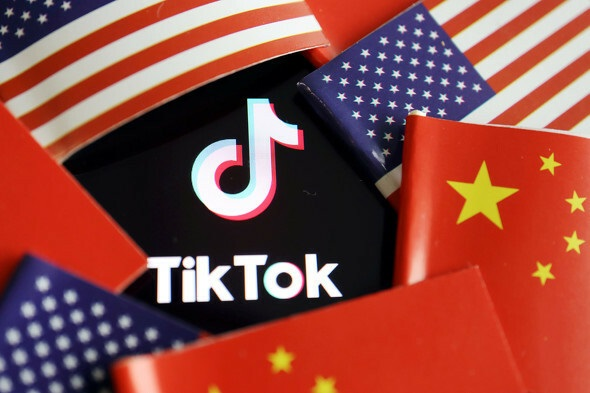

行政権を乱用して、強引に普通の企業を売らせることは、正直言うと強奪です。これで、米国の商業環境、政府の信頼度は下がるわけだ。トランプ氏の本当の意図何か、一言いうと、反グローバル化です。

本当に情報漏洩などのセキュリティ問題があれば、FBI等、一発でぶっ壊れるから、トランプまで登場する必要ない。勿論、トランプ氏のチームはこれらの副作用を知った上、あえてやる本当の目的は、中国も、同じ手口で中国に進出する米企業に仕返してほしいわけです。もし、中国政府はそのまま思う通りに、穴に墜としたら、米企業は自然に米に戻るでしょう。  
2019年ごろ、懸命に呼びかけた製造業をアメリカに戻そうとしたが、あまり効果が薄かった所、TikTok禁止で現実に一歩進めたかもしれない。

日本もこの反グローバル化の風潮に流されたらどうなるかわかりませんが、経済、科学技術の発展は打撃を受けるのではないかと思います。少なくとも、米の奴隷として、縛られる運命に深めるでしょう。トランプ氏はうれしいことです。
