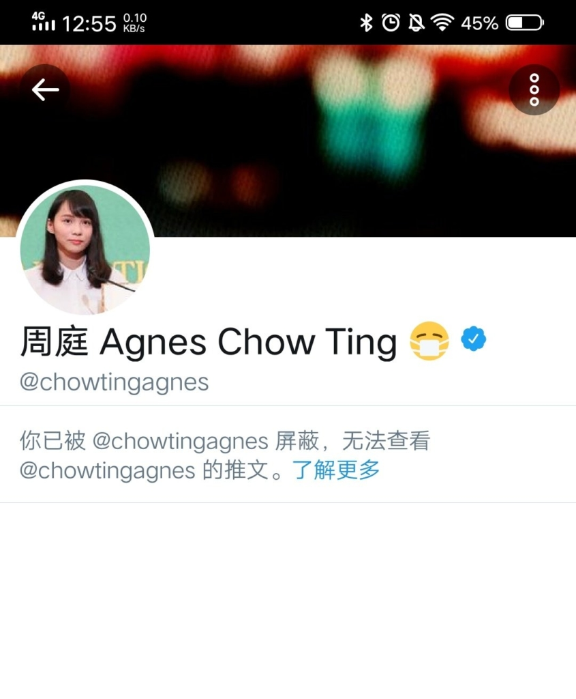

@chowtingagnes 政治を主張する著名人は、自らを批判するアカウントをブロックするのとしたら、どう思いますか？  
もし、そのような人は政権を握って、同じ事をやるとしたら、異見を持つ人を逮捕したり、暗殺したりすることになるでしょう。  
曽てのドイツ、中国(国民党、共産党を全て含む)、日本等、全ての独裁政権はやっていたことで、ファシズムと同じです。

勿論、私は周庭の解除を求める事ではなく、香港区議会選挙、自称民主派の圧勝後、初の大規模騒動の後、改めて、この周庭の主張する「民主」運動の本質について、日本にいる皆さんは考えてもらいたいです。

もし、貴方は正義だと思って、「香港加油」としたら、香港政府、中国共産党政府、香港のプロテスター達、どれが独裁なのか、この機会を通じて、考え直してみたらいかがでしょうか。  
  
あの周庭さんの本質はファシズムです。

https://twitter.com/AmandaChen202/status/1200917337978753025?s=20

https://twitter.com/liamstone\_19/status/1201220630684680192?s=20

https://twitter.com/linguelingue2/status/1201167756608995328?s=20
