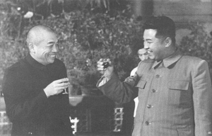

中国の公開した朝鮮戦争資料について、ざっくりと、おさらいします。

**背景**

今は北朝鮮が貧しい印象を持つ日本人は多いと思いますが、当時の北朝鮮の経済力は韓国を圧倒的でした。当時の韓国は東京と似ており、庶民の生活は苦しかったのと廃墟だらけの環境だった。 韓国ではちゃんとした軍がなく、治安を維持に中心とした武装で、戦車などの重装備がなかったので、これは、金日成は38度線を超え、朝鮮半島を全て手にしようとしたわけです。

**中国も米国もやられる側**

当時の北朝鮮は侵攻のために米国の侵略だと言訳を作ったが、今の明らかになった資料では、米国はそんな意図はなかった。 結果的に米中は戦場の主役になったが、中国も米国も戦争をしたい意図はなく、北朝鮮とソ連は戦禍の禍根でした。

金日成の南進について、元々中国は関与しなかったものです。 金日成とスターリンの密約があったでしょうが、この辺の資料について、今でも開示されないようだ。 北朝鮮の戦争前から全滅するまで、中国は朝鮮から何の連絡もなかったようだ。毛沢東でも新聞紙の見て戦争が起こった事を分かったという事でした。 逆に、朝鮮軍が圧勝した時期、中国は仁川を含めて米軍の奇襲に警鐘を鳴らしたにも関わらず何の返事もなかった。 その後、多くの日本の方のご存知の通り、米軍は仁川で上陸し朝鮮軍を撃破した。 志願軍のリーダー彭徳懐氏が山の中で金日成を見つけた時、元々20万ほどの朝鮮軍が、金日成と2人の警備員しか残らずでした。

**中国の参戦**

米軍は朝鮮半島のほぼ全域占領したところで、中朝辺境が米軍機に爆撃された事は多かったです。 意図的にやったか、パイロットは迷って使いきれなかった爆弾を捨てただけなのかわからない、北朝鮮の情勢不透明すぎた状況で、毛沢東の代表した上層部は米軍が朝鮮の次、中国を侵略する可能性が高いと判断がありました。

当時の中国は空軍がほぼなし、中心部の内戦は落ち着き1年ほど、成るべく戦争を避け、国の建設に集中したい。中国は参戦としても仁川上陸の前であろうと米国の判断でもあり、中国の事をあまり気にしなかったようだ。

この状況の中、中国は本当に戦争に陥る事を極力避けようとして、志願軍の名義で宣戦しないで、密かに朝鮮に入って、奇襲で米軍を38度線以降、留めるようにしました。

・金日成は間違いなく、スキル足りない野心家である ・スターリンは東亜の紛争で政治利権の最大化を図ってる。 この2人は、間違いなく、戦禍の禍根である。 ・中国は成るべく平和な環境が欲しく、米ソ勢力のどちらに対しても無力で、国境から米勢力から極力守ろうとしたわけです。 ・米国も中国と同様、被害者であろう、その後、日韓経済の発展に力を入れて、ソ連勢力の侵入を守ってきたと思います。

**まとめ**

朝鮮戦争は引き分けと主張する説があります。韓国、米国の観点からでは、戦争前の状態に戻り、それは正かもしれません。 中国にとっては、米軍が中国の国境まで、戦争に関与しなかったので、中国の国境から米軍を38度線まで追い出す事は、本来の目的にも達成したし、その後、数十年の間、中国の東部と南部、米国勢力の軍事的な侵攻を防げました。 数十年後、ベトナム戦争の北緯17度線の確保にも繋がっています。 多くの中国人は犠牲したので、完勝と言いませんが、異なる時代の武器でも、米軍を勝ったと、疑問なく言えるでしょう。

中国と北朝鮮、お互いに侵略を受けたら、軍を出動して助ける義務があるように、「中朝友好協力相互援助条約」を締結しました。

北朝鮮にとっては、完敗で、多くの人を虐殺した大馬鹿な事でした。金日成とスターリンが戦犯です。
