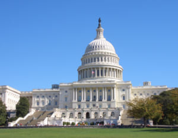

中国は米国を超えるまで、米中関係の主軸は対立になります。誰が大統領になるかと関係なく、米の国家利益によるものです。最近のニュースなどの情報から、これからの米中対立は本質な所になり、金融戦争がおこるかと思います。

貿易戦争では、中国が内部循環と外部循環、＋ベトナム経由で、米国の攻撃を上手く避け、ほぼ効果はなかったです。 チップの禁輸など、技術面の規制も、レアアースの交渉などで何とか行けるので、完全に禁じる事が、当面は難しいでしょう。最近、 ・[中国のアントグループの上場一時停止](https://news.yahoo.co.jp/articles/c52badf0aa73c82899e25df1b232822e720ff1d5) ・トランプならば、再選のプレッシャーがなく、経済の憂慮なく本気で中国と戦える。 ・バイデンなら、イデオロギー政党の民主党ですから、トランプの演劇より、本気で中国と戦う傾向が強い。 国、政権のことを人間と例えるなら、金融は国の血液です。金融は、国の命に係わる程、非常に重要です。習近平は、2035年まで、中国経済の総量を今の倍以上に成長させると発表した事とは、体が今の倍、血液も併せて、今の倍まで成長しなくてはならない。

米国は世界の金融覇権で、中国の金融はアメリカと比べて、極めて弱いです。 今まで、産業や、貿易の面で米中の比較は多いが、本当に弱い金融を抜けているというか、あまり報道されてないかと思います。

金融機関を監督する体制から言うと、米国のFRB、第三者の監督機関と異なって、中国は完全に政府機関、官僚の監督になります。(※補足：[諸外国における金融制度の概要](https://www.fsa.go.jp/common/about/research/kaigaiseido.pdf)) 官僚の特徴は、商業利益より、安全を求めるから、その結果、中国の金融業界の規制が多い訳です。 中国の金融は、リーマンショックのような高リスクな事が起こらなくて安全ですが、その反面、大量な資金を増やすことも難しい。

中国の大手企業は、必ず米国で上場して融資を受ける主な原因は、中国の金融業が堅いです。言い換えると、今まで、中国の飛躍的な経済成長は、米国の資本に頼っています。

2035年まで、中国経済総量の倍増には、大量な資金が必要なわけで、米国からの融資が必要だが、もし、金融戦争を興して、資金流を遮断、もしくは、何かしらの形で制限されたら、中国の発展は留められるかもしれない。 予想できる資金の不足と安全を求む金融は矛盾であり、当面、中国の大きな課題である。 但し、金融戦争が起こっても、中国は香港という武器があります。本土の金融制度を大幅に変更する事が難しいが、体制外で、完全に資本主義のルールで動かす金融拠点、香港があります。香港の金融を活用して、資金を増やすことは可能でしょう。 2019年度、反送中の運動は、米国が香港の金融センターを崩壊させる陰謀である。これからの金融戦争の準備でもある。  これから、中国はどう対応するか、こちらでは分かりませんが、必ず対策を打つことと、米中金融戦争のリスクが高いこと、皆さんに伝わればと思います。

因みに、米国内の状況次第だが、FRB利息アップすれば、中国を含めて海外での投資は自然に回収に向かって動くので、中国経済も減速に向かう事になるでしょう。
