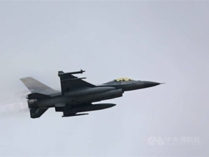
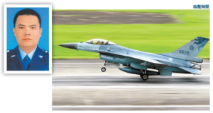

11/17 18:07、台湾の戦闘機F-16A(番号：6672)がレーダーの画面から消失して、同日、同機の墜落と発表しました。 その発表と同時に、[国民党軍の参謀総長黃曙光氏は衡山基地へ避難](https://tw.appledaily.com/politics/20201117/SY6Z5Y3DTBHQJL7KG6FYYARLQI/)した。 

墜落の原因について、調査中で、まだ報道されていない。ただ、以下の点から、中国解放軍に落されたのではないかと推測しております。

1. パイロットはかなりベテランというか、[上校(大佐)ですから、20機ほどをリードする隊長](https://mil.news.sina.com.cn/china/2020-11-18/doc-iiznctke2022099.shtml)である。
2. 報告なしで、行き成り消失とは、通常故障はあり得ない、空中で解体、爆発、パイロットが急に意識が失う、もしくは、通信不可能な状態を表す。
3.  離陸2分、数千メートの高さまで昇ったことは、飛行機自体は問題なさそう。
4. 同時間帯、中国解放軍のJ-16D(最新型電子戦機)、Y-8(偵察、電子戦機)、KJ-2000(早期警戒機)は、近い空域で活動していたようだ。
5. 台湾国民党軍の参謀総長、戦時、実際に軍隊を指揮する人は、急に衡山基地へ避難した。 これが準戦争状態である事です。単なる事故などでの墜落は、ここまでやる必要ない。つい最近、F-5Eの墜落では、単なる事故だったので、ここまではしなかった。
6. 夜行は危険ですが、18時頃、さほど暗くないと、2千2百時間超えたかなり熟練したベテランですから、行き成り海と空を勘違いして、海面へ突っ込む事が想像し難い。

台湾の戦闘機が老朽化したからという説がある。1990年代から輸入したF-16Aが決して新しくないが、F-5E程、古くない。台湾では比較的に新しい方で、F-16シリーズはかなり品質のしっかりとした機種である。しかも、通常の飛行訓練であれば、墜落したとしても、定めた航路から、直ぐ、残骸を見つけるでしょう。飛行機には位置を特定する装置もあるので、いくら故障といっても、探すのは簡単です。

未だに、墜落した飛行機は見つからないと、上記の点から、当時の状況を以下に推測します。

1. 中国解放軍の飛行機を発見して、迎撃するために、待機したF-16Aは緊急離陸
2. 解放軍側のKJ-2000はJ-16DとY-8を指揮して、迎撃してきたF-16Aに対して、強電磁波での干渉を指示
3. F-16Aが強電磁波干渉を受け、通信、フライトコントローラーなどを含めて、全ての電子機器が無効になり、墜落した ※F-16がフライトコントローラーなどコンピューターからの補正がないと、人間だけでは基本、操縦できない。
4. 墜落後、レーダーからF-16Aが消失
5. 前方の状況を受け、参謀総長は衡山基地へ避難

真実が何か分かっていないが、上の推測では、報告なしで墜落、墜落した残骸が見つからない、参謀総長は衡山基地へ避難する異様な動きは、論理的に、全て解説できます。

補足： ネットの噂には、大陸へ亡命したかの説もあるが、今までの情報は少なすぎて、判断できません。 本当の真相は、台湾の統一まで、明らかにならないかもしれません。

補足（11/20）： 今回の墜落を受け、機体の故障の可能性が極めて低いとはいえ、同機種は全て飛行停止と発表された。 参考：「[台湾F-16飞行训练时失联 战机停飞特检](https://www.dw.com/zh/%E5%8F%B0%E6%B9%BEf-16%E9%A3%9E%E8%A1%8C%E8%AE%AD%E7%BB%83%E6%97%B6%E5%A4%B1%E8%81%94-%E6%88%98%E6%9C%BA%E5%81%9C%E9%A3%9E%E7%89%B9%E6%A3%80/a-55650922)」 同型飛行機の飛行停止とは、同型機の欠陥を確認した場合、よくあるものです。例えば、[日本のF-2](https://news.yahoo.co.jp/articles/e417bec434dbef730dc3c05077c4131480f257de)がその一例です。但し、機体の故障の可能性が低いのに、同型機が全部飛行停止とは、飛行機の欠陥と関係なく、**別の要因があるわけ**です。 例えば、10末のF-5E墜落について、本当に博物館に入れるべき老朽化したもので、事故品発にも関わらず、台湾では飛べますと謳うやり方から、F-16Aの飛行停止は尋常ではありません。 仮に、報道されたパイロットの「空間識失調」だとして、偶々ですから、他のパイロット、機体と関係ありません。

こちらのF-16A、飛行停止の「別の要因」とは、まさか、こちらの推測した解放軍の強電磁波武器の攻撃ではありませんか？ 台湾の発表は恐らく、機械故障ではないが、パイロットの責任に押し寄せるでしょうが、はっきりしない様になるでしょう。繰り返しますが、本当の真相は、台湾の統一まで、明らかにならないかもしれません。

因みに、F-16Aの飛行停止とは、台湾では、空戦できる戦闘機がほぼゼロになります。 残ったF-5E、F-CK-1は、全て博物館展示用に相応しい、老朽した物で、制空権がほぼ喪失状態と言っても良い。
