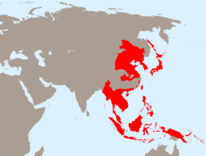

今の日本は米国の半植民(衛星国)です。世界大戦で失敗したから❓と思う人は多いかもしれないが、私は、仮に戦争がない、又は、戦争に勝ったとしても、大日本帝国は必ず失敗するとこちらの主張です。 然も、心の中に残ってる「帝国」は、これから、「失敗」を味わっていくかと思います。

帝国の失敗とは、日本に限るものではなく、英も仏も、帝国は必ず滅びる事は、歴史の必然です。 こちらは日本の右翼はよく勘違いしやすい所でしょう。例えば、今の邪魔らしい強い中国がなければ、元の大日本帝国の栄光を取り戻せるかと勘違いしてるようですが、こちらはできないと、断言できます。

形とした帝国は今の世界にありませんが、古くからある考え方ですから、行き成り消える訳ではありません。日本を含めた西側諸国は帝国的な考え方で国家関係、ビジネスのやり取りまで貫通しています。

日本の「帝国」の考え方とは、帝国の皇民は目上の立場で、中国大陸、東南アジア、南アジア諸国の人は従順してもらわなくてはならない。そして、多くの日本人の中では、気付かずに、当たり前のようなものとして持っています。勿論、日本に限らず、西側、曽ての帝国歴ある国は共通です。

例えば、日本少子化で、外国人移民を招くことが必要だというとき、日本人は管理職にして外国人移民を使うと言ったパターンって、違和感がありませんか？スキルなどで決めるのではなく、国籍、人種で決めていく考え方について、気付きましょう。この考え方を基に外国人労働者を招くところは、基本、単純労働な所、然も、トラブルが多い。研修や実習の名目で、実は安い労働力を仕入する目的の外国人技能実習制度は、この考え方を忠実に実行しています。勿論、ニュースに出るほどの不祥事が多い程のトラブル多発です。この制度で大きく成長して強くなった企業は一つもないようです。

今の日本はリベラルの世界では？と疑問するでしょう。 細かい所まで割愛するが、アジア諸国向けの政策は、基本、永遠に奴隷にしてくれる事を前提としたものです。中国という大誤算もあるが、付加価値低い生産を依頼して、高収入といっても、女性は日本へ売春してくるぐらいか？

今、中国の台頭について、殆どの不満の本質は、この帝国的な考え方ベースかと思います。見下ろして済むはずな中国のくそ野郎は、いつか上になって、目線が下から上へ向けなくてはならない時代になってきた事、キモイ？ 「反中」の世論は、戦後の60年代～80年代はかなり少ないですよね？「反中」の一番激しい時代は2010年前後、今でも「反中」が多いが、政府のTOPは「親中」派が多いことを気付きましょう。 こちらは「帝国」的な考え方は失敗していく実例です。東南アジア諸国も、中国と一同、強くなるでしょう。上目線の帝国の考え方は、どこでも通用しなくなる時代になります。

上目線ではなく、平等で対応していくことは重要であると、多くの日本企業のオーナーは知って、対応している訳です。特に新しい考え方は受けやすいIT業界、日本企業でも外国人の上司は沢山います。極端？かもしれないが、国籍、人種を無視して、完全にスキル次第で、有能な人材を求める楽天のように、社内の公式言語を英語にする会社もあります。

貴方の心の中に、帝国的な考え方を持っていますか？気づきますか？

この世界は見た目上だけではなく、平等になっていくわけです。日本は豊かで平和の国でありままで、変わらないでしょうが、曽てのような上に立つ国ではなくなると思います。特に中国の台頭では、加速していくでしょう。
