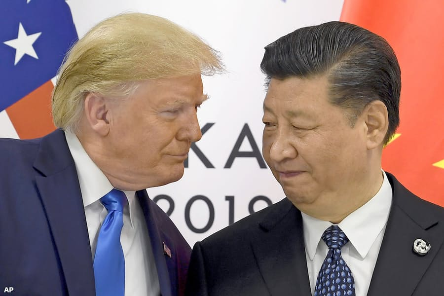

①両方とも経済の損失あるでしょうが、米国は耐えられず、協議に急いでいるでしょう。引き分けだけでも、米のやり方的には、協議に至ることが難しいでしょう。  
(こちらについて、当サイトの主張とあっている)  
②新たな冷戦の可能性がない。中国の立場では、経済の損失より、政権の利益が大きい、もし、冷戦があれば、協議が必要ないでしょう。少なくても、選挙までないでしょう。  
③エネルギー、農産品の中国の拡大輸入は、他のエネルギー、農産品の輸出国の競争となり、購買者の中国に有利だ。  
輸入の量はさほど変わらないでしょうから、米からの輸入量が増えれば、他国からの量が減るでしょう。競争が激しくなる見込みでしょう。  
④金融業が中国へ進出できることは、中国は米の金融の手法もわかって、最悪の状況でも日本のような経済バブルの崩壊がないでしょう。  
⑤結果的にwinwinな訳だ。
