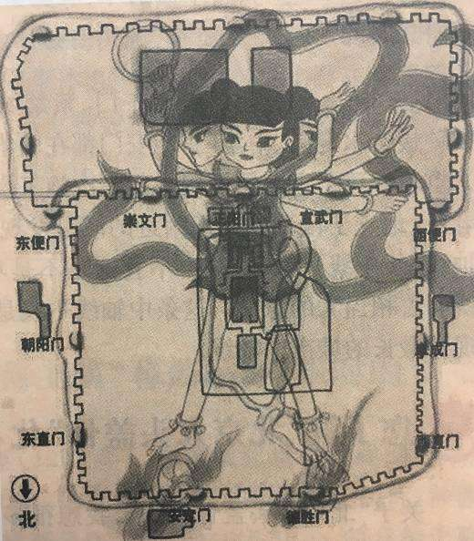

**前書き**

北京の中軸線の都市伝説について、前回はいきなり「[北頂娘娘廟](https://blog.loveapple.cn/chinese-folk/20191207281.html)」から紹介し始めたが、今回は本線に戻って、全体図から紹介したいと思います。  
北京は元の時代から首都として建築させ、明の永楽帝より改築し、今の形になりました。明の帝都として改造されたときの伝説を紹介させていただきます。談話や、伝説の内容ですので、歴史と関係ありません。

<figure>

<figcaption>

八臂哪吒（はっぴなた)の城

</figcaption>

</figure>

[哪吒（なた)](https://ja.wikipedia.org/wiki/%E3%83%8A%E3%82%BF_\(%E4%B8%AD%E5%9B%BD%E7%A5%9E%E8%A9%B1\))は四海の竜王と戦う神です。孫悟空も竜王と戦った事はあったが、仲直りの過程があるのが哪吒と違う所です。哪吒はキラーとして育てられて、正式に神になっても竜王と対立する勢力の存在です。

ちょっと脱線して、すみませんが、 [中国産のアニメ映画「哪吒之魔童降世（英語名：Ne Zha）」、2019年の映画興行収入TOPになっています](https://www.jetro.go.jp/biznews/2019/08/48bf3a3e62522b76.html)。 アニメで中国語を勉強したい方はぜひ、見てください。引き続き、本題に戻ります。

北京は元々幽州(ゆうしゅう)と呼ばれて、苦い海であり、中には悪い竜がいる。ある日、 哪吒が現れ、悪の竜と戦い、北海白塔山と玉泉山の下にある海眼(井戸のようなもの)に禁錮させた。時が経って、幽州に人が住むようになり、苦海幽州とも呼ばれます。悪の竜が「孽竜(げつりゅう)」と呼ばれます。  
海眼(かいがん)について、伝説上では、海まで通るような井戸らしいものです。通常の井戸は淡水がでるだけで、掘りすぎると石油が出るかもしれないが、海眼と言われるものは、海の臭みも出てきて、科学的に解明できていないものです。後文にも言及します。

易経の考え方は善と悪、対立の勢力をバランスよく共存させることは理想な状態だと言い、都市の良い風水とは、「孽竜」がいる事が、帝都にあっている一つの要因だと思われます。 北京を首都として再建することは孽竜を治めて共存できることはコツであることです。
