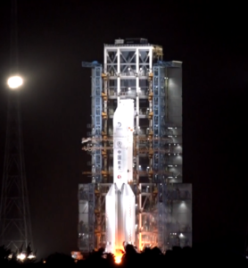
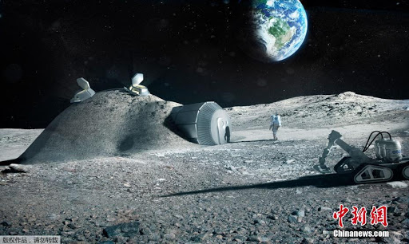

前回のアポロ計画の月面着陸から、約40年程経った今、嫦娥5号までの月面着陸の人類初とは？

勿論、中国の月面着陸は、米国の有人着陸との距離があるので、同レベルではありませんが、中国は曽ての米ソの月面着陸の繰り返すではなく、人類史上初めて試みも多く、米ソより複雑、難しいことをやってきました。

**嫦娥4号：人類史上初の月背面着陸**

月は地球を回っていて、永遠に地球に向けてる正面と地球に向かない背面はあります。  
曽て米ソの月面着陸は全て、地球向けの正面で行うものです。理由は簡単で、地球の背面では、電波が遮断されて、通信できないからです。

嫦娥4号は月背面着陸するために、通信の中継衛星、鵲橋(じゃっきょう)を利用しました。

こちらについて、言うほどもなく、着陸した嫦娥4号だけではなく、中継衛星を含めて、2機のロケットにも高い品質と安定性は必要です。

**嫦娥5号：人類史上初の月軌道の無人接続**

嫦娥5号の着陸地点は、リュムケル山と嵐の大洋の北側の平原です。  
ここは米ソの探索機の着陸したことがなく、人類初めて到達した所です。これから、中国のステーションもこちらに建てるではないかと推測してよいでしょう。

また、同探索機は2kgのサンプルをリターンする事は、ソ連の200ｇレベルを超えました。  
こちらは、単純に積載量を増えただけではなく、かなり複雑な計算と準備は要したことを表します。

今回の最も難しい所は、月から帰還する所で、直接地球へ帰るのではなく、月軌道で軌道船と接続してから、地球へ帰還するのです。勿論、こちらの作業は主にAIで行います。リモートコントロールもあるでしょうが、通信距離が長く、時間のブレが酷いもんだから、人間は直接の操作が現実ではありません。

勿論、嫦娥5号は終わりではありません。  
今の難しい作業は、全て、月面基地を建築のための試験である。  
2030年、中国の有人月面着陸する際、予め、月面基地に必要とした資材、設備は全ては届いて、初期の基地は建設完了な状態になるかと想定してよいでしょう？！

因みにですが、月や火星向けの基地の試験等は、中国の砂漠で、既に1年以上行っていました。
