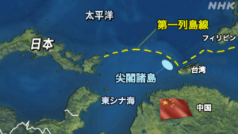
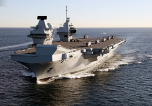
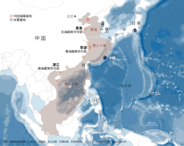

釣魚島(尖閣諸島)の問題は、ただの無人島の問題ではありません。あんな大型船や飛行機を派遣して、紛争を興すほどの利益があるわけがないでしょう。更に、豪英仏の参入は、もはや、日本より、欧米の利権を守るための動きです。釣魚島(尖閣諸島)が一つのネタしか過ぎない。日本当局の図りは、内外の反対を失くしてスムーズに憲法九条の改正ではないかと見受けています。国民の利益と直結しないでしょう。

日本は琉球王国を滅んで、1895年ごろ、日本は朝鮮半島と中国大陸の侵略と併せて、釣魚島(尖閣諸島)を強制に占領しました。日本外務省はダメ出しで強引に否定する以外、法的な根拠は全くない。国家関係は人間関係と同様、一方的に自らの利益を主張するだけでは、トラブルだらけで、孤立され、失敗な人生を招くだけでしょう。 釣魚島(尖閣諸島)問題を解決するには、一番相応しいやり方は、利権を分けようとする第三者を排除して、日本と中国だけ、共同開発向けの交渉をすべきです。そして、東南アジアの開発や欧米と対抗で、日本の協力も必要な訳ですから、「共同」と言いつつも、日本は半分以上の利権を得られるように、交渉のネタは十分あるでしょう。

しかし、豪英仏の軍艦は米軍と同様に日本へ進駐できることは、早い段階で第三者の入場を許容することでは、国民への不利益ばっかりなことで、完全に欧米強権の使い物になってしまっている。事実上、日本は既に尖閣諸島のために、自らの利権を捨てたといえるでしょう。

尖閣諸島を中心に拡大してみれば分かるが、ここが完全に中国に制された場合、東シナ海から太平洋への出入り口になるでしょう。こちらは、米国も紛争に絡んできた本当の要因の一つです。

東シナ海を巡って、豪、英仏の海軍も日本と共同訓練してきたから、「[中国牽制本格化](https://news.yahoo.co.jp/articles/2243c4d1f7dea6c1e46980bfde8d0d17ce8dea44)」と一先ず安心になる日本の方はいるでしょう。但し、豪英仏の三カ国の海軍は、中国向けの戦力がほぼゼロであること、日本マスコミは絶対報道しないでしょう。また、日本の国民に勘違いさせている。 豪は米の言いなりで動くが、英仏はあくまで、トランプ政権への不満を表してるだけです。実状況から見ていこう。

1. 中国は米軍を相手にしているわけで、戦いの相手は米空母です。今年の色々なやり取りの結果、今の米空母は南シナ海、東シナ海の侵入は難しくなってきた。 中国近辺に入ってこれる空母について、誤解されないように予め交渉済みか、中国海軍は情報収集するために、一旦黙ってるのかの二択です。
2. 中国は既に豪を叩き始めたわけです。今までの愚か行為を反省せず、自国に不利益な愚かな行為を継続する場合、豪の元外交官トニーケビン氏は、元シンガポー首相リー・クアンユー氏の言葉を借用して「[オーストラリアはアジアの白いゴミになるだろう(英語)](https://johnmenadue.com/how-australia-sabotaged-its-own-interests-in-relations-with-china/)」と示唆した。
3. 英海軍は２基の空母があるが、うちのエリサベツ号は来年夏ごろまでメンテナンス中で、今は派遣したことで英周辺ではほぼ無防備で、しかも、艦載機も、周辺の護衛艦も足りない状態で、日本へ来ることは、何かを守るより、存在感を示すだけだ。怒ったら、早速逃げないと、中国ミサイルの標的しかすぎないでしょう。
4. 中国の年間軍艦の製造数は、一つのフランス海軍に当たる規模です。仏海軍は英より強いが、中国の相手にならない。しかも、地中海でトルコとの紛争もあるので、同時に二つの戦場に軍を投入できるか❓現実的ではありません。

英仏海軍は中国と戦う姿勢ではないこと、お分かりになったでしょうか。 では、何で日本へ来たか？南シナ海、西太平洋当たりでは、中国以外、米軍もある事、思い出してください。 実力を示すより、存在感を示す事って、中国は特に困ることがないし、米軍へ不満を表すことは本当の意味です。トランプの実績からみると、盟友を売って、自らの利益の最大化を図ることは有名です。西太平洋までの空母派遣は、米軍が信用できず、自ら利権を守ってきた訳です。

実力の弱い国は二つ以上の強権を招いて戦ってもらう事での自衛策がある、例えば、大清国、今のフィリピンは皆そうですけど、日本の戦力ない艦隊を進駐してもらうやり方は正直不可解と言ってもよいでは？ 釣魚島(尖閣諸島)の問題はただの無人島の問題ではない。日本は尖閣諸島をめぐって、何をやろうとするのか、抑々、日本の戦略は何なのか？

戦力のない艦隊を招くことは、戦ってもらうことではなければ、相手の安心を買うのでしょうか？ ①欧米の安心を買う ②中国対抗の重要性を強調 その次は❓自衛隊⇒軍隊に帰る事で、もっと力を出せるんだとアピールするのでしょうか❓ 日々強くなってきた中国軍を対抗するために、「日本軍」の力も必要になってくる日が迫ってきたと言えるのでしょうか。

米軍も、仏軍も、英軍も、日本へ進駐することで、経費、汚染は全て国民の税金で代償するでしょう。普通の国家になると安倍晋三の目指した目標を思い出すと、尖閣諸島を利用して憲法九条の改正を実現しようとしてること、分かりやすくなるかと思います。仮に、尖閣諸島を失ったとしたら、更に、内外の声がなくなり、憲法九条の改正はスムーズに行けるでしょう。

↑これは、習近平と安倍晋三は裏側で仲良くして、合意済みかもしれない❓
