ダライ・ラマ法王の日本人向けのサイトにある記事「[我らのチベット、彼らのチベット](https://www.tibethouse.jp/about/information/chinas_fiction/) 」と、wikipediaの内容を合わせて、文書にある重要なポイントを解釈します。政治の正当性を主張して、日本人を騙す目的の内容ですから、上質に見えるような文書の裏には、どのような事実を隠したか、説明していきたいと思います。

欧米の植民地支配の手口を分かれば、ダライ・ラマのテロリストの本質は直ぐ見破るでしょう。こちらの解説で、その一斑を見せてあげたいと思います。

チベットの歴史[(wikipedia)](https://ja.wikipedia.org/wiki/%E3%83%81%E3%83%99%E3%83%83%E3%83%88_\(1912-1950\))から、チベットは大清国の時代から、中国の領土になりました。ダライ・ラマも、[こちらのwikipediaの記事](https://ja.wikipedia.org/wiki/%E3%83%81%E3%83%99%E3%83%83%E3%83%88_\(1912-1950\))では、1912-1950年からチベットという国と主張してます。

### **チベットは国ですか**❓

勿論、チベットは国ではありません。  
大清国に編入された以降、国になった事でもありません。[国](https://ja.wikipedia.org/wiki/%E5%9B%BD)とは住民・領土・主権及び外交能力（**他国からの承認**）を備えた地球上の地域のことを指す。ダライ・ラマはいくら嘘を織り込んでも、チベットは外交能力が基本ありません。  
このwikipediaにある記事「[チベット (1912-1950)](https://ja.wikipedia.org/wiki/%E3%83%81%E3%83%99%E3%83%83%E3%83%88_\(1912-1950\)#%E3%83%81%E3%83%99%E3%83%83%E3%83%88%E3%81%AE%E5%A4%96%E4%BA%A4%E9%96%A2%E4%BF%82)」では、外交の正当性を説明するために、1946年、イギリスの植民地のインドと蒋介石へ、悪戯に文書を送ったと説明しようとするが、まず、インドという国が、その悪戯文書の送った三年後の1949年に成立した事の可笑しい所と、蒋介石はチベットを国として認めるはずがない。wikiの内容からも、周辺国は誰もチベットを国として認められない事が書いてあります。  
こちらは、戦前(1936年❓頃)と戦後、蒋介石の中華民国政権の地図です。チベットは明らかに中華民国の一部として記載されてる。戦前戦後に関わらず一致しているわけです。

<figure>

- <figure>
    
    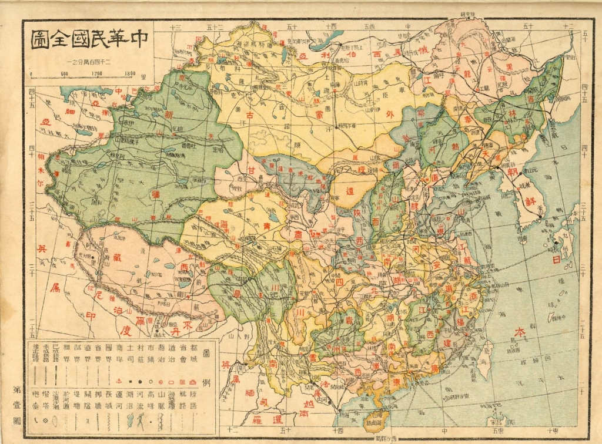
    
    <figcaption>
    
    1936年？に出版された中華民国地図
    
    </figcaption>
    
    </figure>
    
- <figure>
    
    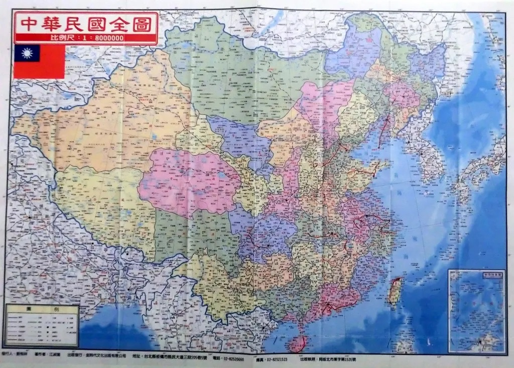
    
    <figcaption>
    
    戦後出版された中華民国地図
    
    </figcaption>
    
    </figure>
    

</figure>

チベットは過去でも今でも、国ではない事、お分かりいただくのでしょうか。  
こちらは、仮に僕は千葉で独立宣言したと、中国や米国へ外交文書を送ったと、いくら大声で主張しても、千葉は国になりません。他国に認められないわけで、外交能力はありません。ダライ・ラマの〇〇チベットの国としての主張も同じく、全く嘘です。  
それでも、いや、チベットは国ですと固執したい方は、千葉の独立も認めてください。訳の分からない独立宣言したからです。どうでしょう？(笑

### **「他に類を見ない」とは**

「我らのチベット、彼らのチベット」記事の中に、「他に類を見ない国家」の言葉があります。  
前述通り、「国家」が嘘で、この「**他に類を見ない**」とはどういう意味でしょうか？

> 政治的に独立していた当時のチベットには自給自足経済があり、世界中のどこにも例のない行政システムによって統治される、文化的にも**他に類を見ない**国家であった。

原文から引用した一部ですが、「政治的に独立していた」だけでは、「国」ではありません。例えば、今のUSAの各州も政治的に独立してるわけです。香港、マカオも政治的に独立した中国の自治区です。しかも、1911年ごろ、大清国から中華民国政権へ交代した頃、戦国のような軍閥乱立の時代がありました。チベットはあくまで一つの地方政権しかすぎません。  
あの「他に類を見えない」本当の意味とは、現代の政治政権の中、ほぼない**政教一致**です。

当時のチベットでは、一番権利を握ってる人は、ダライ・ラマ等、仏教のTOPと土地持ちの大地主です。寺院から行政権を行使して、僧侶は絶対的な権利を握ってる社会でした。wikiの記事も、ダライ・ラマのサイトも「**政教一致**」を避けてるわけです。何故だろう❓これが、ダライ・ラマらの望んでるチベットの本質を見える重要なポイントです。  
政教統一のチベットは、彼らが言ってる本当の意図した「自由」のチベットです。僧侶と大地主、言い変わると、少数派の奴隷主の自由の地であり、奴隷主の楽園で、大多数を占める奴隷の地獄です。

### **政教一致のチベットは暗黒な片隅  
**

まず、政教一致とは何か？一言いうと、その国の全ては宗教のトップは管理する、独裁より暗い政権のことです。  
その逆は政教分離です。日本の天皇は宗教のものと近いが、幕府時代から、天皇は政治とほぼ無縁になり、政教分離でしょう。  
日本を含めて、現代の欧米の全ての国は、基本、政教分離です。民主国家の憲法には、政教分離の事をはっきりと定めています。この民主国家の政教分離の制度は、ヨーロッパの暗い歴史から得た教訓で改善した制度です。政教一致にした場合、社会全体は宗教のTOPにコントロールされて、暗黒な時代の繰り返しでした。勿論、信教の自由は、政治と関係ないので、政教分離しても宗教の自由が守られるものです。

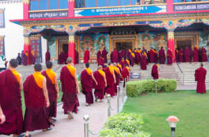旧チベットの僧侶と中国内陸の僧侶と異なって、行政権利を手に握っているわけで、生産しません。  
しかも、この人たちは当時大清国、中華民国政権の軍隊を追い出すほどの強力、それほど規模のある軍隊を持っているわけです。僧侶、地主は行政、戦争を維持する自給自足の経済力はどのように支えてきたのでしょうか？

当時のチベットでは、工業はないので、ほぼ農業のみ、そして、生産は基本、奴隷となります。勿論、チベットでは、独特な文化背景から生まれたものですから、細かい所はヨーロッパの農奴制度と違うが、庶民をある土地に縛る奴隷制度であることは間違いありません。

旧チベットの農奴制度について、京都大学、大西広氏の論文で、客観的に「[「農奴制」は確かに存在した](https://repository.kulib.kyoto-u.ac.jp/dspace/bitstream/2433/155120/1/kronso_183_1_1.pdf)」だと論じました。ダライ・ラマの主張「『旧チベットは封建農奴制社会』という中国の詭弁」が嘘であること、客観的な数字と歴史の資料から証明できます。  
旧チベットの真実は農奴制社会であることです。  
勿論、ダライ・ラマの織り込んだ嘘では、嘘を隠そうとしても、漏れてしまった矛盾はあります。同サイトの「[チベットの宗教と特性](https://www.tibethouse.jp/about/culture/religion/)」では、チベット宗教の特性を説明しようとしたらころ、「中世のヨーロッパ社会に類似」との意味合いは、**農奴制度**だという意味を指してます。共産党政権は、農奴制度を崩した事を嘘のつかない体で認めているわけです。

> 共産中国に占領される以前のチベットは、**中世のヨーロッパ社会に類似**した点もみられる封建社会であった。

因みに、ダライ・ラマの主張した政教一致政権とは他にありますか？  
近代の人類社会ではかなり珍しいです。宗教の影響一番深いイランでも、宗教は政治に絡んではいけないとはっきり定まてます。  
明らかに政教一致の政権は、ISIS、タリバンぐらいかな？この両者とも、米CIAの育てたテロリストであることも、ダライ・ラマと共通しています。しかも、性奴隷の報道はしばしばあること、思い出してください。  
**政教一致の地は、人類歴史上一番暗い所であること、ダライ・ラマは粉飾した旧チベットも異例ではありません**。

### **何故チベット人は亡命するか？**

亡命するチベット人は政教分離に妥協しない、主に僧侶や奴隷主です。普通のチベットの民衆、曽ての奴隷は解放されるから、亡命する必要ありません。ダライ・ラマは中共侵略と主張するが、実は、地方政権として一旦、妥協して、奴隷主の利権が大きく侵害され、反乱⇒逃亡の経緯があります。

日欧米のマスコミは、中国の紛争を煽るために政教一致の政権でも美しく粉飾するが、社会主義の中国当局は、余地なく、政教一致を許しません。チベットではダライ・ラマだけではなく、別の仏教の教派のTOPとして、[パンチェン・ラマ](https://ja.wikipedia.org/wiki/%E3%83%91%E3%83%B3%E3%83%81%E3%82%A7%E3%83%B3%E3%83%BB%E3%83%A9%E3%83%9E)もあります。政教分離に妥協したパンチェン・ラマは今でも、仏教のリーダーとしてチベットにいます。勿論宗教の自由は十分あります。  
こちら「[写真で見る平和解放前と平和解放後のチベット](https://xizang.is-mine.net/photos.html)」記事では、おもてなし、チベットの本当の歴史は紹介されています。

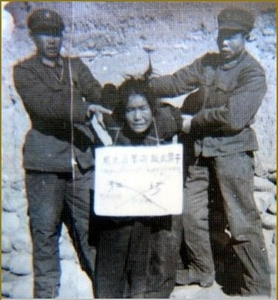  
ダライ・ラマは政教分離に妥協しない派として、弾圧されるわけです。共産党政権ですから、別に、チベットの特別な起こり事ではなく、中国全国、曽ての統制階級の皆が弾圧される対象です。  
こちらは、多数の中国人の選んだ人民民主専制の政権です。今の中国は、毛沢東時代のような左よりではないが、資本主義に近い社会主義初級段階でも、変わらないこととして、アリババ等、大財閥から政治への干渉を警戒しているわけです。  
ちょっと脱線しますが、コロナ禍で、中国の防疫対策での国民優先、日欧米の経済の優先の対応、大きな違いの根本要因の一つは、大財閥は政治をコントロールできないことです。だからこそ、社会主義政権は国民の命最優先できたでしょう。

因みにですが、仮に、中共政権とダライ・ラマ政権は、民主制度の選挙で選ぶとしても、絶対的な多数を占める曽ての農奴、農奴の子孫は中共以外の選択肢はありません。

### **宗教の弾圧がありますか？**

中国は宗教の自由があるから、前述通り、パンチェン・ラマのように宗教だけでは弾圧されません。

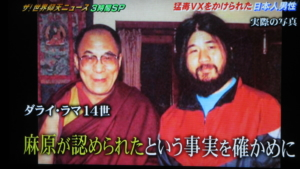但し、寺院など、宗教の施設や、僧侶など宗教の身分を利用して、政治活動、テロをやることで、警察にやられるわけです。こちらは日本のオウムと同じく、宗教だけならば、当局は文句しないが、テロをやったら、関係者を捕まえることは当たり前です。  
もし、ここで異見があるならば、取りあえず、日本当局へ何故オウム真理教を弾圧するかと、納得できる回答まで聞いてみてください。オウム真理教は弾圧される記事や写真はいくらでもあるでしょう。勿論、こちらの一般人の価値観ではテロリストには当たり前なことですから、同様、テロリストのダライにも適用します。

本当に宗教の自由がないチベット人はチベットにいる人ではなく、インドに亡命中のチベット人だそうです。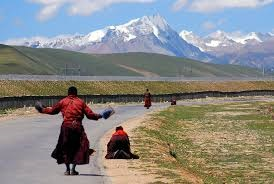

チベット旅行や、ドキュメンタリーではよくである風景として、徒歩で青海湖などへ参拝していく信徒です。この信徒たちは、歩きながら拝跪する参拝のやり方は非常に印象的で、僕からは見るだけでも、心が振られるほど、尊敬を払いたいと思います。

宗教の自由がないと言うならば、これは何なんだろうか？  
かわりに、インドの亡命中のチベット人はこのような、どこでも、差別されることなく、堂々と、仏教を信仰すると、表に出す自由がありません。

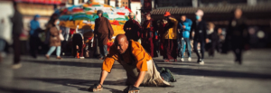過去の記事([インドという国の特徴](https://blog.loveapple.cn/news/202009085413.html))にも紹介してあるが、インドは中国のように、全国で通じる言葉、共通認識となる文化がなく、宗教のインド教で異なる地域の国民を団結しようとして、それ以外の宗教、例えば、仏教、ムスリムの信徒は弾圧されます。インドにいるチベット人は、自由に自らの宗教を信じることができなく、チベットの環境と比べるもんにならないようです。

ダライ・ラマのサイトでは勿論、こちらの内容を触りません。世界最大の民主国家のインドですから、どのように弾圧されても民主としか言えないでしょう。ボース(CIA)に許されないからだ。  
1950年代から、インドに亡命したすべてのチベット人を含めて、国民として扱わずに、健康保険、年金など、国民にあたる福祉は一切受けられない。例えば、中印国境紛争の中、亡命チベット人もインド軍に雇われた人が戦死した場合、インド軍の死傷人数にカウントされない。インド国民ではなく、インド軍に編入される資格がないからです。

### **ダライ・ラマの本質はテロリスト**

ダライ・ラマのチベット政権は、イギリスが中国侵略するために育ったテロリストです。こちらは、[明治維新の薩摩藩](https://www.amazon.co.jp/gp/product/B084KT9N2P/ref=ppx_yo_dt_b_d_asin_title_o00?ie=UTF8&psc=1)と一緒だと言っても、伝わらない方いると思いますが、戦後、CIAからの資金提供される組織といったら通じるのでしょうか。CIAの支援について、[wikipediaのチベット歴史](https://ja.wikipedia.org/wiki/%E3%83%81%E3%83%99%E3%83%83%E3%83%88%E3%81%AE%E6%AD%B4%E5%8F%B2)にも明記してあります。

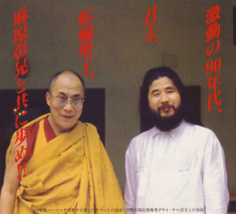 

CIAは米国のスパイ組織です。敵と見る国の政権転覆を目指して、テロリストを送っている。全文に触ったISIS、タリバンは全て米国に育てられたテロリストです。ダライ・ラマのテロ部隊も、直接、CIAからの訓練を受けています。[近年はNGOという名目上の人権組織を経由して、テロリストの組織に資金を提供したり、メンバー教育などを行っています](https://twitter.com/TibetUygurClub/status/1315304968664932352?s=20)。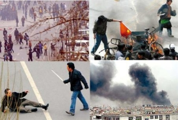  
ダライ・ラマのサイト、ネット上で調べれば沢山出てきますが、チベット人、僧侶の中共当局からの鎮圧の写真や、映像があります。これらは基本、テロリストの鎮圧で、日欧米のマスコミでは人権云々で中共を批判しています。本当に人権と関係なく、日欧米の主流マスコミのボースは、CIAのボースと同じ組織からです。

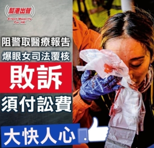テロリストは僧侶、普通のチベット人の形で画面に出てくるので、当時の状況は全く知らない、画面しか見えない傍観者を騙しているわけです。  
同じことは香港でもあります。  
日欧米の主流マスコミは言ってる、[香港の民主派は、異見をいう人に油をかけて人つけるぐらい、我々一般人の想像を超える暴徒](https://twitter.com/loveapple/status/1193784080774512640?s=20)です。  
マスコミ、知識人たちは、色んな嘘を織り込んで、我々の一般人を騙してます。  
左の図では、[目の失った女性の嘘を暴いた記事](https://blog.loveapple.cn/news/20191218684.html)です。印象が残ってる読者はいらっしゃると思いますが、その時、香港警察の暴行だと、騙されたのでしょうか。

### **中国のテロリスト対策、「収容所」の嘘**

都市生活になれた人の視点ではわかり難いかと思いますが、チベットのある片隅に生活してる10-20代の若者の立場を置き換えて、想像してみよう。  
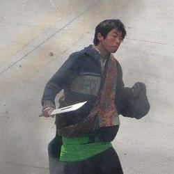宗教が満ちた環境で育ち、この人生は宗教のために生きるものと思い込んで、更に、インドから潜入してきたスパイに扇動され、過激派になってラサなどでテロを興すかと、神聖な偉業のために、自殺攻撃を含めて自らの命を尽くす。

左の図はラサ暴動で刀を持って、市民向けの無差別攻撃の暴徒です。この人はダライ・ラマに毒されたチベット人の少年です。  
ダライ・ラマ政権はテロを量産して、中共に送っているわけです。そのサイトで人権云々の内容では、実にはダライ・ラマは送ったスパイ、テロを排除するための一環である。  
これで人権侵害と言ったら、日本で警察は強盗を捕まえる時に、横から離してくれという事と同様、アホか、その強盗より悪意のある人です。

ただ、中国当局はダライ・ラマのスパイとテロの排除が手段しかすぎず、目標ではありません。  
あらゆるチベットの住民は平和な環境で、幸せに暮らせる事が根本的な目標である。少年をダライ・ラマの毒害から救える方法は簡単に言えば、技術等、就職できるスキルを習得させ、過激な宗教思想以外に、自らの道を選べる選択肢を増やせることです。

技術を学ぶ専門学校はチベット等、少数民族向けに沢山建設しました。こちらは中国の独特なやり方ではなく、米国もフランス等も、過激化のリスク高い宗教信徒を世俗化するために、ムスリム向けの教育施設を建設してます。但し、しっかりと、教育に投資して上手く回せたのは、中国だけです。

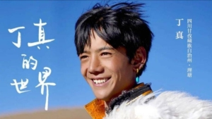ようは、中国のチベットなどの少数民族の若者は、ただで、専門学校へ通って、技術を学べることです。これらの学校は、日欧米のマスコミ、ダライ・ラマのデマ情報配信機関では、一般国民を洗脳するために、「収容所」と誹謗中傷しています。  
また、技術を勉強した人達は、仕事をやってみて、やっぱり、思ったイメージと違うと言ったら、また、自ら、この「収容所」と言われた学校へ戻って、2つ、3つの技術を学んでいくぐらいです。日本でいえば、ただの生涯学習になるのかな？左の図のように、今のチベット族の少年は過激な宗教の毒害から救われています。

### **まとめ**

チベットはチベットに住んでいる住民の手に握っている。中国共産党当局はその権利しっかりと守る義務があり、力を尽くしているでしょう。  
中国共産党政権の過去には文化大革命があったが、今の政権のTOPと全国も国民は、世界の誰よりその過ちを警戒し、制度上、繰り返すことが難しいと言ってもよい。冗談だけど、単に反省の態度からみるとしたら、日本の世界大戦を興すより繰り返すリスクが低いと言えます。  
仮にダライ・ラマの政権に切り替わったら、別の「文化大革命」がやってきて、もっと、暗黒な未来になります。

チベットの運命は数十年以上外国へ亡命した奴隷主、日欧米の強権で左右されるものではありません。  
日本の民間人はよくわからないといった場合、遠慮した方が賢明でしょう。本当にテロリストに利用されるからです。

筆者は懸念していることは、ダライ・ラマを含めて、過激系宗教のテロリストは日本での活躍です。  
これらのテロリストは、中国、インド、アメリカ、東南アジア諸国に止められ、日本と遠く離れているはずですが、日本でリベラルに変身して活動しています。  
ぶっちゃけいうと、日本での反中は、中国には何の影響もなく困る事がありませんが、テロリストに利用されることで、日本内部でポピュリズムを煽って、日本が紛争に陥るリスクが高くなっていること、警戒すべきかと思います。

毛沢東の文化大革命に本当に詳しい人は気付くでしょうが、民主国家の中では、差別、無知や、暴力の満ちた別の「文化大革命」が既に蔓延しています。ダライ・ラマは、一種の「文化大革命」の種として、CIAが中国へ送り込もうとした仕掛けです。
