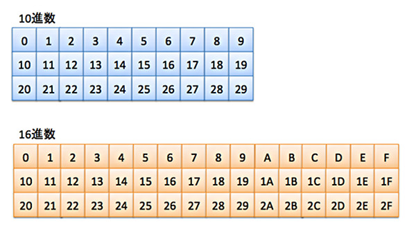
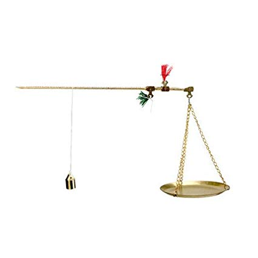

重量や、長さを測る単位は基本、10進数を使います。例えば、キログラム、キロ、10毎の単位がありませんが、10で区切って、桁は上がっています。10進数が人間の頭に、一番計算しやすいです。  
但し、曽ての中国は違って、重さの表示は16進数を数千年の間、使っていました。

今の中国は日本と同じく、10進数を使っています。古い言葉の表現はそのまま、斤と両を使いますが、昔と全然違います。例えば、1斤(500ｇ)＝10両、1両は50ｇとなります。  
16進数の時代は、1斤＝16両になり、勿論、16進数を使う知恵はあります。

**誰も信じてくれるための解説**

1斤＝16両、16は、北斗七星+南斗六星+福禄寿三星を表します。  
商売で品物の重量を測る時、嘘をついて、重さが欠損させて売るようにしたら、 福、禄(財 、昇進 )、寿のどれか、欠ける事になる、長年でやっていくと、 福禄寿が全てかけてしまう、懲罰になるようだ。  
福、禄(財、昇進)、寿を求めるのが普通だから、昔のマーケットで、野菜、肉を買うとき、ちゃんとした監督役がいなくても、重さが足らずにものを売る業者が基本的になかったようです。

この内容、談話等、昔の中国の民俗を紹介するとき、よくありそうな内容です。勿論、これだけで、数千年計算し難い16進数は継続するのが弱すぎます。

**本質**

<figure>

<figcaption>

天秤とてこの原理を利用した  
中国の古くから使われたはかり  
今は殆ど利用されません。

</figcaption>

</figure>

中国の通貨は、20世紀まで、銀と金を使っていました。  
銀と金の重量で価値を表して、通貨として使う場合、お金を崩すなど、分けるとき、半分ずつ分ける方が、正確性を保ちやすい訳です。10進だと、どうしても、3と2で分けるなど、微妙に差のあるような分け方をしなくてはならない。曽て、精密に測り道具のない時代では非常に困難です。  
16進数を使えば、いくら細かく分けても、同量な半分に分ければ、精密な測りがなくても、比較的、正確に対応できます。

中国式の測りを見たことある人は少ないと思いますが、添付の画像をご覧ください。  
棒とおもりで、重量を計算します。16進数の方が、目盛りを半分に数回で分けて、簡単に正しく製造できます。  
通貨、重さを測るためのはかり、使いやすい、作りやすいために、数千年の間、16進数を使い続けました。

**最後に**

勿論、現代になると、銀や、金の重量ではなく、国から発行した通貨を使うようになり、10進数で世界共通の会計方法も対応できます。  
測りも工場で生産するようになり、正確に目盛りを設定できるし、測りの形も、ヤマト運輸でもよく見かけるような使いやすいものになり、昔のタイプは姿が消えています。
