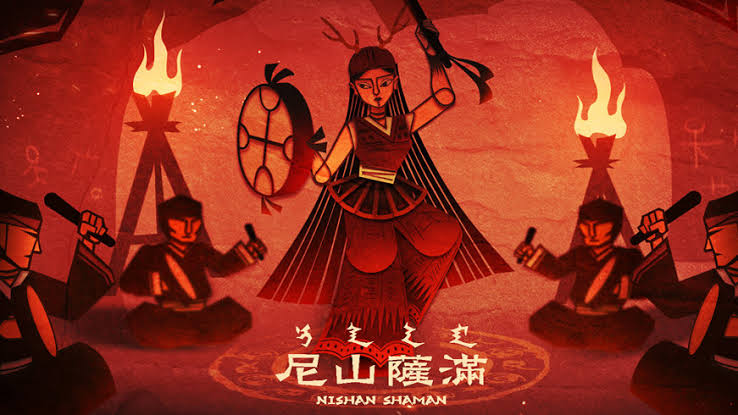

占いは詐欺と近い職業である事を前は紹介ししました。霊能力で占うと唱える人は、99%は詐欺、残り1%の内、霊関係の詐欺が99%、残りの1%が本当の霊能力だという説があります。中国の東北地方のシャーマニズム(跳大神)理論で霊能力の占いを紹介し、連載をしたいと思います。

シャーマニズム(跳大神)は女真(満)族から始まり、今、東北地方、韓国、幅広く広がってるかと思います。  
全ての動物は霊の性質があると信じ、中では「胡黄白柳灰」五種類の動物を中心に信じる宗教的なものです。  
勿論、東亜特有ではなく、アマゾン河の部落にもあります。

**用語説明**

本題に入る前に専門用語：その1「神仙」  
「神」と「仙」は中国語で本質同じだが、違いとして「認定」らしいものの有無です。  
神の定員が少ないので、長い年月経ち、神になりたい仙が沢山いるが、全員は認める事が現実的ではありません。  
神になるために地方の取締の役に認定してもらう必要があります。

専門用語： その2「出馬」  
中国語で出馬の意味は日本語と近いが、東北地方で出馬といったら、霊能力者として世に出る事を指します。  
主な業務内容は死者の霊と通信の媒体として、情報の伝達などをし、人の運命を語る事で予測的な事になるでしょう。占いの一種となります。

専門用語： その3 「胡黄白柳灰」  
五種類の動物、狸、イタチ 、ハリネズミ 、蛇、ネズミを指します。  
この五種類の動物より、仙になったものがあるともいえます。

**分類**

世の中霊能者 、私は3種類を分ける：  
①詐欺：基本はこちら  
②霊の媒体：霊能者の多くはこちら  
③「霊」、「仙」そのもの：珍しいが、明らかに歴史に名を残ったのは、中国の「#妈祖」、泰の「#白龍王」(チョー・ヤム・ナム氏)だ。  
今回のテーマは②霊の媒体を中心とします。

**天劫**

霊が仙になるために、「天劫」を受ける事と「徳」を積み重ねる事が基本です。  
「天劫」は道教の用語で、ドラマ「[永遠の桃花～三生三世～](https://www.twellv.co.jp/program/china/eien_touka/)」にも、その話は大幅に取り上げ、概念は同じです。  
霊が定期(約500年)で強い落雷などの天劫を受け、生き残ったら次のステップへUPする事はできます。

強い落雷等の「天劫」は、霊にとって致命的で、やられたら基本は消えてしまい、通常の死亡のように往生さえもできません。  
何処かに隠して「天劫」から逃げるのが主流で、普通の人の体の中に潜む事が一つのよい方法らしい。  
但し、誰でもできるのではなく、縁のある人限定です。

「天劫」から逃げる以外、「徳」を積み重ねるために、霊の媒体となる人の体を利用して、占い、既に死んだ人の霊とコミュニケーションを取る事によって、人を手伝ったり、善の道へ誘導したりすることで、積み重ねた「徳」を半分に分け、得た資産は 霊媒体 の物になる仕組みです。  
  
(続き
