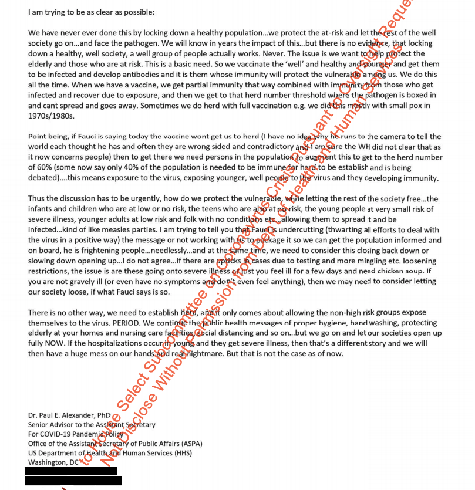

新型コロナ(COVID19)を利用して、GDPへあまり貢献しない貧乏人、保険などの大金を使う老齢者の排除❓は事実だと、暴かれています。  
トランプ政権は集団感染といって、何百万人の米国人の感染を許可した。  
因みに「**集団感染**」とは、防疫方法ではなく、動物を使った試験など、集団的に感染されてる状態を表す言葉である。こちら引用したツイトは当時の科学顧問のポール・アレクサンダー氏は、上司と他の6人の高官への手紙と暴かれた内容です。

概ね：

- リスク高い(高齢者等)以外、ウイルスにさらされるべき
- 自然免疫の効果を得るために、子供や若者を感染させることは最善だろう
- 若い、健康な人を素早く感染させて広げることで免疫力を発達させる

若い、健康な感染者は感染されて死ぬほどではないが、無症状の人はなく、感染を広めることも早いわけで、高齢者等、どう守るか自然に消滅していく以外の選択肢がなさそうです。  
実際、今の死亡者の中、高齢者の割合も高いです。

知らないウイルスに一番最初に直面した世界一の人口大国の中国は、しっかりと、感染を納めたのに、何故、地球最強のアメリカは、1日20万以上の感染、数千人の死者をだしてるか、この暴かれた手紙から、態々、新型コロナ(COVID19)の感染を広めたことは明らかでしょう。  
健康な人は普通に治る、お金持ちはいくらの高額な医療費は払えるから、かかってもなんとかなるでしょうが、  
事実上、治療費を払えない貧乏人、保険などの大金を使う老齢者の排除❓になっているわけです。

https://twitter.com/politico/status/1339264489988960257?s=20

