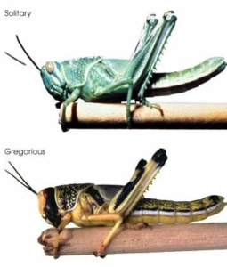

「[秋](https://www.kanjipedia.jp/kanji/0003110100)」の収穫の季節を表す文字は、何故、「[禾](https://www.kanjipedia.jp/kanji/0000635400)」と「[火](https://www.kanjipedia.jp/kanji/0000622700)」の組み合わせでしょうか❓  

新型コロナとあわせて、冬場になってきた今は、[アフリカや、南アメリカでは、バッタは再び襲来](http://アフリカ中心にバッタ被害　懸念さらに　FAO　監視・防除　支援呼び掛け)してくるようです。ニュースを見て、思い出したのは「秋」という文字、収穫を表す文字で、態々、「禾」と「火」意味は、収穫後、禾を焼き尽くして、バッタの蝗害を防ぐ意味もあります。地方や、機械化の進化によって、変わってる所もあるが、今の中国の農村でも、秋の収穫を過ぎた時期で、畑を焼き尽くす習慣があります。

バッタ、イナゴによる興した「蝗害」は今でも、直接退治する方法がなく、自然に終わるまで、待つしかありません。駆除と言っても、事前予防か、次回の発生を予防するかしかありません。  
中国語で、イナゴを「蝗虫」と言い、災害になる時は「蝗害」となります。「蝗」の字、「虫」と「皇」(皇帝)の組み合わせでも、国運に関わる災害という意味です。ちなみに、大清国の前の時代、明の亡国は、蝗害に深くかかわったようです。酷い地方では、畑だけではなく、人間や家畜もバッタに食べられない様に必死だったらしい。

通常のバッタは、特定の植物しか食べない、大きな害に見えない虫です。食べられるので、秋田など、イナゴの名物料理もあります。  
群に集まると、食草⇒雑食に変異して、何も食べるものになります。植物だけではなく、動物も食べるようになって、食糧がなければ、お互いに食い尽くす。弱点として、カビ、水に弱いので、梅雨や、雨季になると、消えます。

温帯では、秋で収穫が終わって、畑に残った短い茎、根などを焼き尽くす事で、バッタの卵の駆除を図れると、焼いた灰が、肥料にもなります。

現代になると、駆除用の農薬などあるが、基本、バッタの卵、幼虫向けの予防策になります。  
また、焼き尽くす要因の一つは、大面積で対策を取らないと行けないので、農薬散布と言っても、簡単ではありませんでした。  
近年、ドローンを活用することで、少ない人力で広い面積の散布は低コストで実現できています。中国は国内だけではなく、パキスタンなどにも支援をして、バッタの災害の予防など、力を貸しています。
